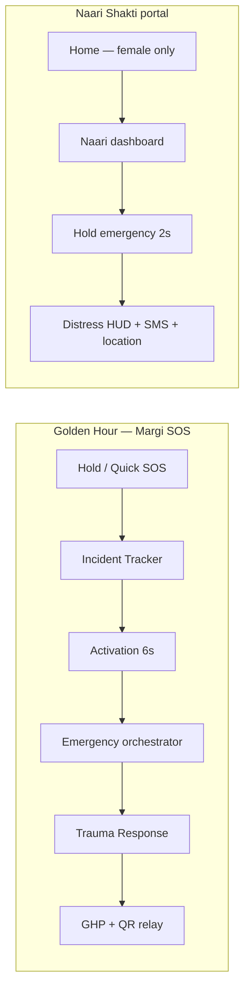
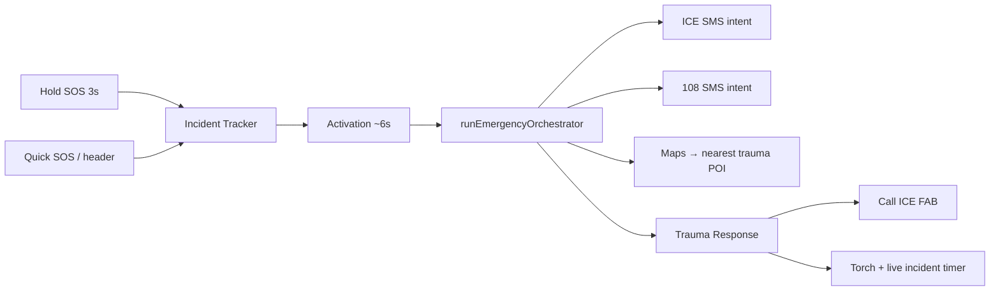
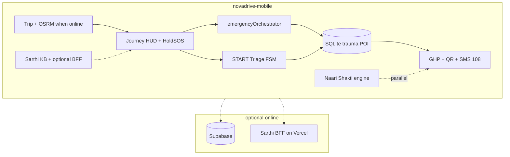

<p align="center">
  <a href="https://github.com/Stormynubee/Margi">
    
  </a>
</p>

<p align="center">
  <strong>Team NovaDrive</strong> · <strong>IIT Madras Road Safety Hackathon 2026</strong> · <strong>RoadSoS</strong> (CoERS &amp; RBG Labs / MoRTH)
</p>

<p align="center"><strong>BY TEAM NOVADRIVE</strong></p>

[](https://roadsafetyhackathon-six.vercel.app)
[](https://github.com/Stormynubee/Margi/actions/workflows/ci.yml)
[](novadrive-mobile/)
[](novadrive-mobile/package.json)
[](LICENSE)

Government-aligned, **offline-first Golden Hour research prototype** for Indian highway corridors — native **Margi** mobile app (P0), optional Next.js mirror, and judge brief site.

| | |
|---|---|
| **GitHub** | [github.com/Stormynubee/Margi](https://github.com/Stormynubee/Margi) |
| **Mobile app (start here)** | [novadrive-mobile/README.md](novadrive-mobile/README.md) |
| **Judges — 5 min** | [JUDGE_START_HERE.md](JUDGE_START_HERE.md) |
| **Changelog** | [CHANGELOG.md](CHANGELOG.md) |
| **Phase 3 (Supabase + Sarthi BFF)** | [docs/PHASE3_SETUP.md](docs/PHASE3_SETUP.md) |
| **Submission checklist** | [docs/SUBMISSION.md](docs/SUBMISSION.md) |
| **Canonical scope** | [docs/CANON.md](docs/CANON.md) |
| **Live brief site** | [roadsafetyhackathon-six.vercel.app](https://roadsafetyhackathon-six.vercel.app) |
| **Complete UI brief** | [margi-complete.html](https://roadsafetyhackathon-six.vercel.app/margi-complete.html) |
| **Deadline** | May 31, 2026, 11:59 PM IST |

---

## Why Margi

When cellular signal fails on NH corridors, victims and bystanders still get structured help through **two parallel safety lanes**:



| Lane | What you get |
|------|----------------|
| **Golden Hour** | Incident type selection → activation → **automated orchestration** (ICE SMS, 108 SMS, nearest trauma POI Maps) → trauma HUD with **incident timer**, **torch**, Call ICE FAB, hospital navigation to **facility coords** → START triage FSM → GHP + bystander QR |
| **Naari Shakti** | Gender-gated women's portal (saffron + navy UI) — SMS nearest police station, ICE alert, helpline **181**, hold-to-activate distress with recording |

**Honest scope:** Sensor fusion + manual SOS (not OS-level crash APIs in P0). **No auto-SMS** when crash/voice calm countdown hits zero — user confirms. SMS and dial use **OS intents** (user taps Send / Call). Gender is **self-reported on-device** (unverified in P0). NH48 corridor has verified hospital phones; **baseline 108 mode** outside the verified pack.

---

## Emergency SOS (May 2026 automation)

Hold SOS, Quick SOS, and header SOS now share one **intentional** path — no premature SMS before incident type is chosen.



| Step | Behavior |
|------|----------|
| **Hold SOS (3s)** | Opens **Incident Tracker** (road accident / natural calamity) — release grace prevents accidental skip |
| **Activation** | Countdown splash, then orchestrator runs |
| **Orchestrator** | GPS → optional ICE SMS → 108 SMS → rank nearest hospital from SQLite POI → open Google Maps to **hospital lat/lng** |
| **Trauma Response** | Elapsed time since SOS, rear-flash **torch** (`TorchCameraLayer`), Call ICE + Call Center FABs, Sarthi + first-aid board |
| **False alerts** | Voice crash detection **off by default**; crash countdown does **not** auto-open 108 SMS |

**Spec:** [novadrive-mobile/docs/superpowers/specs/2026-05-28-margi-emergency-automation-design.md](novadrive-mobile/docs/superpowers/specs/2026-05-28-margi-emergency-automation-design.md)  
**Smoke matrix:** [novadrive-mobile/docs/DEVICE_SMOKE_MATRIX.md](novadrive-mobile/docs/DEVICE_SMOKE_MATRIX.md)

---

## What's in v2.0.0

| Area | Shipped |
|------|---------|
| **Emergency** | Incident tracker routing, orchestrator, hospital nav fix, ICE call FAB, local safety alerts (5 km) |
| **Trauma HUD** | `TraumaResponseActionBar` — incident timer, torch, team attribution on home header |
| **Naari Shakti** | Restored saturated saffron/navy portal (not washed-out secondary containers) |
| **Location** | Geo-filtered community alerts, regional daily brief, Sarthi corridor context from GPS |
| **Phase 3** | Supabase auth + profile sync, NGO volunteer registry, OSRM trip routing, Sarthi BFF health, HTTP dispatch audit |
| **Phase 2 P1** | Drive HUD layout, Rah-Veer claim log, journey debrief, TTS on START triage |
| **Voice** | Distress policy + classifier; optional YAMNet on dev/APK builds |
| **Quality** | **220** Jest unit tests · `npm run verify:docs` · `npm run verify:branding` |

Package: `novadrive-mobile` **2.0.0** · Android `com.margi.app` · deep link `margi://`

---

## App map (mobile)

| Tab | Route | What you get |
|-----|-------|----------------|
| **Home** | `/(tabs)/explore` | Drive mode, Quick SOS, Bystander QR, Naari Shakti (female), daily safety brief, Sarthi FAB — header shows **Margi** + **BY TEAM NOVADRIVE** |
| **Trip** | `/(tabs)/drive` | Plan corridor, OSRM route when online, calibration → live SOS HUD |
| **Community** | `/(tabs)/history` | Hazards within **~5 km**, pioneers leaderboard |
| **Profile** | `/(tabs)/profile` | Medical ICE, voice detection toggle, accessibility |
| **Emergency stack** | `/emergency/*` | Selection → activation → response → route |
| **Naari Shakti** | `/naari-shakti` | Safety mode, 2s hold distress |
| **Also** | `/sarthi`, `/scan`, `/rahveer`, `/ngo`, `/auth` | Assistant, QR relay, Good Samaritan, volunteer registry, Supabase sign-in |

**Drive flow:** Home **ENTER DRIVE MODE** → Trip → **Start Driving** → calibration → **Live SOS HUD** (hold 3s on top strip) → journey summary.

Full mobile guide: **[novadrive-mobile/README.md](novadrive-mobile/README.md)**

---

## Architecture



Detail: [docs/ARCHITECTURE.md](docs/ARCHITECTURE.md) · [docs/MARGI_FINAL_IMPLEMENTATION_PLAN.md](docs/MARGI_FINAL_IMPLEMENTATION_PLAN.md)

---

## Monorepo layout

```
novadrive-mobile/     # PRIMARY — Expo SDK 54 · React Native · Margi Care Path UI
  app/                # expo-router screens (tabs, emergency, naari, sarthi, …)
  src/lib/emergency/  # orchestrator, hospital nav, incident elapsed, hold SOS grace
  src/lib/naariShakti/
  src/lib/voice/
  src/components/emergency/  # TraumaResponseActionBar, TorchCameraLayer
novadrive/            # Next.js prototype + Sarthi BFF API routes
docs/                 # Judge docs, specs, site/, POI runbooks
supabase/             # Migrations (profiles, volunteers, dispatch_events)
scripts/              # ingestCorridors.py → emergency_seed.db
```

---

## What changed recently

See **[CHANGELOG.md](CHANGELOG.md)**. Highlights:

| Date | Milestone |
|------|-----------|
| **2026-05-28** | **Emergency automation** (`7bf530a`) — incident tracker, `runEmergencyOrchestrator`, ICE/108 SMS intents, hospital Maps target, Call ICE FAB, geo alerts, Sarthi GPS context |
| **2026-05-28** | **Trauma HUD + Naari UI** (`e1a55b4`) — incident timer, torch, BY TEAM NOVADRIVE header, saturated Naari Shakti styling, mobile README refresh |
| **2026-05-28** | **Phase 3 (v2.0.0)** — Supabase auth, NGO registry, OSRM trip, Sarthi health, HTTP dispatch, native crash adapter (dev build) |
| **2026-05-28** | **Phase 2 P1** — Drive HUD v1.6, Rah-Veer claims, journey history, START triage TTS |
| **2026-05-28** | **Margi rebrand** — `com.margi.app`, `margi://`, Care Path tokens ([release notes](release-notes-margi-rebrand.md)) |
| **2026-05-28** | **Distress voice** — policy grace, classifier, sensitivity setting ([release notes](release-notes-distress-voice.md)) |
| **2026-05-26** | **Naari Shakti portal** — gender gate, 2s hold distress, home stack cards |

Release tag: **`v2.0.0-production`** (demo milestone — not clinical production; [CANON.md](docs/CANON.md)) · APK: [novadrive-mobile/scripts/BUILD_APK.md](novadrive-mobile/scripts/BUILD_APK.md)

---

## Quick start (judges & developers)

### Fastest: release APK

Download **`margi-debug.apk`** from [Releases](https://github.com/Stormynubee/Margi/releases) or CI artifacts → install → **Continue as Guest**.  
Details: [JUDGE_START_HERE.md](JUDGE_START_HERE.md)

### Build & run on device (USB)

```bash
cd novadrive-mobile
npm install --legacy-peer-deps
npx expo install react-native-worklets babel-preset-expo
cp .env.example .env    # optional: Sarthi BFF + Supabase keys
npm test                # 220 unit tests
npm run android         # debug APK + Metro (uses Android Studio JBR on Windows)
```

**Recommended SOS demo:** Guest → Trip → **Start Driving** → calibration → **hold SOS 3s** (top HUD strip) → pick incident type → activation → trauma response → verify ICE FAB, timer, torch, Maps opens toward **hospital** (not user pin).

**Naari demo (~30s):** Medical → **Female** → Home **NAARI SHAKTI** → Enable Portal → Safety Mode ON → hold **Emergency Help** 2s.

**Offline GHP:** Build packet online → enable airplane mode on GHP screen → QR still readable.

### Expo Go (same Wi‑Fi)

```bash
cd novadrive-mobile
npm run start:lan
```

Open `exp://YOUR_LAPTOP_IP:8081` in Expo Go (SDK 54). For full native modules (torch, dev crash hooks), use **`npm run android`** development build instead.

### Web prototype (optional)

```bash
cd novadrive
npm install
npm run dev
```

Sarthi BFF: set `EXPO_PUBLIC_SARTHI_API_URL` in mobile `.env` to your deployed `novadrive` origin — [docs/PHASE3_SETUP.md](docs/PHASE3_SETUP.md).

---

## Roadmap (honest)

| Phase | Status | Scope |
|-------|--------|--------|
| **P0** | ✅ | Expo app, FSM, SQLite routing, GHP/QR, GovTech UI, Naari Shakti, emergency orchestrator |
| **P1** | ✅ | Trip briefing, Rah-Veer log, TTS triage, drive HUD polish |
| **P2** | 🟡 Partial | Supabase, NGO registry, OSRM, HTTP dispatch — **OS crash APIs** still experimental / dev-client only |
| **Beyond hackathon** | — | Verified gender, clinical START certification, national POI coverage |

---

## Contributing & security

- [CONTRIBUTING.md](CONTRIBUTING.md) — TDD for `src/lib`, PR checklist
- [docs/AGENTS.md](docs/AGENTS.md) — Cursor agents & skills
- [SECURITY.md](SECURITY.md)

---

## License

[MIT](LICENSE) — IIT Madras Road Safety Hackathon submission and open continuation.

*Margi · Team NovaDrive · When signal drops, the path still holds.*
