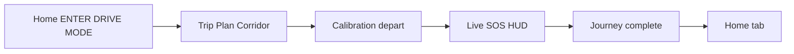
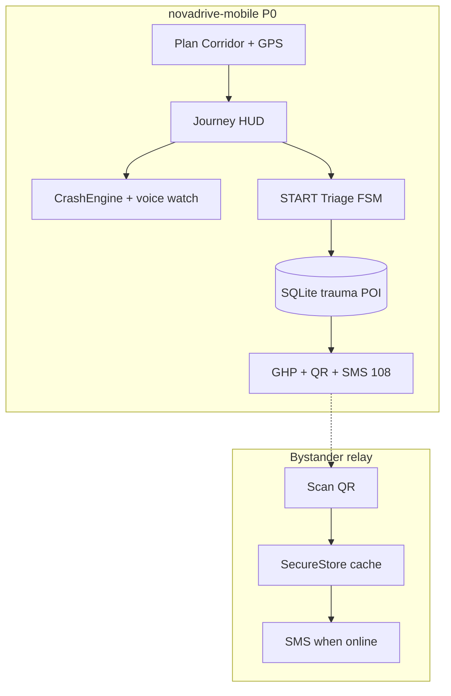

# NovaDrive

**Signal drops. The critical minute doesn't.**

**Team Vortex** · **IIT Madras Road Safety Hackathon 2026** · **RoadSoS** (CoERS & RBG Labs / MoRTH)

[](https://roadsafetyhackathon-six.vercel.app)
[](https://github.com/Stormynubee/novadrive/actions/workflows/ci.yml)
[](novadrive-mobile/)
[](LICENSE)

Government-aligned, **offline-first** Golden Hour co-pilot for Indian highway corridors — native mobile P0, optional web mirror, and a public team brief for judges.

| | |
|---|---|
| **GitHub** | [github.com/Stormynubee/novadrive](https://github.com/Stormynubee/novadrive) |
| **Live brief site** | [roadsafetyhackathon-six.vercel.app](https://roadsafetyhackathon-six.vercel.app) |
| **Complete UI brief (HTML)** | [novadrive-complete.html](https://roadsafetyhackathon-six.vercel.app/novadrive-complete.html) |
| **Submission checklist** | [docs/SUBMISSION.md](docs/SUBMISSION.md) |
| **Changelog (latest work)** | [CHANGELOG.md](CHANGELOG.md) |
| **Deadline** | May 31, 2026, 11:59 PM IST |

---

## Why NovaDrive

When cellular signal fails on NH corridors, victims and bystanders still get:

- **START medical triage** — deterministic FSM, not panic UX
- **Trauma-tier routing** — not “nearest pin”
- **Golden Hour Packet (GHP)** — human-readable brief for **108**
- **QR bystander relay** — packet hops to any phone with network later

**Honest scope:** P0 uses sensor fusion + manual SOS, not OS-level crash APIs. No auto-dial when the calm countdown reaches zero.

---

## Drive flow (mobile P0)



Journey monitoring starts only after **Start Driving** on the Trip tab (not from Home alone).

---

## Architecture



Full detail: [docs/ARCHITECTURE.md](docs/ARCHITECTURE.md) · [docs/NOVADRIVE_FINAL_IMPLEMENTATION_PLAN.md](docs/NOVADRIVE_FINAL_IMPLEMENTATION_PLAN.md)

---

## Monorepo layout

```
novadrive-mobile/          # PRIMARY — Expo app → Android APK (GovTech UI)
novadrive/                 # Web UI prototype (Next.js) — judges / team mirror
docs/
  ARCHITECTURE.md
  SUBMISSION.md
  AGENTS.md                # Cursor / skills guide
  site/                    # Team brief → Vercel
scripts/
  ingestCorridors.py       # OSM → emergency_seed.db
data/                      # Generated SQLite (gitignored)
```

---

## What changed recently

See **[CHANGELOG.md](CHANGELOG.md)** (2026-05-23 stabilization):

- GovTech tab shell, Plan Corridor, calibration, SOS HUD
- Journey lifecycle fixes, voice/impact gating, 32 unit tests, `typecheck` in CI
- [Device smoke matrix](novadrive-mobile/docs/DEVICE_SMOKE_MATRIX.md)

---

## Quick start (judges)

### Mobile app (required demo)

```bash
cd novadrive-mobile
npm install --legacy-peer-deps
npm run typecheck
npm test
npx expo start
# Android APK:
npx expo run:android
```

**Guest mode** → Trip → **Start Driving** → calibration → HUD → Hold SOS → Triage → Route → GHP → QR → airplane-mode test.

See [novadrive-mobile/README.md](novadrive-mobile/README.md) and [docs/SUBMISSION.md](docs/SUBMISSION.md).

### Web prototype (optional)

```bash
cd novadrive
npm install
npm run dev
```

### Team brief site

```bash
node docs/site/build-docs.js
```

Deployed via Vercel (`vercel.json` → `docs/site`).

---

## Roadmap

| Phase | Scope |
|-------|--------|
| **P0** | Expo app, FSM, SQLite routing, GHP/QR, GovTech UI, stabilization tests |
| **P1** | Trip info cards, Rah-Veer claim log, TTS, OSM offline tiles |
| **P2** | Supabase auth, NGO registry, OS crash APIs if entitled |

---

## Contributing & security

- [CONTRIBUTING.md](CONTRIBUTING.md) — TDD for `src/lib`, PR checklist
- [docs/AGENTS.md](docs/AGENTS.md) — Cursor subagent & skills
- [SECURITY.md](SECURITY.md)

---

## License

[MIT](LICENSE) — IIT Madras Road Safety Hackathon submission and open continuation.
