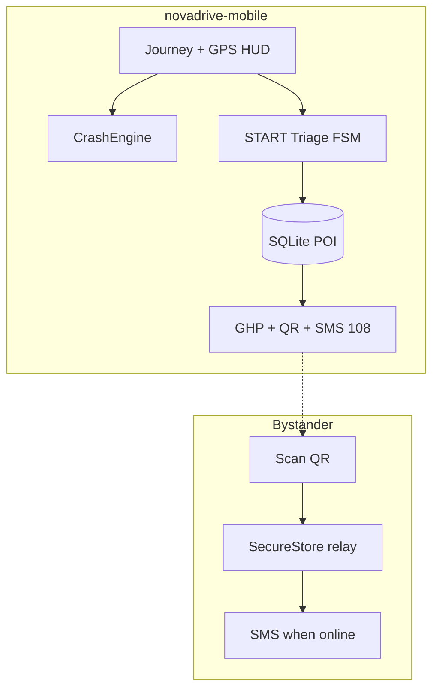

# NovaDrive

**Signal drops. The critical minute doesn't.**

[](https://roadsafetyhackathon-six.vercel.app)
[](novadrive-mobile/)
[](LICENSE)

Native, **offline-first** emergency co-pilot for Indian highways — built for the **RoadSoS** track (CoERS & RBG Labs, IIT Madras / MoRTH).

| | |
|---|---|
| **Live brief site** | [roadsafetyhackathon-six.vercel.app](https://roadsafetyhackathon-six.vercel.app) |
| **GitHub** | [github.com/Stormynubee/novadrive](https://github.com/Stormynubee/novadrive) |
| **Deadline** | May 31, 2026, 11:59 PM IST |

---

## Why NovaDrive

When signal fails on NH corridors, victims and bystanders still get:

- **START medical triage** — deterministic FSM, not panic UX
- **Trauma-tier routing** — not “nearest pin”
- **Golden Hour Packet (GHP)** — human-readable brief for 108
- **QR bystander relay** — packet hops to any phone with network later

---

## Monorepo layout

```
novadrive/                 # Web UI prototype (Next.js) — judges / team mirror
novadrive-mobile/          # PRIMARY — Expo app → Android APK
docs/
  NOVADRIVE_FINAL_IMPLEMENTATION_PLAN.md   # Single source of truth (P0)
  NOVADRIVE_MASTER_BRIEF.md                # Product & hackathon context
  ARCHITECTURE.md
  SUBMISSION.md                            # Demo checklist & slides
  site/                                    # Team brief → Vercel
scripts/
  ingestCorridors.py                       # OSM → emergency_seed.db
data/                                      # Generated SQLite (gitignored)
```

---

## Quick start (judges)

### Mobile app (required demo)

```bash
cd novadrive-mobile
npm install --legacy-peer-deps
npm test
npx expo start
# Android APK:
npx expo run:android
```

**Guest mode** → Start journey → Hold SOS → Triage → Route → GHP → QR → airplane-mode test.

See [novadrive-mobile/README.md](novadrive-mobile/README.md) and [docs/SUBMISSION.md](docs/SUBMISSION.md).

### Web prototype (optional)

```bash
cd novadrive
npm install
npm run dev
```

### Team brief site

```bash
node docs/site/build-docs.js
# Deployed via Vercel (vercel.json → docs/site)
```

---

## Architecture (P0)



**Honest scope:** P0 uses **sensor fusion + manual SOS**, not OS-level crash APIs. No auto-dial at crash countdown zero.

Full detail: [docs/ARCHITECTURE.md](docs/ARCHITECTURE.md) · [docs/NOVADRIVE_FINAL_IMPLEMENTATION_PLAN.md](docs/NOVADRIVE_FINAL_IMPLEMENTATION_PLAN.md)

---

## Roadmap

| Phase | Scope |
|-------|--------|
| **P0** ✅ | Expo app, FSM, SQLite routing, GHP/QR, guest mode, airplane demo |
| **P1** | Trip info cards, Rah-Veer ₹25k claim log, TTS, OSM offline tiles |
| **P2** | Supabase production auth, NGO registry, OS crash APIs if entitled |

---

## Contributing & security

- [CONTRIBUTING.md](CONTRIBUTING.md)
- [SECURITY.md](SECURITY.md)

---

## License

[MIT](LICENSE) — hackathon submission and open continuation.
