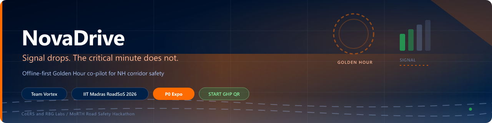
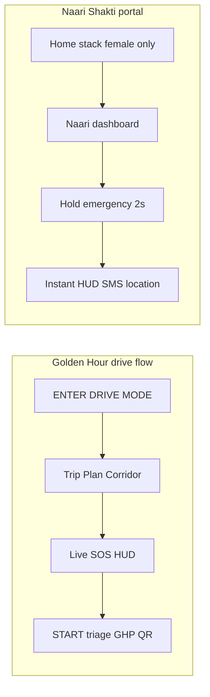
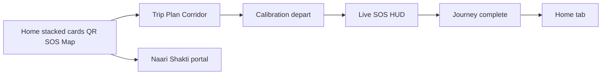
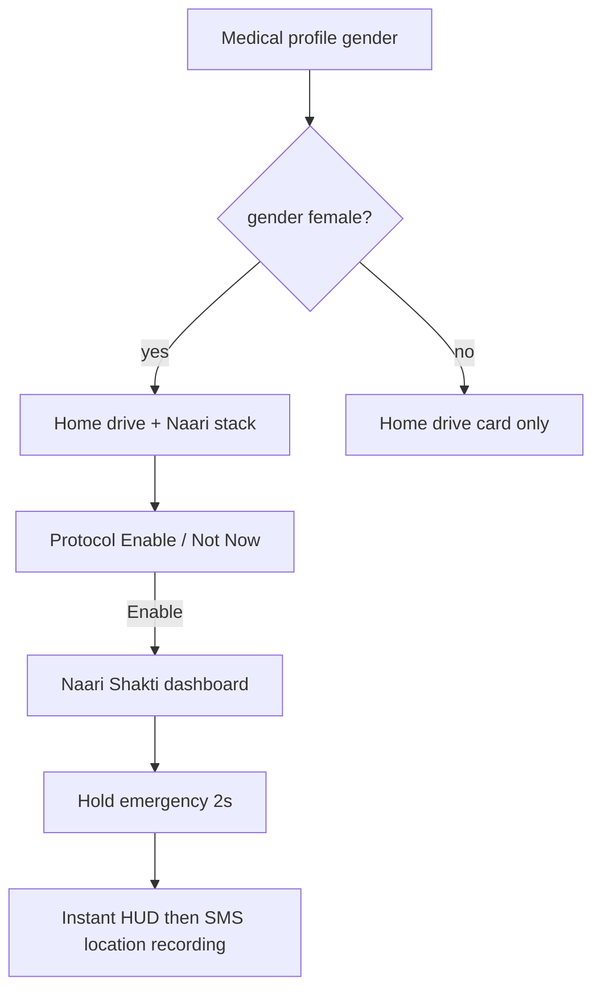
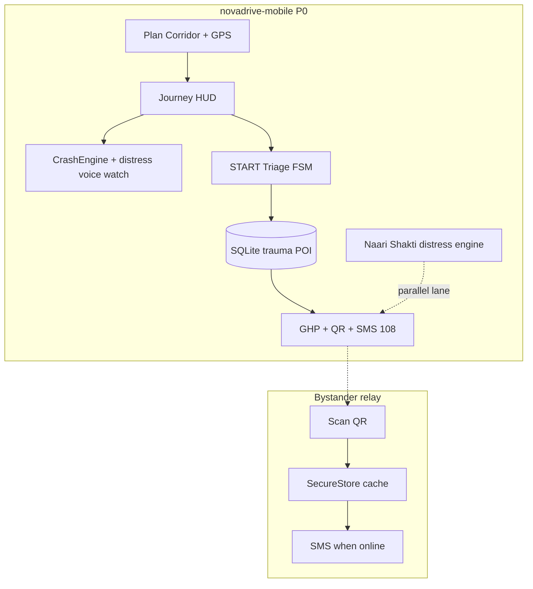

<p align="center">
  <a href="https://github.com/Stormynubee/novadrive">
    
  </a>
</p>

<p align="center">
  <strong>Team Vortex</strong> · <strong>IIT Madras Road Safety Hackathon 2026</strong> · <strong>RoadSoS</strong> (CoERS &amp; RBG Labs / MoRTH)
</p>

[](https://roadsafetyhackathon-six.vercel.app)
[](https://github.com/Stormynubee/novadrive/actions/workflows/ci.yml)
[](novadrive-mobile/)
[](LICENSE)

Government-aligned, **offline-first** Golden Hour co-pilot for Indian highway corridors — native mobile P0, optional web mirror, and a public team brief for judges.

| | |
|---|---|
| **GitHub** | [github.com/Stormynubee/novadrive](https://github.com/Stormynubee/novadrive) |
| **Live brief site** | [roadsafetyhackathon-six.vercel.app](https://roadsafetyhackathon-six.vercel.app) |
| **Complete UI brief (HTML)** | [novadrive-complete.html](https://roadsafetyhackathon-six.vercel.app/novadrive-complete.html) |
| **Submission checklist** | [docs/SUBMISSION.md](docs/SUBMISSION.md) |
| **Changelog (latest work)** | [CHANGELOG.md](CHANGELOG.md) |
| **All versions & commits** | [docs/VERSION_HISTORY.md](docs/VERSION_HISTORY.md) |
| **Fork this repo** | [github.com/Stormynubee/novadrive/fork](https://github.com/Stormynubee/novadrive/fork) |
| **Deadline** | May 31, 2026, 11:59 PM IST |

---

## Why NovaDrive

When cellular signal fails on NH corridors, victims and bystanders still get structured help through **two parallel safety lanes**:



| Lane | What you get |
|------|----------------|
| **Golden Hour** | START medical triage (deterministic FSM), trauma-tier routing, Golden Hour Packet for **108**, QR bystander relay |
| **Naari Shakti** | Gender-gated women's safety portal — SMS nearest police station, live location to ICE, helpline **181**, hold-to-activate distress with voice recording |

**Honest scope:** P0 uses sensor fusion + manual SOS, not OS-level crash APIs. No auto-dial when the calm countdown reaches zero. Naari Shakti SMS opens the OS composer (user taps Send). Gender is **self-reported on-device** (unverified in P0 — no Aadhaar API).

---

## Drive flow (mobile P0)



Journey monitoring starts only after **Start Driving** on the Trip tab (Home **ENTER DRIVE MODE** opens Plan Corridor; it does not start the journey alone).

### Naari Shakti (women's safety portal)



| Step | What happens |
|------|----------------|
| Onboarding | Select gender on **Medical profile** (required) or optionally on sign-in |
| Home (female) | Stacked **ENTER DRIVE MODE** (navy) + **NAARI SHAKTI** (saffron) cards via `HomePrimaryStack` |
| Home (male) | Drive card only — no Naari UI |
| First tap | **Naari Shakti Protocol** — *Unverified female user detected* → **Enable Portal** or **Not Now** |
| Portal | Safety Mode ON → hold **Emergency Help** 2s → distress HUD appears immediately; SMS, location share, TTS, and recording follow |

Docs: [design spec](docs/superpowers/specs/2026-05-23-naari-shakti-design.md) · [implementation plan](docs/superpowers/plans/2026-05-23-naari-shakti.md) · [Stitch prompt](docs/design/stitch-prompts/naari-shakti-portal.md)

---

## Architecture



Full detail: [docs/ARCHITECTURE.md](docs/ARCHITECTURE.md) · [docs/NOVADRIVE_FINAL_IMPLEMENTATION_PLAN.md](docs/NOVADRIVE_FINAL_IMPLEMENTATION_PLAN.md)

---

## Monorepo layout

```
novadrive-mobile/          # PRIMARY — Expo app → Android APK (GovTech UI)
  src/components/home/     # Stacked ENTER DRIVE MODE + Naari portal cards
  src/components/naari/  # Naari Shakti UI
  src/lib/voice/         # Distress voice policy, classifier, optional YAMNet
  src/lib/naariShakti/   # Eligibility, distress engine, hold timer (Jest)
novadrive/                 # Web UI prototype (Next.js) — judges / team mirror
docs/
  ARCHITECTURE.md
  SUBMISSION.md
  AGENTS.md                # Cursor / skills guide
  design/stitch-prompts/   # Enhanced Stitch prompts (e.g. Naari Shakti)
  superpowers/specs/       # Feature design specs
  site/                    # Team brief → Vercel
scripts/
  ingestCorridors.py       # OSM → emergency_seed.db
data/                      # Generated SQLite (gitignored)
```

---

## What changed recently

See **[CHANGELOG.md](CHANGELOG.md)**:

- **2026-05-28 — Distress voice hardening** (`7370f90`): policy grace windows, two-stage classifier, Naari+journey mic mount, sensitivity setting, smoke rows 23–26 ([mobile README](novadrive-mobile/README.md#distress-voice-detection))
- **2026-05-28 — Safety brief screens** (`f3f2222`): institutional Protocol Alpha / Regional Alert detail UX
- **2026-05-28 — Activation splash** (`5008608`): minimum 10s dwell before trauma response auto-navigation
- **2026-05-26 — Naari Shakti UI & emergency reliability** (`c828e90`): home stack cards, portal layout, first-hold emergency with instant HUD + cached GPS
- **2026-05-26 — Naari Shakti portal** (`f8f6dce`): gender gate, protocol modal, distress engine
- **2026-05-23 — Stabilization:** GovTech tab shell, Plan Corridor, calibration, SOS HUD (`d900ab5` map/quick menu)
- [Device smoke matrix](novadrive-mobile/docs/DEVICE_SMOKE_MATRIX.md) — Naari rows 13–15 · distress voice rows 23–26

Release tag: **`v1.4.0-distress-voice`** (recommended for judges) → [VERSION_HISTORY](docs/VERSION_HISTORY.md)

---

## Quick start (judges)

### Mobile app (required demo)

```bash
cd novadrive-mobile
npm install --legacy-peer-deps
npm run typecheck
npm test
npx expo start
# Android APK:
npx expo run:android
```

**Golden Hour path:** Guest mode → Home **ENTER DRIVE MODE** → Trip → **Start Driving** → calibration → HUD → Hold SOS → Triage → Route → GHP → QR → airplane-mode test.

**Naari Shakti path (optional, ~30s):** Guest → Medical → **Female** → Home → Enable Portal → Safety Mode ON → hold Emergency Help 2s → distress HUD + SMS composer.

**Distress voice regression (optional, ~30s):** Start journey → switch tabs (Home / Community / Settings) → confirm **no** false distress modal from UI sounds or app TTS. See smoke rows 23–24 in [device matrix](novadrive-mobile/docs/DEVICE_SMOKE_MATRIX.md).

See [novadrive-mobile/README.md](novadrive-mobile/README.md) and [docs/SUBMISSION.md](docs/SUBMISSION.md).

### Web prototype (optional)

```bash
cd novadrive
npm install
npm run dev
```

### Team brief site

```bash
node docs/site/build-docs.js
```

Deployed via Vercel (`vercel.json` → `docs/site`).

---

## Roadmap

| Phase | Scope |
|-------|--------|
| **P0** | Expo app, FSM, SQLite routing, GHP/QR, GovTech UI, Naari Shakti, stabilization tests |
| **P1** | Trip info cards, Rah-Veer claim log, TTS, OSM offline tiles |
| **P2** | Supabase auth, NGO registry, OS crash APIs if entitled |

---

## Contributing & security

- [CONTRIBUTING.md](CONTRIBUTING.md) — TDD for `src/lib`, PR checklist
- [docs/AGENTS.md](docs/AGENTS.md) — Cursor subagent & skills
- [SECURITY.md](SECURITY.md)

---

## License

[MIT](LICENSE) — IIT Madras Road Safety Hackathon submission and open continuation.
