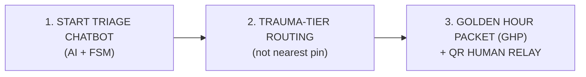
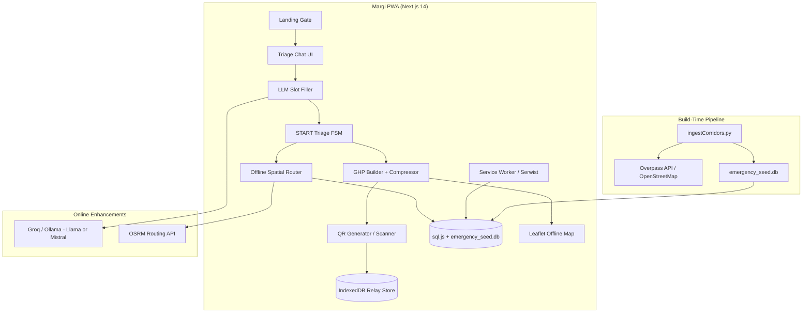
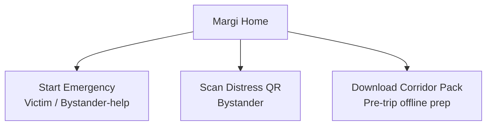
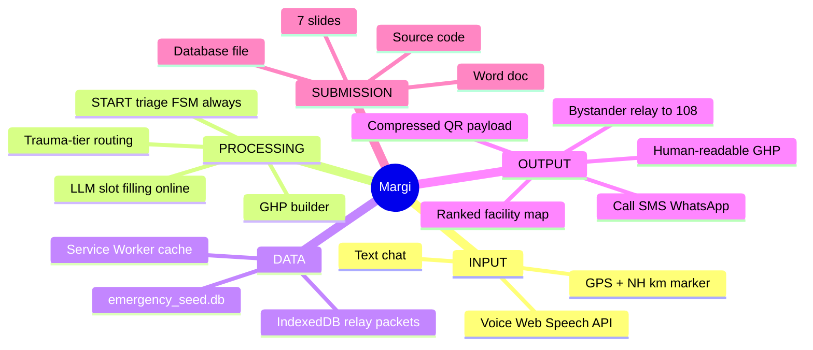
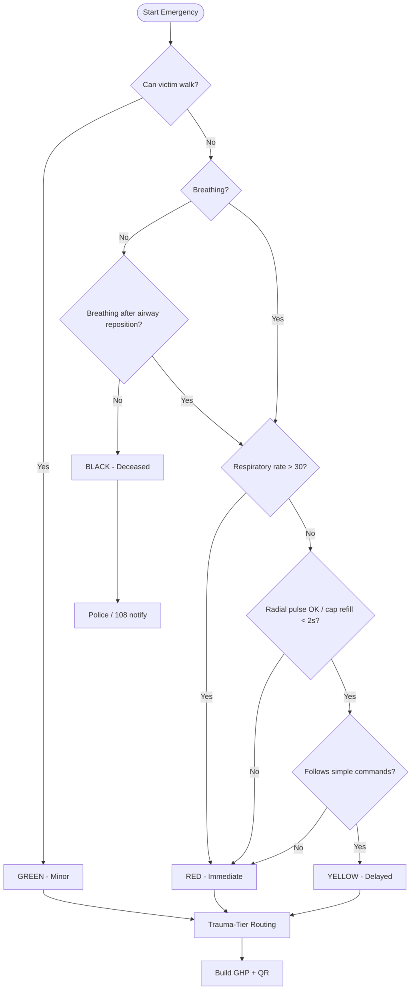
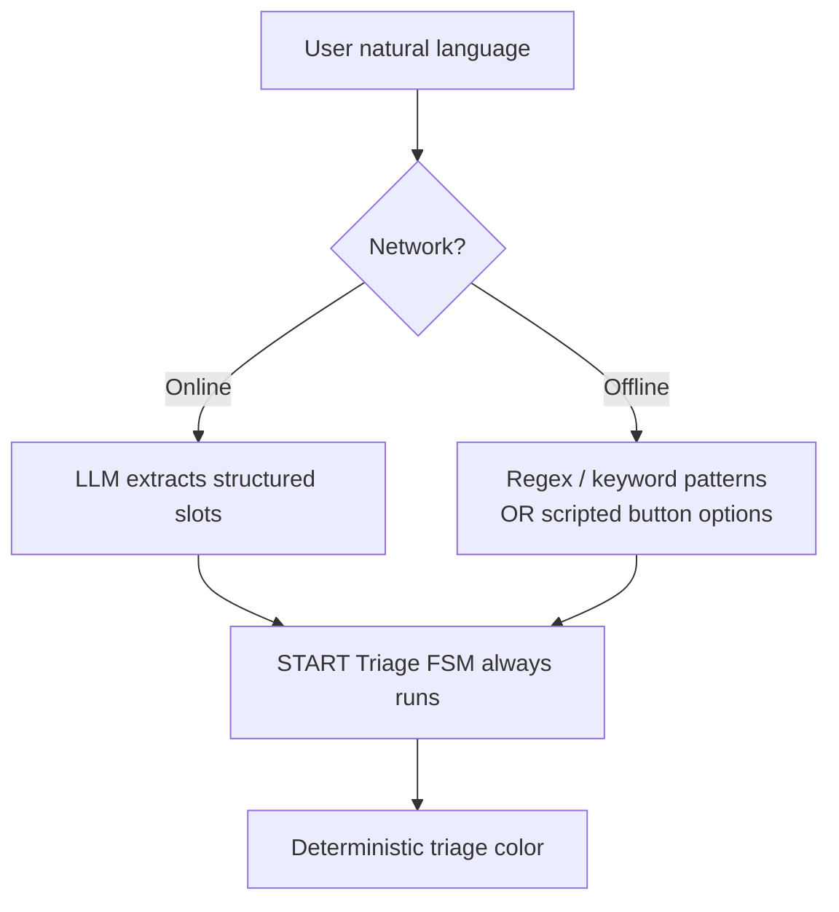
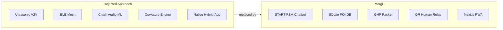
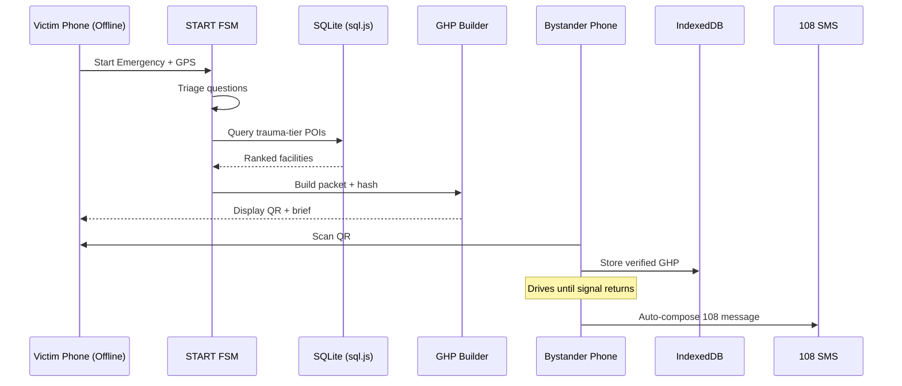

# Margi — Master Team Brief

**Project:** Margi (Road Safety Hackathon 2026 — RoadSoS Track)  
**Organizer:** CoERS & RBG Labs, IIT Madras (with MoRTH)  
**Document version:** 1.0  
**Last updated:** May 2026  
**Audience:** Full hackathon team — developers, presenters, data engineers

---

## Table of Contents

1. [Executive Summary](#1-executive-summary)
2. [Hackathon Alignment](#2-hackathon-alignment)
3. [Product Vision & One-Line Pitch](#3-product-vision--one-line-pitch)
4. [Why We Chose This Architecture](#4-why-we-chose-this-architecture)
5. [What We Rejected (And Why)](#5-what-we-rejected-and-why)
6. [Core Innovation](#6-core-innovation)
7. [System Architecture](#7-system-architecture)
8. [End-to-End Pipeline](#8-end-to-end-pipeline)
9. [User Flows & Mind Map](#9-user-flows--mind-map)
10. [START Triage FSM Specification](#10-start-triage-fsm-specification)
11. [Golden Hour Packet (GHP) Specification](#11-golden-hour-packet-ghp-specification)
12. [Data Pipeline & Database](#12-data-pipeline--database)
13. [Offline & Spatial Routing](#13-offline--spatial-routing)
14. [AI Chatbot Architecture](#14-ai-chatbot-architecture)
15. [Human QR Relay System](#15-human-qr-relay-system)
16. [Tech Stack](#16-tech-stack)
17. [Project Structure](#17-project-structure)
18. [Implementation Plan (4 Weeks)](#18-implementation-plan-4-weeks)
19. [Execution Checklist by Role](#19-execution-checklist-by-role)
20. [Demo Day Script (90 Seconds)](#20-demo-day-script-90-seconds)
21. [Submission Requirements](#21-submission-requirements)
22. [Verification & Testing Plan](#22-verification--testing-plan)
23. [Risks & Mitigations](#23-risks--mitigations)
24. [Competitive Advantages](#24-competitive-advantages)
25. [Glossary (Quick Reference)](#25-glossary-quick-reference)
26. [Open Decisions & Team Actions](#26-open-decisions--team-actions)
27. [Contacts & Resources](#27-contacts--resources)

---

## 1. Executive Summary

**Margi** is an **offline-first, AI-powered emergency chatbot** (Progressive Web App) designed for the **RoadSoS** problem statement at the IIT Madras National Road Safety Hackathon 2026.

When a road accident happens — often with **no mobile signal** on highways — victims and bystanders lose precious minutes trying to explain location, injury severity, and which hospital to use. Margi compresses that chaos into a **60-second guided triage conversation**, routes the victim to the **correct trauma-tier facility** (not just the nearest clinic), builds a **Golden Hour Packet (GHP)** dispatch brief, and if offline, passes that packet through a **human QR relay chain** until any phone regains signal and can SMS **108/112**.

**Tagline:** *The network failed. The golden hour didn't.*

---

## 2. Hackathon Alignment

### Event Details

| Item | Detail |
|------|--------|
| **Theme** | AI in Road Safety (2026 focus: **AI-powered chatbots**) |
| **Our track** | **RoadSoS** — location-based emergency services during accidents |
| **Team size** | 1–10 members (Unstop enforced) |
| **Submission** | Unstop only — one submission, one problem statement |
| **Indian track deadline** | **May 31, 2026, 11:59 PM IST** (extended) |
| **Stage 1** | Online prototype + code + DB + 7 slides + Word doc |
| **Stage 2** | Shortlisted teams present **live at IIT Madras** |

### RoadSoS Evaluation Criteria (What Judges Score)

| Criterion | How Margi Addresses It |
|-----------|-------------------------------|
| Data reliability & geographic accuracy | Pre-built, verified SQLite POI database from OSM + manual corridor verification |
| Valid emergency contacts fetched & displayed | Hospitals, police, ambulance, towing — with real phone tags where available |
| Offline capability | FSM triage + sql.js local DB + Service Worker + corridor packs + QR relay |
| Innovation & extra features | GHP pre-dispatch brief + human sneakernet relay + trauma-tier routing + NH km markers |
| Cross-country integration | Country/state config packs (IN + BIMSTEC: NP, BD, LK, etc.) |
| AI chatbot requirement | Conversational UI with LLM slot-filling over deterministic START FSM |
| Open-source preference | OSM, OSRM, sql.js, Llama/Mistral (Groq/Ollama), no proprietary lock-in |

### Submission Deliverables Checklist

- [ ] Full source code (Python preferred for backend/ingest)
- [ ] **Structured database** (`emergency_seed.db` + export)
- [ ] **Exactly 7 slides** (Welcome + Thank You included)
- [ ] **Word document**: codebase overview, dependencies, assumptions
- [ ] Working Unstop submission before deadline

---

## 3. Product Vision & One-Line Pitch

### Problem

India records ~**1.7 lakh road deaths/year**. On highways, accidents often occur in **dead zones** with no signal. Victims cannot:
- Explain exact location (lat/lng is meaningless to most users)
- Communicate injury severity clearly to 108
- Know whether the nearest facility is a **trauma center** or a small clinic
- Pass information to dispatch when their phone has no connectivity

### Solution

Margi is a **conversational emergency agent** that:
1. Runs **START medical triage** (international first-responder protocol)
2. Finds the **right tier** of emergency facility offline
3. Generates a **dispatch-ready Golden Hour Packet**
4. **Relays** that packet via QR to a bystander when the victim has no signal

### Pitches (Memorize)

| Audience | Pitch |
|----------|-------|
| **30 sec (judges)** | Margi is an offline AI emergency chatbot. In 60 seconds it triages injuries, routes RED cases to trauma centers, builds a 108-ready brief, and if there's no signal — a bystander scans a QR and carries that brief until they get network. |
| **Technical** | LLM-as-skin, FSM-as-spine, sql.js POI store, Haversine spatial query with trauma-tier filter, lz-string GHP encoding, IndexedDB human relay. |
| **Emotional** | When the network fails, the golden hour doesn't. |

---

## 4. Why We Chose This Architecture

We intentionally built a system that is:

1. **Demo-proof** — works in Chrome on two phones with airplane mode
2. **Offline-first** — core path never requires live API calls
3. **Medically grounded** — START triage protocol, not arbitrary questions
4. **Clinically routed** — trauma-tier matching, not nearest-pin routing
5. **Information-centric** — solves *dispatch delay*, not *sensor novelty*
6. **Hackathon-aligned** — AI chatbot is the product, not a sidebar feature
7. **Open-source friendly** — OSM, OSRM, open LLMs, SQLite

---

## 5. What We Rejected (And Why)

Early ideation explored a **sensor-heavy "smart vehicle mesh"** approach. After engineering verification, we **deliberately killed** those features. This section documents why — so the team stays aligned and does not re-introduce scope creep.

### Rejected Feature Matrix

| Rejected Idea | What It Tried To Do | Why We Killed It |
|---------------|---------------------|------------------|
| **Ultrasonic V2V** | Phones communicate via 19–21 kHz sound between vehicles | Browsers block mic/audio without user gesture; road noise interference; iOS ultrasonic limits; unreliable demo |
| **BLE / DTN mesh** | Crash packets relay through passing cars via Bluetooth | Web Bluetooth cannot advertise/beacon; no BLE mesh in browsers; iOS has no Web Bluetooth |
| **Wi-Fi Direct beacons** | Broadcast distress via Wi-Fi Direct SSID | **Not available in web browser APIs** |
| **Crash audio ML** | Always-on mic detects tire screech/impact | False positives; privacy issues; battery drain; research-grade ML scope |
| **Capacitor/native hybrid** | Wrap PWA in native shell for "real" Bluetooth | Doubles build complexity; judges won't sideload APKs; contradicts accessible web prototype |
| **Curvature/anxiety physics engine** | Predict safe speed on curves from OSM geometry | Wrong problem statement (RoadWatch); OSM geometry too sparse; missing friction/banking data |
| **Background volunteer GPS dispatch** | Track volunteers when app minimized | PWAs cannot reliably background-track GPS (especially iOS); needs gov integration |
| **Base64-only SMS coords** | Encode GPS in SMS as Base64 | 108 operators cannot decode; useless to dispatchers |
| **Always-on "Drive Mode"** | Mic + wake lock + audio on launch | Scary UX; permission denial; battery drain |

### Strategic Lesson

> **Judges score emergency chatbots with valid POI data and offline reliability — not ultrasonic chirps between cars.**

Our creative differentiator is **information surviving dead zones** (GHP + human QR relay), not **machines talking to machines**.

---

## 6. Core Innovation

### The Three Pillars



### Innovation #1 — Golden Hour Packet (GHP)

A **structured, dispatch-ready brief** — not raw chat logs:

- Triage color (RED/YELLOW/GREEN/BLACK)
- GPS + landmark + optional NH km marker
- Victim status flags
- Selected facility (name, type, phone, ETA, distance)
- State emergency number (108/112) + language
- Integrity hash (tamper detection)
- Relay chain audit log

**Why it matters:** 108 dispatchers lose minutes asking "where are you? what happened?" GHP **pre-answers** those questions.

### Innovation #2 — Human QR Relay (Sneakernet)

When victim phone has **no signal**:

1. Triage completes offline → GHP generated
2. Victim screen shows **QR code** + human-readable brief
3. Bystander taps **[Scan Distress QR]** on their phone
4. Packet stored in **IndexedDB**
5. When `online` event fires → auto-compose **SMS to 108** with readable GHP text

**Why it matters:** Honest, demo-proof, works on every smartphone. No mesh fantasy.

### Innovation #3 — Trauma-Tier Routing

| Triage | Route To | trauma_tier |
|--------|----------|-------------|
| **RED** | Trauma center / surgical ER | 1, 2 |
| **YELLOW** | General hospital with ER | 2, 3 |
| **GREEN** | Clinic / minor care | 3 (+ police if needed) |
| **BLACK** | Deceased after airway attempt | Police / 108 notification |

**Why it matters:** Nearest hospital might be a PHC unable to handle head trauma. We route by **capability**, not distance alone.

---

## 7. System Architecture

### High-Level Architecture Diagram



### Layer Responsibilities

| Layer | Responsibility | Must Work Offline? |
|-------|----------------|-------------------|
| **UI (Next.js PWA)** | Chat, map, QR, scan, landing gate | Yes (cached shell) |
| **FSM (TypeScript)** | Medical triage logic | **Yes — mandatory** |
| **LLM (optional)** | Natural language → structured slots | No (enhancement only) |
| **sql.js + SQLite** | POI lookup | **Yes — mandatory** |
| **GHP encoder** | Serialize, compress, hash | **Yes — mandatory** |
| **QR relay** | Encode/decode, IndexedDB, SMS trigger | **Yes — mandatory** |
| **Service Worker** | Cache app shell, DB, wasm, tiles | **Yes — mandatory** |
| **OSRM** | Road-accurate ETA | No (fallback: Haversine ETA) |
| **Ingest script** | Build POI database | Build-time only |

---

## 8. End-to-End Pipeline

### Pipeline A — Build-Time (Developer Machine / CI)

```
OpenStreetMap data
        ↓
Overpass API queries (nwr: hospitals, clinics, police, ambulance)
        ↓
ingestCorridors.py
  • Parse names, phones, types
  • Assign trauma_tier (1/2/3)
  • Tag corridor + state
  • Manual verification CSV merge (top 50 POIs per demo corridor)
        ↓
public/emergency_seed.db
        ↓
Bundled into PWA + submitted with hackathon deliverables
```

### Pipeline B — Runtime (Victim Path)

```
User taps [Start Emergency Triage]
        ↓
Browser requests GPS (single getCurrentPosition)
        ↓
Chatbot conversation (LLM online / scripted offline)
        ↓
Slots fill START FSM states
        ↓
FSM outputs triage color
        ↓
Spatial query: bbox filter → Haversine sort → trauma-tier filter
        ↓
Select best facility + compute ETA
        ↓
Build GoldenHourPacket + SHA-256 integrity hash
        ↓
┌─────────────────┴─────────────────┐
│ ONLINE                            │ OFFLINE
│ • Call 108 / hospital             │ • Show GHP on screen
│ • SMS / WhatsApp share            │ • Display QR code
│ • Show map route                  │ • Prompt bystander scan
└───────────────────────────────────┘
```

### Pipeline C — Runtime (Bystander Relay Path)

```
Bystander taps [Scan Distress QR]
        ↓
Camera decodes QR payload
        ↓
Deserialize + verify integrity hash
        ↓
Store in IndexedDB + append relayChain entry
        ↓
Listen for navigator 'online' event
        ↓
Format human-readable SMS template (Tamil/Hindi/English)
        ↓
Trigger sms:108?body=... OR navigator.share() OR copy-to-clipboard
        ↓
(Optional) POST anonymized GHP to backend audit endpoint
```

---

## 9. User Flows & Mind Map

### Landing Gate (3 Entry Points)



### Mind Map — Full System



### Flowchart — Triage Decision (Simplified)



---

## 10. START Triage FSM Specification

### States

| State | Purpose |
|-------|---------|
| `AMBULATORY` | Can victim walk? |
| `BREATHING_CHECK` | Are they breathing? |
| `AIRWAY_REPOSITION` | After airway maneuver, breathing? |
| `RESPIRATORY_RATE` | RR > 30/min? |
| `PERFUSION_CHECK` | Radial pulse / capillary refill |
| `MENTAL_STATUS` | Follows simple commands? |
| `TAGGED` | Final triage color assigned |

### Correct Transition Rules (Critical — Do Not Simplify Wrong)

| Condition | Result |
|-----------|--------|
| Can walk | **GREEN** → done |
| Not breathing → airway fails | **BLACK** → done |
| Not breathing → airway succeeds | → **RESPIRATORY_RATE** (NOT immediate RED) |
| RR > 30 | **RED** |
| No radial pulse OR cap refill ≥ 2s | **RED** |
| Cannot follow commands | **RED** |
| All checks pass, non-ambulatory | **YELLOW** |

### FSM Interface (TypeScript)

```typescript
export type TriageState =
  | 'AMBULATORY' | 'BREATHING_CHECK' | 'AIRWAY_REPOSITION'
  | 'RESPIRATORY_RATE' | 'PERFUSION_CHECK' | 'MENTAL_STATUS' | 'TAGGED';

export interface TriageContext {
  count: number;
  canWalk: boolean;
  breathing: boolean;
  respiratoryRateOver30: boolean;
  capillaryRefillOk: boolean;
  followsCommands: boolean;
  severeBleeding: boolean;
  triageResult: 'RED' | 'YELLOW' | 'GREEN' | 'BLACK';
  stateLog: string[];
}
```

### Medical Disclaimer (Required in UI)

> *Margi provides decision support only. It is not a medical diagnosis. In an emergency, always call 108/112 when possible.*

---

## 11. Golden Hour Packet (GHP) Specification

### Schema

```typescript
export interface GoldenHourPacket {
  id: string;                    // UUID v4
  createdAt: string;             // ISO8601
  triage: 'RED' | 'YELLOW' | 'GREEN' | 'BLACK';
  location: {
    lat: number;                 // 6 decimal places
    lng: number;
    landmark?: string;
    nhCode?: string;             // e.g. "NH48"
    nhKm?: number;
  };
  victims: {
    count: number;
    canWalk: boolean;
    breathing: boolean;
    severeBleeding: boolean;
    capillaryRefillOk: boolean;
    followsCommands: boolean;
  };
  routing: {
    facilityName: string;
    facilityType: 'trauma' | 'hospital' | 'clinic';
    phone: string;
    etaMinutes: number;
    distanceKm: number;
  };
  emergency: {
    dial: string;                // "108" | "112" | "102"
    state: string;
    language: 'en' | 'hi' | 'ta';
  };
  relayChain: Array<{ at: string; deviceHint: string }>;
  integrity: string;             // SHA-256 hex digest
}
```

### Encoding Strategy

| Step | Method |
|------|--------|
| 1 | Build minimal JSON or pipe-delimited string |
| 2 | Compress with **lz-string** (`compressToEncodedURIComponent`) |
| 3 | If payload > 800 bytes → QR carries **only** `{ id, lat, lng, triage, integrity }`; full GHP on screen + IndexedDB |
| 4 | Integrity via **Web Crypto SHA-256** (not HMAC — no client secrets) |

### SMS Template Example (English)

```
🚨 ROAD EMERGENCY - Margi
Triage: RED | Victims: 1
Location: NH48 km 87 (13.082700, 80.270700)
Injuries: Not walking, breathing, severe bleeding suspected
TAKE TO: Apollo Trauma Center (12 min / 8.4 km)
Call: 108 (Tamil Nadu)
Generated offline via bystander relay.
```

---

## 12. Data Pipeline & Database

### SQLite Schema

```sql
CREATE TABLE emergency_nodes (
    id INTEGER PRIMARY KEY,       -- OSM node id
    name TEXT NOT NULL,
    lat REAL NOT NULL,
    lng REAL NOT NULL,
    type TEXT NOT NULL,           -- hospital, clinic, police, ambulance
    trauma_tier INTEGER NOT NULL, -- 1=trauma center, 2=hospital ER, 3=clinic
    emergency_phone TEXT,
    nh_corridor TEXT,
    state TEXT,
    verified INTEGER DEFAULT 0,   -- 1 if manually verified
    verified_at TEXT
);
CREATE INDEX idx_coords ON emergency_nodes(lat, lng);
CREATE INDEX idx_tier ON emergency_nodes(trauma_tier);
```

### trauma_tier Assignment Heuristics

| Tier | Signals in OSM name/tags |
|------|--------------------------|
| **1** | "trauma", "AIIMS", "medical college", "super specialty" |
| **2** | "district hospital", "general hospital", `healthcare=hospital` |
| **3** | clinic, PHC, small dispensary |

**Important:** Manually verify top 50 POIs in demo corridor. Do **not** default all missing phones to "108" — mark as `unknown` and exclude from "verified count" claims.

### Demo Corridors (Pick One Primary)

| Corridor | Bbox (south,west,north,east) | Notes |
|----------|------------------------------|-------|
| **Chennai–Bengaluru NH48** | 12.5,77.5,13.2,80.3 (expand as needed) | Near IIT Madras relevance |
| **Delhi–Jaipur NH48** | 26.5,75.5,28.7,77.3 | High traffic |
| **Kathmandu valley (BIMSTEC)** | Separate ingest pass | International track appeal |

### Overpass Query Pattern (Use `nwr`, not nodes only)

```overpass
[out:json][timeout:120];
(
  nwr["amenity"="hospital"]({{bbox}});
  nwr["amenity"="clinic"]({{bbox}});
  nwr["emergency"="ambulance_station"]({{bbox}});
  nwr["amenity"="police"]({{bbox}});
);
out center;
```

---

## 13. Offline & Spatial Routing

### Spatial Query Algorithm

```
1. User GPS (lat, lng) + triage color
2. Compute bbox delta (~50 km radius)
3. SQL: SELECT * FROM emergency_nodes WHERE lat/lng in bbox AND trauma_tier matches triage
4. For each result: Haversine distance
5. Sort ascending by distance
6. Return top N (display top 3 on map)
```

### ETA Calculation

| Mode | Formula |
|------|---------|
| **Offline fallback** | `etaMinutes = (distanceKm / 40) * 60` (assume 40 km/h ambulance avg) |
| **Online enhancement** | OSRM `/route/v1/driving/{lng,lat};{lng,lat}` → duration |

Document the 40 km/h assumption in the Word doc submission.

### sql.js Critical Rule

```typescript
// ✅ CORRECT — bundled locally
locateFile: () => '/sql-wasm.wasm'

// ❌ WRONG — breaks offline demo
locateFile: (file) => `https://sql.js.org/dist/${file}`
```

---

## 14. AI Chatbot Architecture

### Hybrid Model: LLM-as-Skin, FSM-as-Spine



### LLM Policy

| Requirement | Choice |
|-------------|--------|
| Hackathon open-source preference | **Primary: Llama 3 / Mistral via Groq or Ollama** |
| Offline | FSM + scripted prompts — **never depend on LLM for demo** |
| Role | Slot filling only — FSM makes all medical/routing decisions |

### Example Slot Filling

| User says | Extracted slot |
|-----------|----------------|
| "He can't walk" | `canWalk: false` |
| "Breathing very fast" | `respiratoryRateOver30: true` |
| "Lots of blood" | `severeBleeding: true` |
| "NH48 near km 87" | `nhCode: 'NH48', nhKm: 87` |

### Voice Input

- **Web Speech API** — triggered by mic button (user gesture required)
- Support **English, Hindi, Tamil** responses minimum

---

## 15. Human QR Relay System

### QR Payload Strategy

| Payload size | QR contains | Also show on screen |
|--------------|-------------|---------------------|
| **Small (<800 bytes)** | Full compressed GHP | Human-readable brief |
| **Large (>800 bytes)** | `{ id, triage, lat, lng, integrity }` | Full GHP (bystander reads + verifies) |

### Bystander Relay Logic

```typescript
// Pseudocode
onQRScanned(payload) {
  const ghp = deserializeAndVerify(payload);
  if (!ghp) return showError('Tampered or corrupted packet');
  ghp.relayChain.push({ at: new Date().toISOString(), deviceHint: getDeviceId() });
  await idb.put('relay_packets', ghp);
  if (navigator.onLine) dispatchSMS(ghp);
  else window.addEventListener('online', () => dispatchSMS(ghp), { once: true });
}
```

### iOS PWA SMS Fallback

`sms:` URIs may fail in installed iOS PWA mode. Fallback chain:

1. `navigator.share({ text: ghpSmsText })`
2. Copy to clipboard + toast notification
3. Display full text for manual send

---

## 16. Tech Stack

| Layer | Technology | Why |
|-------|------------|-----|
| Frontend | **Next.js 14** (App Router) | React PWA, SSR optional, team familiarity |
| Styling | **Tailwind CSS** | Fast UI |
| PWA / Offline | **Serwist** or `@ducanh2912/next-pwa` | Service Worker caching |
| Maps | **Leaflet** + OpenStreetMap tiles | Free, cacheable tiles |
| Client DB | **sql.js** + `emergency_seed.db` | Offline SQL queries in browser |
| Client storage | **IndexedDB** (via `idb` library) | Relay packet persistence |
| QR | `qrcode` + `html5-qrcode` or `@yudiel/react-qr-scanner` | Generate + scan |
| Compression | `lz-string` | QR size reduction |
| Hashing | **Web Crypto API** (SHA-256) | Integrity check |
| Routing (online) | **OSRM** public or self-hosted | Road ETA |
| LLM (online) | **Groq** (Llama 3) or **Ollama** local | Open-source preference |
| Backend (optional) | **FastAPI** (Python) | POI ingest helpers, optional GHP audit POST |
| Data ingest | **Python 3** + Overpass API | Build-time pipeline |
| Tests | **Vitest** or **Jest** | FSM + encoder unit tests |

---

## 17. Project Structure

```
roadsafetyhackathon/
├── docs/
│   └── MARGI_MASTER_BRIEF.md          ← this document
├── scripts/
│   ├── ingestCorridors.py                  # Overpass → SQLite
│   └── verify_pois.py                      # Manual verification helper
├── public/
│   ├── emergency_seed.db                   # Compiled POI database
│   ├── sql-wasm.wasm                       # Bundled locally (CRITICAL)
│   ├── manifest.json                       # PWA manifest
│   └── icons/                              # PWA icons
├── src/
│   ├── app/
│   │   ├── page.tsx                        # Landing gate (3 buttons)
│   │   ├── triage/page.tsx                 # Chat + FSM + GHP + QR
│   │   ├── scan/page.tsx                   # Bystander QR scanner
│   │   ├── dashboard/page.tsx              # Offline map view
│   │   └── api/
│   │       └── chat/route.ts               # LLM slot-filling proxy (optional)
│   ├── db/
│   │   └── sqliteClient.ts                 # sql.js init + spatial queries
│   ├── utils/
│   │   ├── startTriageFSM.ts               # START state machine
│   │   ├── ghpCompressor.ts                # Serialize, lz-string, hash
│   │   ├── offlineRouter.ts                # Haversine + tier filter + ETA
│   │   ├── smsFormatter.ts                 # 108 SMS templates (en/hi/ta)
│   │   └── llmSlotFiller.ts                # Online NL → slots
│   ├── components/
│   │   ├── ChatBox.tsx
│   │   ├── QRGenerator.tsx
│   │   ├── QRScanner.tsx
│   │   ├── OfflineMap.tsx
│   │   └── TriageSummary.tsx
│   └── lib/
│       └── idb.ts                          # IndexedDB wrapper
├── tests/
│   ├── startTriageFSM.test.ts
│   ├── ghpCompressor.test.ts
│   └── offlineRouter.test.ts
├── submission/
│   ├── slides/                             # Exactly 7 slides
│   └── documentation.docx                  # Dependencies + assumptions
├── package.json
├── next.config.js
└── README.md
```

---

## 18. Implementation Plan (4 Weeks)

### Week 1 — Data Foundation

| Day | Task | Owner | Done? |
|-----|------|-------|-------|
| 1–2 | Finalize demo corridor bbox | Team lead | [ ] |
| 2–3 | Write + run `ingestCorridors.py` with `nwr` queries | Data eng | [ ] |
| 3–4 | Manual verify top 50 POIs (spreadsheet) | All | [ ] |
| 4–5 | Bundle `emergency_seed.db` + `sql-wasm.wasm` in `/public` | Backend | [ ] |
| 5 | Implement `sqliteClient.ts` + basic spatial query test | Frontend | [ ] |

### Week 2 — Core Logic

| Day | Task | Owner | Done? |
|-----|------|-------|-------|
| 1–2 | Implement `startTriageFSM.ts` with correct airway transitions | Frontend | [ ] |
| 2–3 | Implement `offlineRouter.ts` (Haversine + tier filter + ETA) | Frontend | [ ] |
| 3–4 | Implement `ghpCompressor.ts` (lz-string + SHA-256) | Frontend | [ ] |
| 4–5 | Unit tests for FSM, encoder, router | QA/Dev | [ ] |

### Week 3 — UI & Integration

| Day | Task | Owner | Done? |
|-----|------|-------|-------|
| 1–2 | Landing gate + triage chat UI | Frontend | [ ] |
| 2–3 | GHP summary screen + QR generator | Frontend | [ ] |
| 3–4 | Bystander scan page + IndexedDB relay | Frontend | [ ] |
| 4–5 | SMS formatter + online event trigger | Frontend | [ ] |
| 5 | Serwist offline caching configured | Frontend | [ ] |

### Week 4 — Polish & Submit

| Day | Task | Owner | Done? |
|-----|------|-------|-------|
| 1 | LLM integration (Groq/Ollama) for online slot filling | AI/Dev | [ ] |
| 2 | Hindi + Tamil UI strings + SMS templates | All | [ ] |
| 3 | Offline demo rehearsal (airplane mode test) | All | [ ] |
| 4 | 7 slides + Word doc + README | Presenter | [ ] |
| 5 | Unstop submission + backup demo video | Team lead | [ ] |

---

## 19. Execution Checklist by Role

### Frontend Developer
- [ ] Next.js PWA shell + Serwist
- [ ] Chat UI wired to FSM
- [ ] QR generate + scan flows
- [ ] Leaflet map with POI markers
- [ ] iOS SMS fallback (share / clipboard)

### Data / Backend Developer
- [ ] Overpass ingest script
- [ ] trauma_tier heuristics + manual verify CSV
- [ ] `emergency_seed.db` export for submission
- [ ] Optional FastAPI audit endpoint

### AI / Logic Developer
- [ ] START FSM (correct medical transitions)
- [ ] LLM prompt for slot filling
- [ ] Offline scripted fallback prompts
- [ ] Voice input integration

### Presenter / PM
- [ ] 7-slide deck (problem → solution → demo → results)
- [ ] 90-second demo script memorized
- [ ] Word doc assumptions (ETA formula, POI sources, START simplification)
- [ ] Unstop registration + submission

---

## 20. Demo Day Script (90 Seconds)

| Time | Action | Say |
|------|--------|-----|
| 0:00 | Enable airplane mode on Phone A | "NH48, zero signal — common on Indian highways." |
| 0:10 | Tap Start Emergency, voice/text input | "Victim: friend bleeding, can't walk, NH48 km 87." |
| 0:25 | FSM completes → RED → trauma center shown | "RED triage — routing to trauma center, not nearest clinic." |
| 0:35 | GHP displayed + QR shown | "Golden Hour Packet ready — everything 108 needs." |
| 0:45 | Phone B scans QR | "Victim phone dead — bystander carries the packet." |
| 0:55 | Disable airplane mode on Phone B | "Bystander drives 5 km — signal returns." |
| 1:05 | SMS to 108 pre-filled | "Information reaches dispatch before the ambulance is called." |
| 1:15 | Show POI count + offline architecture slide | "14,000+ POIs, fully offline triage, open-source stack." |

**Backup:** Pre-record 2-minute demo video if live Wi-Fi fails.

---

## 21. Submission Requirements

### 7-Slide Deck Outline

| Slide | Content |
|-------|---------|
| 1 | Welcome — Team name, Margi, RoadSoS |
| 2 | Problem — Golden hour, dead zones, wrong hospital routing |
| 3 | Solution — Offline AI triage chatbot + GHP + human relay |
| 4 | Architecture — FSM + SQLite + QR relay diagram |
| 5 | Innovation — Trauma-tier routing, NH km markers, multilingual |
| 6 | Demo results — POI count, offline test, sample GHP |
| 7 | Thank you + future work (volunteer network, OSRM live, BIMSTEC expansion) |

### Word Document Must Include

- Complete codebase map
- All npm/pip dependencies
- Assumptions: ETA formula, START simplification, POI verification level
- How to run ingest script + dev server
- Offline demo instructions

---

## 22. Verification & Testing Plan

### Automated Tests

```typescript
// startTriageFSM.test.ts
expect(triage({ canWalk: true })).toBe('GREEN');
expect(triage({ canWalk: false, breathing: false, airwayOk: false })).toBe('BLACK');
expect(triage({ canWalk: false, breathing: false, airwayOk: true })).toContinueTo('RESPIRATORY_RATE');
expect(triage({ respiratoryRateOver30: true })).toBe('RED');

// ghpCompressor.test.ts
expect(roundTrip(ghpWithTamilLandmark)).toEqual(ghpWithTamilLandmark);
expect(verifyIntegrity(tamperedPacket)).toBe(false);

// offlineRouter.test.ts
expect(route('RED', chennaiCoords)[0].traumaTier).toBeLessThanOrEqual(2);
```

### Manual Tests (Required Before Submit)

| Test | Pass criteria |
|------|---------------|
| Airplane mode triage | Full FSM + GHP without network |
| QR scan relay | Phone A → Phone B packet verified |
| SMS trigger | 108 message readable in Tamil/Hindi/English |
| sql.js offline | DB loads with CDN disabled |
| POI search | Known hospital appears within 50 km of test coord |
| LLM offline fallback | Scripted prompts work when API key removed |

---

## 23. Risks & Mitigations

| Risk | Impact | Mitigation |
|------|--------|------------|
| QR too large to scan | Demo fail | lz-string + minimal QR payload |
| sql.js CDN load | Offline fail | Bundle `sql-wasm.wasm` locally |
| Wrong START medical flow | Judge challenge | Use spec in Section 10 exactly |
| Fake POI phone numbers | Credibility loss | Manual verify; honest unverified counts |
| iOS SMS broken in PWA | Demo fail on iPhone | `navigator.share()` + clipboard fallback |
| LLM hallucination | Wrong triage | FSM validates all decisions |
| Overpass rate limit | Ingest fail | Retry + bbox chunking at build time |
| Scope creep | Nothing finished | Reject sensor features (Section 5) |

---

## 24. Competitive Advantages

### Why Margi Beats Typical Submissions

| Typical team builds | Margi builds |
|--------------------|-------------------|
| Map with hospital pins | START triage + trauma-tier routing |
| Generic chatbot | FSM-backed medical protocol + AI skin |
| Online-only POI lookup | Pre-baked SQLite + corridor packs |
| Sends GPS coordinates | Sends full **108-ready Golden Hour Packet** |
| No offline story | QR human relay through dead zones |
| English only | Hindi + Tamil + BIMSTEC config ready |

### Pros of This System

1. **Reliable demo** — airplane mode + QR works every time
2. **Medically defensible** — START protocol, not made-up questions
3. **Clinically smarter routing** — trauma center for RED cases
4. **Offline-first engineering** — real dead-zone problem on NH highways
5. **Human relay innovation** — creative but honest (no fake mesh)
6. **Open-source stack** — aligns with CoERS evaluation preference
7. **Submission-complete** — includes required database artifact
8. **BIMSTEC-ready** — country packs expandable
9. **Stage 2 ready** — live demo on two phones, no special hardware
10. **Clear narrative** — one story judges remember: *information survives when network doesn't*

---

## 25. Glossary (Quick Reference)

| Term | Brief definition |
|------|------------------|
| **PWA** | Website that installs and works offline |
| **FSM** | Fixed step-by-step logic (Finite State Machine) |
| **START** | Standard medical triage protocol for accident scenes |
| **GHP** | Golden Hour Packet — structured emergency brief for 108 |
| **POI** | Point of Interest — hospital, police, ambulance on map |
| **SQLite** | Single-file local database |
| **sql.js** | SQLite running inside the browser |
| **OSM** | OpenStreetMap — free map/POI data source |
| **Overpass API** | Server to query OpenStreetMap data |
| **trauma_tier** | Hospital capability level: 1=trauma center, 2=hospital, 3=clinic |
| **Haversine** | Formula for distance in km between GPS coordinates |
| **bbox** | Bounding box — rectangular geo filter for fast SQL |
| **OSRM** | Open Source Routing Machine — road travel time |
| **ETA** | Estimated time of arrival in minutes |
| **IndexedDB** | Browser database for relay packets |
| **Service Worker** | Script that caches app files for offline use |
| **QR relay** | Offline handoff via bystander scanning QR code |
| **Sneakernet** | Data carried by humans, not network |
| **LLM-as-skin** | AI makes conversation natural |
| **FSM-as-spine** | Rules make all critical decisions |
| **lz-string** | Compression library for shrinking QR payloads |
| **SHA-256** | Hash function for packet integrity check |
| **Golden hour** | First ~60 minutes after trauma — critical for survival |
| **108 / 112** | Indian emergency ambulance / unified emergency numbers |
| **NH km marker** | Highway kilometer marker (e.g. NH48 km 87) |
| **BIMSTEC** | Bay of Bengal regional countries for international track |
| **CoERS** | Centre of Excellence for Road Safety, IIT Madras |
| **RoadSoS** | Our hackathon problem — emergency services access |

---

## 26. Open Decisions & Team Actions

| Decision | Options | Deadline | Owner |
|----------|---------|----------|-------|
| Primary demo corridor | Chennai-Bengaluru NH48 vs Delhi-Jaipur | Week 1 Day 1 | Team lead |
| LLM provider | Groq (cloud) vs Ollama (local) | Week 3 | AI dev |
| BIMSTEC pack | Add Nepal OR Bangladesh corridor | Week 4 (if time) | Data eng |
| Backend audit API | Include FastAPI POST or skip for MVP | Week 2 | Team vote |
| Repo host | GitHub/GitLab for team collaboration | Immediately | All |

### Immediate Next Steps (This Week)

1. Create GitHub repo with folder structure from Section 17
2. Register team on Unstop (if not done)
3. Run first Overpass ingest for chosen corridor
4. Implement `startTriageFSM.ts` + unit tests
5. Schedule daily 15-min standup until submission

---

## 27. Contacts & Resources

| Resource | Link |
|----------|------|
| CoERS event page | https://coers.iitm.ac.in/event/national-road-safety-hackathon-2026/ |
| Unstop (Indian track) | https://unstop.com/hackathons/road-safety-hackathon-2026-iit-madras-1680515 |
| Hackathon email | hackathon@rbg.iitm.ac.in |
| Coordinator | Dr. Swathy — +91 9791628414 |
| OpenStreetMap | https://www.openstreetmap.org |
| Overpass API | https://overpass-api.de |
| OSRM demo server | http://router.project-osrm.org |
| sql.js | https://sql.js.org |
| START triage reference | https://en.wikipedia.org/wiki/Simple_triage_and_rapid_treatment |

---

## Appendix A — Architecture Comparison (Before vs After)



---

## Appendix B — Full Runtime Sequence Diagram



---

*End of Margi Master Team Brief — share freely with all team members.*

**Document maintainer:** Update this file when scope, corridor, or demo script changes. Do not re-introduce rejected features without team vote.
