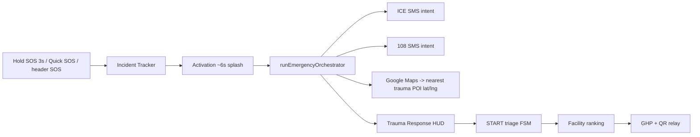
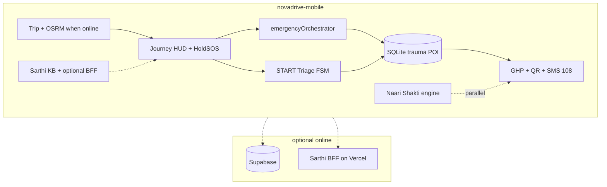
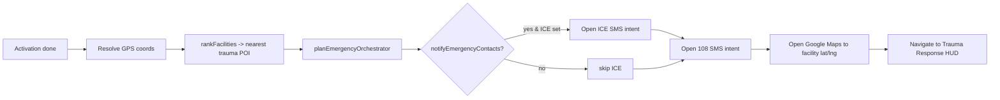
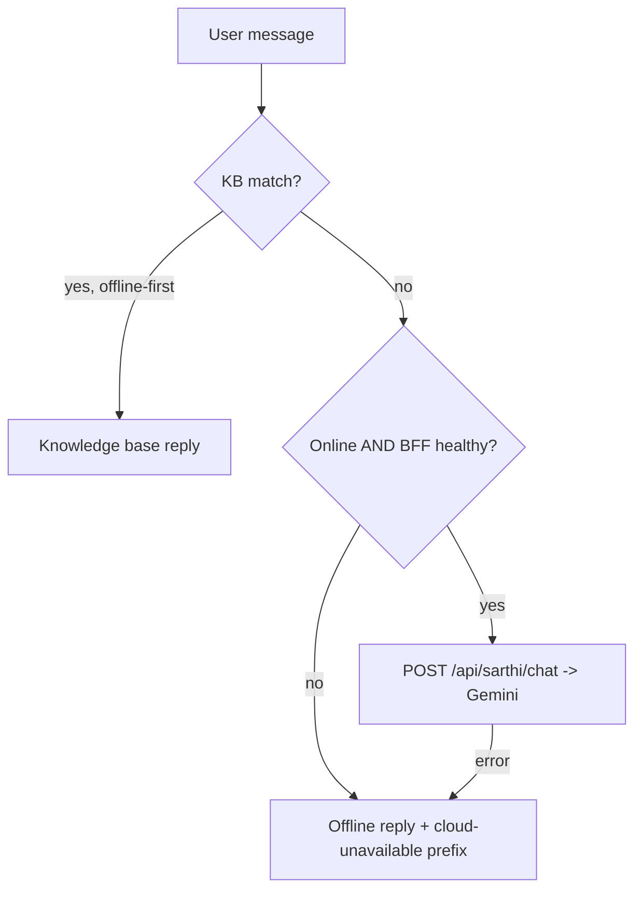
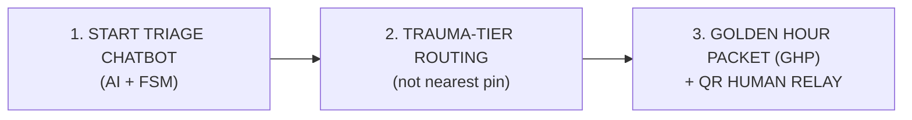
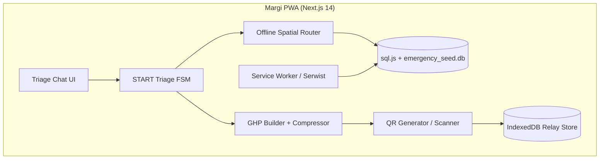
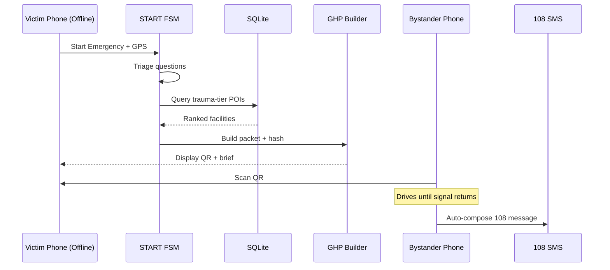

# Margi — Complete Replication Bible

> **This is the master engineering record for Margi.** It captures the *real shipped architecture*, every subsystem, the exact tech stack and versions, environment + deployment, and a full **problem-to-solution engineering log** so the entire project can be **rebuilt from zero** by a human or an AI model. The original aspirational planning brief (PWA vision) is preserved verbatim in **Appendix A** for history.

**Project:** Margi — offline-first Golden Hour road-safety prototype
**Team:** Team NovaDrive · IIT Madras National Road Safety Hackathon 2026 (RoadSoS track, CoERS & RBG Labs / MoRTH)
**Repository:** [github.com/Stormynubee/Margi](https://github.com/Stormynubee/Margi)
**Primary client:** `novadrive-mobile/` — native Expo SDK 54 Android app (`com.margi.app`, `margi://`)
**Optional cloud:** `novadrive/` — Next.js 14 Sarthi AI BFF + web relay (Vercel)
**Brief site (this page):** static HTML built from this file → [roadsafetyhackathon-six.vercel.app](https://roadsafetyhackathon-six.vercel.app)
**Tagline:** *When signal drops, the path still holds. The network failed — the golden hour didn't.*

---

## Table of Contents

1. [What Margi Really Is](#1-what-margi-really-is)
2. [The Two Safety Lanes](#2-the-two-safety-lanes)
3. [Repository Topology](#3-repository-topology)
4. [Complete Tech Stack And Versions](#4-complete-tech-stack-and-versions)
5. [Mobile App Architecture](#5-mobile-app-architecture)
6. [Expo Router Screen Map](#6-expo-router-screen-map)
7. [Core Library Reference](#7-core-library-reference)
8. [START Triage FSM](#8-start-triage-fsm)
9. [Golden Hour Packet GHP](#9-golden-hour-packet-ghp)
10. [Facilities SQLite And Trauma Tier Ranking](#10-facilities-sqlite-and-trauma-tier-ranking)
11. [Emergency Orchestrator](#11-emergency-orchestrator)
12. [Hold SOS Quick SOS And Incident Tracker](#12-hold-sos-quick-sos-and-incident-tracker)
13. [Trauma Response HUD](#13-trauma-response-hud)
14. [Naari Shakti Womens Safety Portal](#14-naari-shakti-womens-safety-portal)
15. [Crash And Distress Voice Engines](#15-crash-and-distress-voice-engines)
16. [Sarthi Assistant Offline And Cloud](#16-sarthi-assistant-offline-and-cloud)
17. [Sarthi BFF Internals](#17-sarthi-bff-internals)
18. [Supabase Backend](#18-supabase-backend)
19. [Web Mirror And Bystander Relay](#19-web-mirror-and-bystander-relay)
20. [Brief Site Build Pipeline](#20-brief-site-build-pipeline)
21. [Environment Variables](#21-environment-variables)
22. [Local Development Setup](#22-local-development-setup)
23. [Deployment Mobile APK](#23-deployment-mobile-apk)
24. [Deployment Sarthi BFF](#24-deployment-sarthi-bff)
25. [Testing Strategy](#25-testing-strategy)
26. [Engineering Problem And Solution Log](#26-engineering-problem-and-solution-log)
27. [Replicate From Scratch Playbook](#27-replicate-from-scratch-playbook)
28. [Honesty Boundaries And Rejected Scope](#28-honesty-boundaries-and-rejected-scope)
29. [Glossary](#29-glossary)
30. [Resources And Links](#30-resources-and-links)

---

## 1. What Margi Really Is

Margi is a **client-heavy, offline-first emergency system** for Indian highway corridors. All medical and routing decisions run **on-device**; the network is an optional enhancement (SMS to 108, Supabase auth, Gemini LLM chat).

| Layer | Reality |
|-------|---------|
| **Primary client** | `novadrive-mobile/` — Expo SDK 54, package `com.margi.app`, version 2.0.0 |
| **Offline core** | START triage FSM → SQLite facility ranking (~50 demo POIs) → Golden Hour Packet → QR (`ND1:` envelope) / SMS composer |
| **Optional online** | Sarthi Gemini BFF (`novadrive/`), Supabase auth + profile + NGO + dispatch audit, OSRM trip routing, HTTP dispatch hooks |
| **Web mirror** | Bystander relay at `/relay`, plus a full web emergency wizard in `novadrive/` |
| **Brief site** | Static HTML at `docs/site/` (this page) deployed as a separate Vercel project |
| **Tests** | 200+ Jest unit tests over lib / FSM / encoders / orchestrator / KB |
| **Judge APK** | GitHub Actions builds `margi-debug.apk` |

**What Margi is NOT** (honesty boundaries — keep these in every pitch):

- Not production emergency medical software — no physician-certified triage, no verified national POI registry, no EMS dispatch guarantee.
- Not a PWA as the primary client — early docs describe a Next.js PWA with sql.js; the **shipped** app is native Expo. (The PWA vision survives as **Appendix A**.)
- Not always-on crash detection — accelerometer heuristics + experimental voice; native crash adapter is stubbed unless a custom dev build is used.
- Not auto-dial — SOS opens the **SMS composer / dialer intent**; the user taps Send / Call (platform policy).

> **Margi provides decision support only. It is not a medical diagnosis. In an emergency, always call 108/112 when possible.**

---

## 2. The Two Safety Lanes

Margi ships **two parallel emergency experiences** that share the offline core.

### Lane A — Golden Hour (road accident SOS)



### Lane B — Naari Shakti (women's safety portal)

Gender-gated (self-reported on device) saffron + navy portal: SMS nearest police station, ICE alert, helpline **181**, hold-to-activate (2s) distress HUD with optional recording, **112** national fallback when far from the demo seed.

| Lane | What the user gets |
|------|--------------------|
| **Golden Hour** | Incident type → activation → automated orchestration (ICE SMS, 108 SMS, nearest trauma POI Maps) → trauma HUD with live incident timer, rear torch, Call ICE FAB, hospital navigation to **facility coords** → START triage → GHP + bystander QR |
| **Naari Shakti** | Gender-gated portal — SMS nearest police station, ICE alert, helpline 181, 2s hold distress with recording, 112 fallback |

---

## 3. Repository Topology

```
roadsafetyhackathon/                  # monorepo root (git: Stormynubee/Margi)
├── novadrive-mobile/                 # PRIMARY — Expo SDK 54 Android app (ship this)
│   ├── app/                          # expo-router screens (tabs, emergency, naari, sarthi...)
│   ├── src/                          # lib, components, hooks, context, theme
│   ├── scripts/                      # APK build, sarthi check, seed gen, gradle patches
│   ├── assets/                       # icon/splash docs + models/
│   ├── app.json / app.config.js      # Expo config
│   ├── babel.config.js               # babel-preset-expo + reanimated plugin
│   ├── jest.config.js                # ts-jest, node env, src roots, *.test.ts
│   ├── tsconfig.json                 # extends expo base, @/* -> ./src/*
│   └── package.json                  # version 2.0.0
├── novadrive/                        # Next.js 14 Sarthi BFF + web relay (Vercel)
│   ├── src/app/                      # web pages + api/sarthi/{health,chat}
│   ├── src/lib/sarthi/aiConfig.ts    # Gemini provider + probe
│   ├── vercel.json                   # separate Vercel project
│   └── package.json
├── docs/                             # judge docs, specs, brief site source
│   ├── CANON.md                      # single source of truth for scope
│   ├── ARCHITECTURE.md               # technical architecture
│   ├── PHASE3_SETUP.md               # Supabase + Sarthi BFF deploy guide
│   ├── MARGI_MASTER_BRIEF.md         # THIS FILE -> builds the brief site
│   └── site/                         # build-docs.js -> index.html (deployed)
├── supabase/migrations/              # profiles, volunteer_providers, dispatch_events + RLS
├── data/corridors/                   # NH-48 POI verification CSV/JSON inputs
├── scripts/                          # Python Overpass ingest + pytest (build-time only)
├── .github/workflows/                # ci.yml, android-apk.yml, poi-ingest.yml
├── vercel.json                       # ROOT project -> static brief site (docs/site)
├── README.md / JUDGE_START_HERE.md / CHANGELOG.md / CONTRIBUTING.md / SECURITY.md
```

**Critical deployment split (the single biggest gotcha):**

| Vercel project | `vercel.json` | Serves | Root directory |
|----------------|---------------|--------|----------------|
| **root** (`roadsafetyhackathon`) | repo-root `vercel.json` | static brief site from `docs/site` | repo root |
| **novadrive** (Sarthi BFF) | `novadrive/vercel.json` | Next.js app with `/api/sarthi/*` and `/relay` | **`novadrive`** |

The brief-site hosts (`roadsafetyhackathon-six.vercel.app`, `margi-tau.vercel.app`) return **404** for `/api/sarthi/health`. Sarthi must point at the separate `novadrive` project (e.g. `novadrive-eta.vercel.app`).

---

## 4. Complete Tech Stack And Versions

### Mobile (`novadrive-mobile/package.json`, version 2.0.0)

| Concern | Package | Version |
|---------|---------|---------|
| Runtime | `expo` | ~54.0.0 |
| React | `react` | 19.1.0 |
| React Native | `react-native` | 0.81.5 |
| Router | `expo-router` | ~6.0.23 |
| Animations | `react-native-reanimated` | ~4.1.1 |
| Worklets | `react-native-worklets` | 0.5.1 |
| Local DB | `expo-sqlite` | ~16.0.10 |
| Camera / torch | `expo-camera` | ~17.0.10 |
| Location | `expo-location` | ~19.0.8 |
| Sensors (crash) | `expo-sensors` | ~15.0.8 |
| Audio (voice) | `expo-audio` | ~1.1.1 |
| Speech (TTS) | `expo-speech` | ~14.0.8 |
| Haptics | `expo-haptics` | ~15.0.8 |
| Crypto (hash) | `expo-crypto` | ~15.0.9 |
| Secure store | `expo-secure-store` | ~15.0.8 |
| Storage | `@react-native-async-storage/async-storage` | 2.2.0 |
| Network state | `@react-native-community/netinfo` | ^11.4.1 |
| Backend SDK | `@supabase/supabase-js` | ^2.106.2 |
| QR | `react-native-qrcode-svg` | ^6.3.21 |
| SVG | `react-native-svg` | 15.12.1 |
| Compression | `lz-string` | ^1.5.0 |
| Icons | `@expo/vector-icons` | ^15.0.2 |
| Fonts | `@expo-google-fonts/hanken-grotesk`, `@expo-google-fonts/public-sans` | — |
| Tests | `jest` ~29.7.0 + `ts-jest` ^29.4.11 | TypeScript ~5.9.2 |

### Cloud BFF (`novadrive/package.json`, version 0.1.0)

| Concern | Package | Version |
|---------|---------|---------|
| Framework | `next` | 14.2.35 |
| React | `react` / `react-dom` | ^18 |
| AI SDK | `ai` | ^6.0.191 |
| Gemini provider | `@ai-sdk/google` | ^3.0.79 |
| OpenAI provider (spare) | `@ai-sdk/openai` | ^3.0.65 |
| QR (web) | `qrcode.react` | ^4.2.0 |
| Compression | `lz-string` | ^1.5.0 |
| Icons | `lucide-react` | ^1.16.0 |
| Styling | `tailwindcss` | ^3.4.1 |

### Build-time data pipeline (`scripts/`)

Python 3 + Overpass API → `emergency_seed.db`; validated by `pytest` in CI (`poi-ingest.yml`). Not bundled into the app at runtime — the mobile app uses an inline seed.

---

## 5. Mobile App Architecture

`novadrive-mobile` is a **client-heavy** app: the offline core never requires a server.



**Conventions**

- **Path alias:** `@/*` → `./src/*` (tsconfig + babel).
- **State:** React Context providers wrap the app in `app/_layout.tsx`: `AppProvider` (journey, triage FSM, GHP, crash, facilities), `SarthiProvider`, `NaariShaktiProvider`, plus `QuickMenuProvider` in `(tabs)/_layout.tsx`.
- **Data boundaries:** auth tokens + relay GHP in **SecureStore**; profile + accessibility in **AsyncStorage**; POI in the **SQLite** file seeded on first launch.
- **TDD discipline:** every `src/lib` module that holds logic ships with a colocated `*.test.ts`.

---

## 6. Expo Router Screen Map

```
app/
  _layout.tsx              # Root: fonts, providers, Stack
  index.tsx / splash.tsx   # Boot + splash
  home.tsx                 # Standalone home (also see (tabs)/explore)
  auth.tsx                 # Supabase sign-in (Guest mode bypasses)
  settings.tsx             # notifyEmergencyContacts toggle, voice sensitivity
  accessibility.tsx medical.tsx emergency-contacts.tsx
  sarthi.tsx               # full-screen Sarthi chat
  scan.tsx                 # bystander QR scanner
  naari-shakti.tsx         # women's portal
  journey.tsx
  (tabs)/
    _layout.tsx            # MargiTabBar + SarthiOverlayBridge + QuickMenuProvider
    explore.tsx            # Home tab (Drive mode, Quick SOS, Naari, brief, Sarthi FAB)
    drive.tsx              # Journey HUD — Hold SOS lives here
    history.tsx            # Community hazards (~5 km), leaderboard
    profile.tsx            # Medical ICE, voice toggle, a11y
  emergency/
    selection.tsx          # incident type picker + cancel-SOS countdown
    activation.tsx         # 6s activation splash + runEmergencyOrchestrator
    locate.tsx             # GPS capture + reverse geocode
    triage.tsx             # START triage FSM UI
    route.tsx              # facility ranking list + Maps navigate
    response.tsx           # trauma HUD: timer, torch, ICE, QR, first aid
    packet.tsx             # GHP QR + relay URL
    relay.tsx              # bystander relay steps + RahVeer claim
  journey/ depart.tsx complete.tsx feedback.tsx
  settings/ journey-history.tsx
  trip/ _layout.tsx plan.tsx discover.tsx
  brief/ [slug].tsx
  rahveer/ index.tsx claim.tsx
  ngo/ index.tsx register.tsx
```

**Canonical emergency flow:** `selection → activation → locate → triage → route → response → packet → relay`.

---

## 7. Core Library Reference

`novadrive-mobile/src/lib/` — the brain of the app.

| Module | Responsibility |
|--------|----------------|
| `startTriageFSM.ts` | START protocol deterministic FSM — `initialState`, `getQuestion`, `applyAnswer` |
| `parseEmergencyText.ts` | offline keyword → FSM slot prefill |
| `facilitiesDb.ts` | `expo-sqlite` seed (`emergency_nodes`) + `rankFacilities(triage, lat, lng)` (Haversine + tier filter) |
| `ghp.ts` | `buildPacket`, `hashPayload`, `formatSms`, `encodeQrPayload`, `encodeQrRelayUrl`, `decodeQrPayload`, `verifyQrDecodedIntegrity` |
| `emergencySms.ts` | ICE + 108 SMS intents, coords resolver (`sos_hold`, `crash_detected` templates) |
| `emergency/emergencyOrchestratorPlan.ts` | `planEmergencyOrchestrator`, `buildMargiIceSmsBody`, `notifyEmergencyContacts` gate |
| `emergency/emergencyOrchestrator.ts` | `runEmergencyOrchestrator` — runs ICE + 108 + Maps in sequence |
| `emergency/holdSosReleaseGrace.ts` | debounce so a quick release does not skip incident picker |
| `emergency/hospitalNavTarget.ts` | resolve Maps destination to the **facility** lat/lng |
| `emergency/dispatchOrchestrator.ts` | optional Supabase `dispatch_events` insert |
| `emergency/incidentCatalog.ts` `incidentElapsed.ts` | incident types + live timer math |
| `emergency/traumaSession.ts` `traumaAssistantOffline.ts` | trauma HUD session + offline first-aid copy |
| `crashEngine.ts` + `crash/crashOrchestrator.ts` `crash/nativeCrashAdapter.ts` | accel + speed fusion (journey-active only); native adapter stubbed |
| `sarthiEngine.ts` | `createThread`, `sendMessage` — offline-first; cloud when online + BFF healthy + not a KB match |
| `sarthiOffline.ts` | offline reply wrapper → knowledge base |
| `sarthi/sarthiKnowledgeBase.ts` | `SARTHI_KB_ENTRIES` pattern-matched offline answers (en/hi/ta) |
| `sarthi/sarthiHealth.ts` | `checkSarthiBffHealth()` — GET `/api/sarthi/health`, requires `geminiReachable` |
| `sarthi/sarthiStrings.ts` `sarthiStatusCopy.ts` | welcome/fallback strings, status chip + connection banner copy |
| `supabase/client.ts` `authSession.ts` `profileSync.ts` | Supabase client (SecureStore auth), session, `profiles` upsert |
| `naariShakti/*` | women's portal engine, stations, SMS, linking actions |
| `voice/*` | distress voice classifier (YAMNet path), default OFF |
| `routing/*` | OSRM + Nominatim trip routing |
| `tts/narrator.ts` | spoken FSM prompts |
| `storage.ts` `types.ts` `brand.ts` `relayChain.ts` `journeyDb.ts` | persistence, types, brand tokens, relay log, journey store |

---

## 8. START Triage FSM

Deterministic finite state machine implementing the international START (Simple Triage And Rapid Treatment) protocol. **The FSM, not the LLM, makes every medical decision.**

### States

`AMBULATORY → BREATHING_CHECK → AIRWAY_REPOSITION → RESPIRATORY_RATE → PERFUSION_CHECK → MENTAL_STATUS → TAGGED`

### Transition rules (do not simplify incorrectly)

| Condition | Result |
|-----------|--------|
| Can walk | **GREEN** → done |
| Not breathing → airway maneuver fails | **BLACK** → done |
| Not breathing → airway maneuver succeeds | → RESPIRATORY_RATE (NOT immediate RED) |
| Respiratory rate > 30/min | **RED** |
| No radial pulse OR capillary refill ≥ 2s | **RED** |
| Cannot follow simple commands | **RED** |
| All checks pass, non-ambulatory | **YELLOW** |

### Interface

```typescript
export type TriageState =
  | 'AMBULATORY' | 'BREATHING_CHECK' | 'AIRWAY_REPOSITION'
  | 'RESPIRATORY_RATE' | 'PERFUSION_CHECK' | 'MENTAL_STATUS' | 'TAGGED';

export interface TriageContext {
  count: number;
  canWalk: boolean;
  breathing: boolean;
  respiratoryRateOver30: boolean;
  capillaryRefillOk: boolean;
  followsCommands: boolean;
  severeBleeding: boolean;
  triageResult: 'RED' | 'YELLOW' | 'GREEN' | 'BLACK';
  stateLog: string[];
}
```

UI: `app/emergency/triage.tsx` drives the FSM via `AppContext.answerTriage`, renders `AnswerChips`, and speaks prompts through `tts/narrator.ts`. Triage color feeds facility ranking.

---

## 9. Golden Hour Packet GHP

A structured, dispatch-ready brief (not raw chat logs). Built in `src/lib/ghp.ts`.

### Schema

```typescript
export interface GoldenHourPacket {
  id: string;                    // UUID-ish
  createdAt: string;             // ISO8601
  triage: 'RED' | 'YELLOW' | 'GREEN' | 'BLACK';
  location: { lat: number; lng: number; landmark?: string; nhCode?: string; nhKm?: number };
  victims: {
    count: number; canWalk: boolean; breathing: boolean;
    severeBleeding: boolean; capillaryRefillOk: boolean; followsCommands: boolean;
  };
  routing: { facilityName: string; facilityType: 'trauma' | 'hospital' | 'clinic';
             phone: string; etaMinutes: number; distanceKm: number };
  emergency: { dial: string; state: string; language: 'en' | 'hi' | 'ta' };
  relayChain: Array<{ at: string; deviceHint: string }>;
  integrity: string;             // SHA-256 hex digest (corruption check, not crypto signing)
}
```

### Encoding and relay

| Step | Method |
|------|--------|
| 1 | Build minimal payload |
| 2 | Compress with `lz-string` |
| 3 | Wrap in the **`ND1:`** envelope for relay URLs (`encodeQrRelayUrl`) |
| 4 | Integrity via SHA-256 (`hashPayload`); `verifyQrDecodedIntegrity` rejects tampered/corrupt packets |
| 5 | If the payload is too large for a reliable QR, the QR carries the minimal `{ id, triage, lat, lng, integrity }` and the full GHP stays on screen + in SecureStore |

### SMS template (English)

```
ROAD EMERGENCY - Margi
Triage: RED | Victims: 1
Location: NH48 km 87 (13.082700, 80.270700)
Injuries: Not walking, breathing, severe bleeding suspected
TAKE TO: Apollo Trauma Center (12 min / 8.4 km)
Call: 108 (Tamil Nadu)
Generated offline via bystander relay.
```

The GHP screen (`app/emergency/packet.tsx`) renders the QR; a bystander scans it (in-app `scan.tsx` or the web `/relay?p=ND1...`), the packet is verified, the relay chain is appended, and an SMS to 108 is composed when signal returns.

---

## 10. Facilities SQLite And Trauma Tier Ranking

`src/lib/facilitiesDb.ts` opens an `expo-sqlite` database (`emergency_seed.db`, table `emergency_nodes`), seeds it on first launch from an inline `SEED[]` (~50 Chennai-corridor POIs) plus a `POI_COORDS` map, then ranks.

### Schema

```sql
CREATE TABLE emergency_nodes (
  id INTEGER PRIMARY KEY,
  name TEXT NOT NULL,
  lat REAL NOT NULL,
  lng REAL NOT NULL,
  type TEXT NOT NULL,            -- hospital | clinic | police | ambulance
  trauma_tier INTEGER NOT NULL,  -- 1 trauma center, 2 hospital ER, 3 clinic
  emergency_phone TEXT,
  nh_corridor TEXT,
  state TEXT,
  verified INTEGER DEFAULT 0,
  verified_at TEXT
);
CREATE INDEX idx_coords ON emergency_nodes(lat, lng);
CREATE INDEX idx_tier ON emergency_nodes(trauma_tier);
```

### `rankFacilities(triage, lat, lng)`

1. Filter by triage-appropriate `trauma_tier` (RED → 1,2 / YELLOW → 2,3 / GREEN → 3).
2. Compute Haversine distance to each candidate.
3. Sort ascending, take top 6, mark the first as `recommended`.
4. Offline ETA fallback: `etaMinutes = (distanceKm / 40) * 60` (40 km/h ambulance average). Online uses OSRM duration.

**Honesty:** the NH48 verified pack is 50 OSM nodes (40 phone-verified) inside the Chennai corridor bbox. Outside it, the app runs **baseline mode** — 108 + GPS + triage, no verified hospital routing until a regional pack ships. Naari uses Chennai demo police stations with 112 national fallback beyond ~150 km. Seed regeneration helper: `scripts/generate-facilities-seed.mjs`.

---

## 11. Emergency Orchestrator

The orchestrator turns one SOS into a coordinated burst of actions. Plan is pure/testable; the runner performs side effects.

- **Plan:** `src/lib/emergency/emergencyOrchestratorPlan.ts` — `planEmergencyOrchestrator()` + `buildMargiIceSmsBody()`.
- **Runner:** `src/lib/emergency/emergencyOrchestrator.ts` — `runEmergencyOrchestrator()`.



- `notifyEmergencyContacts` is a boolean in `UserProfile.settings` (default `true` in `storage.ts`, toggled in `app/settings.tsx`); the plan gates ICE SMS on it.
- Maps navigation targets the **facility** coordinates (`hospitalNavTarget.ts`), not the user's pin — a deliberate fix (see §26).
- Triggered from `app/emergency/activation.tsx` after the countdown.

---

## 12. Hold SOS Quick SOS And Incident Tracker

All SOS entry points share one **intentional** path — no premature SMS before an incident type is chosen.

| Entry | Behavior |
|-------|----------|
| **Hold SOS (3s)** on Drive HUD | `HoldSOSButton.tsx` (haptics + progress ring) opens the Incident Tracker; `holdSosReleaseGrace.ts` prevents accidental skips on quick release |
| **Quick SOS** (Home) | `src/lib/home/quickSos.ts` → Incident Tracker |
| **Header SOS** | same path |

`app/emergency/selection.tsx` is the Incident Tracker (road accident / natural calamity) and includes a cancel-SOS countdown. After selection → `activation.tsx` (≈6s splash) → orchestrator runs.

---

## 13. Trauma Response HUD

`app/emergency/response.tsx` with `src/components/emergency/TraumaResponseActionBar.tsx`.

- **Live incident timer** since SOS (`incidentElapsed.ts`).
- **Rear-flash torch** via `useTorch.ts` (camera permission + `torchOn`) rendered through `TorchCameraLayer.tsx` (a hidden 1×1 `CameraView` with `enableTorch`). The torch logic and the camera layer are deliberately split (see §26).
- **Call ICE** + **Call Center** FABs (`contactActions.ts`).
- **First-aid board** (`FirstAidBoard.tsx`) + offline trauma copy (`traumaAssistantOffline.ts`).
- Sarthi assistant available inline.

---

## 14. Naari Shakti Womens Safety Portal

Gender-gated (self-reported in Medical) women's safety lane with a saturated saffron + navy identity.

- Routes: `app/naari-shakti.tsx`; components under `src/components/naari/*`; logic in `src/lib/naariShakti/*`.
- Actions: SMS nearest police station, ICE alert, helpline **181**, 2s hold-to-activate distress HUD with optional recording.
- **112** national fallback when the user is far from the demo police seed.
- Entry: Medical → set **Female** → Home **NAARI SHAKTI** card → enable portal → Safety Mode → hold Emergency Help 2s.

---

## 15. Crash And Distress Voice Engines

### CrashEngine (`crashEngine.ts`)

Active **only** when `journey.status === ACTIVE`. Heuristic fusion:

1. Peak accelerometer above threshold within a window.
2. Speed before impact > 25 km/h.
3. Speed after < 5 km/h.

Output: a calm **15-second confirmation dialog** (`CrashCandidateModal.tsx`). **No automatic triage or 108 at timer zero** — the user confirms. Native OS crash APIs are stubbed (`crash/nativeCrashAdapter.ts`) unless a custom dev build supplies them.

### Distress voice (`voice/*`)

Optional YAMNet-based distress classifier, **off by default** (sensitivity setting in Profile). Even when triggered, the countdown does **not** auto-open the 108 SMS — fail-safe against false positives. Evaluation: `docs/VOICE_CLASSIFIER_EVAL.md`.

---

## 16. Sarthi Assistant Offline And Cloud

Sarthi is the in-app AI helper. It is **offline-first**: a deterministic knowledge base answers without any network, and the cloud Gemini BFF is an enhancement.

### Decision flow (`src/lib/sarthiEngine.ts`)



- `matchKnowledgeBase()` over `SARTHI_KB_ENTRIES` (crash, fire, trapped, bleeding, not-breathing, SOS, corridor, medical, greeting, help_general, guest_identity...) in en/hi/ta.
- `shouldUseOfflineFirst()` keeps emergency/help intents fully offline even when online.
- When the cloud call fails, `wrapCloudUnavailableReply()` prefixes the offline answer with *"Cloud Sarthi (Gemini) is temporarily unavailable. On-device guidance:"* so it never silently degrades to a generic boilerplate.
- Health gate: `checkSarthiBffHealth()` requires `ok === true` **and** `geminiReachable !== false`. The status chip ("Gemini online" vs "Offline KB") is driven by this real probe, not by "is an API key present".

This offline-first design is exactly why a misconfigured BFF used to show the same canned intro for every message — see the Sarthi entries in §26.

---

## 17. Sarthi BFF Internals

`novadrive/` is a Next.js 14 app. Only two API routes matter.

### `src/lib/sarthi/aiConfig.ts`

- Reads `GOOGLE_GENERATIVE_AI_API_KEY` and **sanitizes a UTF-8 BOM** (`\uFEFF`) and whitespace that CLI env uploads can prepend (`sanitizeGoogleApiKey`).
- Scrubs `process.env` on load so libraries reading the raw var get a clean key.
- Builds the provider explicitly: `createGoogleGenerativeAI({ apiKey })` rather than relying on implicit env reads.
- Model: `process.env.SARTHI_GEMINI_MODEL || 'gemini-2.5-flash'`.
- `probeSarthiGemini()` performs a **real** generation (`system: 'You are Sarthi health check. Reply in one short word.'`, `prompt: 'ping'`, `maxOutputTokens: 64`) and returns `{ ok, error? }` based on whether non-empty text comes back.
- `resolveSarthiModel()` prefers direct Google when a key exists, else falls back to the AI Gateway string model.

### `GET /api/sarthi/health` (`src/app/api/sarthi/health/route.ts`)

Returns `{ ok, service, model, geminiConfigured, geminiReachable, provider, probeError? }`, status 200 only when configured **and** the probe actually reaches Gemini. CORS enabled.

### `POST /api/sarthi/chat` (`src/app/api/sarthi/chat/route.ts`)

- 503 if not configured.
- Builds a system prompt from the context (journey phase, language en/hi/ta, display name, guest vs auth, medical summary, ICE presence, regional protocols) and calls `generateText({ model: resolveSarthiModel(), system, messages, maxOutputTokens: 256 })`.
- Returns `{ reply, actionCard? }` (action card appears when corridor/route is mentioned). CORS enabled.

A local helper `novadrive-mobile/scripts/check-sarthi-bff.cjs` hits both endpoints to validate a deployment from the dev machine.

---

## 18. Supabase Backend

Project `Projectmargi` (`yllcmksndrhlektbjvcu`). Migrations under `supabase/migrations/`.

| Migration | Contents |
|-----------|----------|
| `20260528_phase3_core.sql` | Tables `profiles`, `volunteer_providers`, `dispatch_events`; RLS policies; `handle_new_user()` trigger on `auth.users` |
| `20260528_phase3_security_fix.sql` | Revokes public RPC execution on `handle_new_user()` |

Mobile integration:

- `src/lib/supabase/client.ts` — `createClient` with `expo-secure-store` auth persistence; reads `EXPO_PUBLIC_SUPABASE_URL` + `EXPO_PUBLIC_SUPABASE_ANON_KEY` (use the **publishable** `sb_publishable_...` key, never the secret).
- `profileSync.ts` — `from('profiles')` select/upsert; `authSession.ts` — session helpers.
- `ngo/volunteerProviders.ts` — `from('volunteer_providers')`; set `verified = true` for a demo NGO row.
- `emergency/dispatchOrchestrator.ts` — `from('dispatch_events').insert(...)` audit.
- **Guest mode** bypasses auth entirely so judges never need to sign in.

---

## 19. Web Mirror And Bystander Relay

`novadrive/src/app/` mirrors the emergency flow for laptop demos and, crucially, hosts the **bystander relay**:

- **`/relay`** (`relay/page.tsx`) — decodes a `?p=` query (`ND1:` + lz-string), shows triage + location, and offers Google Maps + SMS-to-108 links. This is the URL embedded in the mobile GHP QR.
- **`/emergency/*`** — a full web wizard (`locate → triage → route → packet → relay`) backed by `lib/session-store.ts`, reusing web copies of `startTriageFSM.ts`, `ghp.ts`, and `facilities.ts`.

---

## 20. Brief Site Build Pipeline

This very page is generated by `docs/site/build-docs.js`:

1. Reads `docs/MARGI_MASTER_BRIEF.md` (this file).
2. Splits out fenced `mermaid` blocks, converts the rest of the markdown to HTML with a small custom parser (headers, tables, lists, code fences, blockquotes, inline code, bold/italic, links, horizontal rules).
3. Generates the sidebar TOC from lines matching `N. [Label](#anchor)`.
4. Writes `docs/site/index.html` and copies `MARGI_MASTER_BRIEF.md` (+ PDF if present) for download.
5. Mermaid renders client-side; a print stylesheet produces a clean PDF via "Save as PDF".

Run locally: `node docs/site/build-docs.js`. Deployed by the **root** Vercel project (`vercel.json`: `buildCommand: node docs/site/build-docs.js`, `outputDirectory: docs/site`).

**Anchor rule:** a heading `## N. Title` becomes id `n-title` (lowercased, punctuation stripped, spaces → hyphens). Keep headings ASCII and punctuation-free so the TOC links resolve.

---

## 21. Environment Variables

Never commit real values. Names only:

### `novadrive-mobile/.env`

| Name | Purpose |
|------|---------|
| `EXPO_PUBLIC_SARTHI_API_URL` | Sarthi BFF origin (the **novadrive** Vercel project, not the brief site) |
| `EXPO_PUBLIC_SUPABASE_URL` | Supabase project URL |
| `EXPO_PUBLIC_SUPABASE_ANON_KEY` | Supabase **publishable** key |
| `EXPO_PUBLIC_TRAUMA_DISPATCH_URL` | optional HTTP dispatch endpoint (trauma) |
| `EXPO_PUBLIC_POLICE_DISPATCH_URL` | optional HTTP dispatch endpoint (police) |

### `novadrive/.env`

| Name | Purpose |
|------|---------|
| `GOOGLE_GENERATIVE_AI_API_KEY` | Google AI Studio key for Gemini (server-side only) |
| `SARTHI_GEMINI_MODEL` | optional model override (default `gemini-2.5-flash`) |
| `AI_GATEWAY_API_KEY` / `VERCEL_OIDC_TOKEN` | optional alternative providers via AI Gateway |

After changing mobile `.env`, restart Metro with `npx expo start --clear` (env is inlined at bundle time).

---

## 22. Local Development Setup

```bash
# Mobile (primary)
cd novadrive-mobile
npm install --legacy-peer-deps
npx expo install react-native-worklets babel-preset-expo
cp .env.example .env            # add Sarthi BFF + Supabase keys (optional)
npm test                        # Jest unit tests
npm run typecheck               # tsc --noEmit
npm run android                 # dev build + Metro (Android Studio JBR on Windows)
# or Expo Go on same Wi-Fi:
npm run start:lan

# Cloud BFF
cd ../novadrive
npm install
npm run dev                     # http://localhost:3000
npm run dev:lan                 # -H 0.0.0.0 -p 3000 for device testing

# Brief site
node docs/site/build-docs.js    # regenerate docs/site/index.html
```

**Recommended SOS demo:** Guest → Trip → Start Driving → calibration → hold SOS 3s → pick incident → activation → trauma response (verify ICE FAB, timer, torch, Maps opens toward the hospital, not the user pin).

---

## 23. Deployment Mobile APK

GitHub Actions `.github/workflows/android-apk.yml`:

- Triggers on `workflow_dispatch` and published `release`.
- Node 20 + Java 17 + Android SDK → `cd novadrive-mobile && npm install` → `expo prebuild --platform android --clean` → `./gradlew assembleDebug`.
- Uploads artifact `margi-debug.apk`; attaches it to the GitHub Release when triggered by a release.

Local APK: `npm run android:apk` (needs JDK 17+; scripts patch the Foojay Gradle resolver and resolve the JDK). Judges install the APK and tap **Continue as Guest**.

---

## 24. Deployment Sarthi BFF

Deploy `novadrive/` as a **separate** Vercel project.

### From GitHub (recommended)

1. Import `Stormynubee/Margi` at vercel.com/new.
2. **Root Directory → `novadrive`** (not repo root).
3. Framework: Next.js (auto).
4. Build & Output Settings: Install `npm install`, Build `npm run build`, **Output Directory empty** (delete any `docs/site` value — that belongs to the brief-site project).
5. Env var `GOOGLE_GENERATIVE_AI_API_KEY` (Production + Preview).
6. Deploy; note the URL.

### From CLI

```powershell
cd novadrive
npm install
npx vercel --prod
# add GOOGLE_GENERATIVE_AI_API_KEY in the dashboard, then redeploy
```

### Verify

```bash
curl https://YOUR-BFF.vercel.app/api/sarthi/health
# expect: { "ok": true, "geminiConfigured": true, "geminiReachable": true, "model": "gemini-2.5-flash" }
node novadrive-mobile/scripts/check-sarthi-bff.cjs https://YOUR-BFF.vercel.app
```

Then set `EXPO_PUBLIC_SARTHI_API_URL` to that URL (no trailing slash) and restart Expo.

---

## 25. Testing Strategy

- **Mobile:** Jest + ts-jest, `testEnvironment: node`, roots in `src/`, pattern `**/*.test.ts` (logic only — no `.tsx` rendering tests). ~72 test files / 200+ cases. Notable clusters: `startTriageFSM`, `ghp`, `facilitiesDb`, `emergencyOrchestrator`, `sarthiEngine`, `sarthiKnowledgeBase`, voice/distress, naariShakti, home/safety brief.
- **Discipline:** TDD for every `src/lib` logic module; keep side effects (intents, navigation, SQLite) behind pure plan functions so they are testable.
- **Docs/branding gates:** `npm run verify:docs`, `npm run verify:branding`.
- **CI (`ci.yml`):** Job 1 mobile typecheck + test + verify gates; Job 2 `novadrive` `next build`; Job 3 build the brief site.
- **POI CI (`poi-ingest.yml`):** Python pytest on `scripts/tests` for any `scripts/**` or `data/**` change.
- **Manual:** `novadrive-mobile/docs/DEVICE_SMOKE_MATRIX.md` (device matrix), optional Maestro flows.

---

## 26. Engineering Problem And Solution Log

This is the institutional memory — every non-trivial bug solved while building Margi, with the real root cause and fix. **Read this before re-touching the relevant subsystem.**

### 26.1 Metro bundling failed on `useTorch.ts` (JSX in a `.ts` file)

- **Symptom:** Android Metro bundling error; torch hook would not compile.
- **Root cause:** JSX (the hidden `CameraView`) lived in a `.ts` file; only `.tsx` may contain JSX.
- **Fix:** split responsibilities — `src/hooks/useTorch.ts` holds permission + `torchOn` logic only; the JSX moved to `src/components/emergency/TorchCameraLayer.tsx`. `TraumaResponseActionBar.tsx` renders the layer. Lesson: keep hooks JSX-free, or use `.tsx`.

### 26.2 SOS stuck on "ADVANCING NOW..." at timer 0

- **Symptom:** Activation countdown reached 0 and froze on "ADVANCING NOW…".
- **Root cause:** navigation was attempted before the router was ready, and the orchestrator ran before navigation, blocking the transition.
- **Fix:** in `app/emergency/activation.tsx`, **navigate first, then run the orchestrator**, and guard navigation with `useRootNavigationState()`. Also corrected the triage type passed to the orchestrator.

### 26.3 Trauma screen crash — `FirstAidBoard` missing

- **Symptom:** opening the trauma response screen crashed.
- **Root cause:** `app/emergency/response.tsx` referenced `FirstAidBoard` without importing it.
- **Fix:** import `FirstAidBoard` from `src/components/emergency/FirstAidBoard.tsx`.

### 26.4 Sarthi returned the same canned reply for every message

- **Symptom:** every message ("how are u", "I need sleep") returned the identical intro/fallback line, while the chip claimed the BFF was online.
- **Root causes (stacked):**
  1. **Health lied** — the old health route returned `ok: true` when the API key merely *existed*, without ever calling Gemini.
  2. **Chat failed silently** — the mobile send path caught BFF errors and fell back to `getFallbackMessage()` (the same boilerplate every time).
  3. **Wrong BFF URL** — the app was pointed at the static brief site (`roadsafetyhackathon-six` / `margi-tau`), which 404s on `/api/sarthi/*`.
- **Fixes:**
  - Health now does a **real Gemini probe** (`probeSarthiGemini`) and returns `geminiReachable`; the mobile health check requires `geminiReachable !== false`.
  - On cloud failure, the offline answer is prefixed with a visible "Cloud Sarthi unavailable" banner instead of silently repeating boilerplate; KB intents stay offline-first by design.
  - `EXPO_PUBLIC_SARTHI_API_URL` points at the dedicated `novadrive` project (e.g. `novadrive-eta.vercel.app`).

### 26.5 Fake "GEMINI BFF ONLINE" chip

- **Symptom:** chip showed online even when Gemini never responded.
- **Root cause:** status was derived from "is a key configured", not from reachability.
- **Fix:** status copy (`sarthiStatusCopy.ts`, `app/sarthi.tsx`) is driven by the real `geminiReachable` probe; chip reads "Gemini online" only when the probe truly succeeds, otherwise "Offline KB".

### 26.6 UTF-8 BOM in the Vercel env key (`character at index 0 has value 65279`)

- **Symptom:** health/chat errored with `... character at index 0 has a value of 65279 ...`.
- **Root cause:** piping the key via PowerShell into `vercel env add` prepended a UTF-8 **BOM** (`\uFEFF`); `@ai-sdk/google` sent it verbatim in the auth header.
- **Fix:** `sanitizeGoogleApiKey()` strips BOM + whitespace, `process.env` is scrubbed on load, and the provider is built explicitly with `createGoogleGenerativeAI({ apiKey: clean })`. Re-added the env without BOM and redeployed.

### 26.7 Gemini quota exceeded on `gemini-2.0-flash`

- **Symptom:** `You exceeded your current quota ... free_tier ... limit: 0, model: gemini-2.0-flash`.
- **Root cause:** the key had no free-tier quota for `gemini-2.0-flash`.
- **Fix:** switched the default model to **`gemini-2.5-flash`** (overridable via `SARTHI_GEMINI_MODEL`), which had availability for the key. Chat then returned real, contextual replies.

### 26.8 Health probe false-negative ("Empty model response" / "Unexpected probe reply: i")

- **Symptom:** chat worked but health reported `geminiReachable: false`.
- **Root cause:** the probe demanded the model echo an exact word with a tiny token budget; `gemini-2.5-flash` returned empty/partial text for the over-constrained prompt.
- **Fix:** relaxed the probe to a short system + `prompt: 'ping'` with `maxOutputTokens: 64`, accepting any non-empty reply as healthy. Health then matched chat reality.

### 26.9 Maps opened to the user's pin instead of the hospital

- **Symptom:** orchestrator's Maps step navigated to the victim location, not the destination hospital.
- **Root cause:** the navigate target used current coords.
- **Fix:** `hospitalNavTarget.ts` resolves the **ranked facility** lat/lng (added lat/lng to the `Facility` type) and Maps opens toward it.

### 26.10 Premature SMS before incident selection / false alerts

- **Symptom:** SMS could fire before the user chose an incident type; voice/crash countdowns risked auto-SMS.
- **Fix:** unified all SOS entries through the Incident Tracker first; added `holdSosReleaseGrace` so a quick release doesn't skip the picker; **disabled voice detection by default**; removed the countdown-0 auto-SMS so the user always confirms.

### 26.11 Documentation drift (PWA vision vs shipped native app)

- **Symptom:** docs described a Next.js PWA + sql.js that was never the shipped client.
- **Fix:** created `docs/CANON.md` as the single source of truth; marked the old brief as historical (now **Appendix A** here); README + this bible describe the real Expo app.

---

## 27. Replicate From Scratch Playbook

To rebuild Margi from zero:

1. **Monorepo:** create `novadrive-mobile/` (Expo), `novadrive/` (Next.js), `docs/`, `supabase/migrations/`, `scripts/`, `.github/workflows/`. Add the **two** `vercel.json` files (root → brief site; `novadrive/` → Next.js).
2. **Mobile scaffold:** `npx create-expo-app` (SDK 54), add expo-router, the dependency set in §4, the `@/*` alias, and `react-native-reanimated/plugin` in babel. Configure `app.json` (`com.margi.app`, `margi://`, camera/location/SMS permissions, plugins).
3. **Offline core first (TDD):** build `startTriageFSM.ts` (§8) → `facilitiesDb.ts` + seed (§10) → `ghp.ts` encoder + integrity (§9), each with `*.test.ts`. This is the demo-critical path; it must work in airplane mode.
4. **SOS path:** `HoldSOSButton` → Incident Tracker (`emergency/selection`) → `activation` (navigate-then-orchestrate, router guard) → `emergencyOrchestratorPlan`/`emergencyOrchestrator` (ICE SMS → 108 SMS → Maps to facility) → trauma HUD (`response.tsx` + `TraumaResponseActionBar` + `useTorch`/`TorchCameraLayer`) → `packet` (QR) → `relay`.
5. **Sarthi:** offline KB (`sarthiKnowledgeBase.ts`) + engine (`sarthiEngine.ts`) offline-first; health gate (`sarthiHealth.ts`) requiring `geminiReachable`. Then the BFF (§17): `aiConfig.ts` (BOM-safe key, explicit provider, `gemini-2.5-flash`), `/api/sarthi/health` (real probe), `/api/sarthi/chat`.
6. **Naari Shakti** (§14), **crash + voice** off-by-default (§15).
7. **Supabase** (§18): apply migrations, wire client with SecureStore, keep Guest mode.
8. **CI/CD** (§23–§25): `ci.yml`, `android-apk.yml`, `poi-ingest.yml`.
9. **Brief site** (§20): write this file; `node docs/site/build-docs.js`; deploy root project.
10. **Wire env** (§21) and verify health endpoints before claiming "online".

**Golden rules learned the hard way:** keep JSX out of `.ts`; navigate before side effects and guard the router; never report a service "online" without probing it; sanitize CLI-uploaded secrets (BOM); pick a model the key actually has quota for; route Maps to the destination, not the origin; never auto-SMS without explicit user confirmation.

---

## 28. Honesty Boundaries And Rejected Scope

| Topic | Demo truth |
|-------|------------|
| POI database | NH48 verified pack (50 OSM nodes, 40 phone-verified) in the Chennai bbox; baseline 108 + GPS + triage elsewhere |
| Naari police | Chennai demo stations; 112 national fallback beyond the seed |
| "production" tag | `v2.0.0-production` = integration milestone, **not** clinical production |
| Sarthi | 31+ offline KB entries; cloud LLM optional |
| Gender | self-reported on device, unverified in P0 |
| Crash/voice | sensor heuristics + experimental voice; no OS crash API in P0; no auto-SMS |

### Deliberately rejected (do not reintroduce without a team vote)

| Rejected idea | Why killed |
|---------------|------------|
| Ultrasonic V2V | browsers block mic without gesture; road noise; unreliable demo |
| BLE / DTN mesh | browsers can't advertise BLE; iOS has no Web Bluetooth |
| Wi-Fi Direct beacons | not available in web/RN-managed APIs |
| Always-on crash audio ML | false positives, privacy, battery, research-grade scope |
| Curvature/anxiety physics engine | wrong problem statement; OSM geometry too sparse |
| Background volunteer GPS | unreliable background tracking; needs gov integration |
| Auto-dial 108 | platform policy; user must tap Send/Call |

**Strategic lesson:** judges score reliable offline triage with valid POI data — not machines chirping at each other. Margi's differentiator is *information surviving dead zones* (GHP + human QR relay).

---

## 29. Glossary

| Term | Meaning |
|------|---------|
| **START** | Simple Triage And Rapid Treatment — accident-scene triage protocol |
| **FSM** | Finite State Machine — deterministic step logic |
| **GHP** | Golden Hour Packet — structured 108-ready emergency brief |
| **ND1:** | Margi relay payload envelope (lz-string compressed) carried in QR / `/relay?p=` |
| **trauma_tier** | hospital capability: 1 trauma center, 2 hospital ER, 3 clinic |
| **Haversine** | great-circle distance between two GPS points |
| **ICE** | In Case of Emergency contact |
| **108 / 112 / 181** | India ambulance / unified emergency / women's helpline |
| **Naari Shakti** | Margi's women's safety lane |
| **BFF** | Backend-For-Frontend — the `novadrive` Next.js server fronting Gemini |
| **Sarthi** | Margi's in-app AI assistant (offline KB + optional Gemini) |
| **OSRM** | Open Source Routing Machine — road ETA |
| **RLS** | Row Level Security (Supabase/Postgres) |
| **Golden hour** | first ~60 minutes after trauma — survival-critical |
| **RoadSoS** | the hackathon problem statement — emergency services access |
| **CoERS** | Centre of Excellence for Road Safety, IIT Madras |

---

## 30. Resources And Links

| Resource | Link |
|----------|------|
| GitHub repo | https://github.com/Stormynubee/Margi |
| Live brief site (this page) | https://roadsafetyhackathon-six.vercel.app |
| Android APK workflow | https://github.com/Stormynubee/Margi/actions/workflows/android-apk.yml |
| Google AI Studio (Gemini key) | https://aistudio.google.com/apikey |
| CoERS event | https://coers.iitm.ac.in/event/national-road-safety-hackathon-2026/ |
| Unstop (Indian track) | https://unstop.com/hackathons/road-safety-hackathon-2026-iit-madras-1680515 |
| OpenStreetMap / Overpass | https://www.openstreetmap.org · https://overpass-api.de |
| OSRM demo | http://router.project-osrm.org |
| START reference | https://en.wikipedia.org/wiki/Simple_triage_and_rapid_treatment |

In-repo: `docs/CANON.md` (scope truth), `docs/ARCHITECTURE.md`, `docs/PHASE3_SETUP.md`, `JUDGE_START_HERE.md`, `docs/SUBMISSION.md`, `novadrive-mobile/README.md`, `novadrive-mobile/docs/DEVICE_SMOKE_MATRIX.md`.

---

## Appendix A — Original Planning Brief (Historical PWA Vision)

> The content below is the **original aspirational brief**. Margi shipped as a **native Expo Android app**, not the Next.js PWA + sql.js described here. Sections 1–30 above are canonical. This appendix is retained for learning and provenance — it documents the architecture we explored, the reasoning, and the rejected sensor-mesh path.

### A.1 Core innovation (three pillars)



The three pillars (offline START triage, capability-based trauma-tier routing, and the GHP carried through dead zones by a human QR relay) survived from this vision into the shipped app — only the delivery platform changed from PWA to native Expo.

### A.2 Original PWA system architecture



In the shipped app: Next.js PWA → Expo Router native; `sql.js` → `expo-sqlite`; IndexedDB relay → SecureStore + `/relay`; Serwist service worker → native offline (assets bundled in the APK); Web Speech API → `expo-speech` + optional YAMNet voice.

### A.3 Original build-time data pipeline

```
OpenStreetMap -> Overpass API (nwr: hospitals, clinics, police, ambulance)
  -> ingestCorridors.py (parse names/phones/types, assign trauma_tier, tag corridor/state, manual verify CSV)
  -> emergency_seed.db -> bundled + submitted
```

This pipeline still exists under `scripts/` (validated by `poi-ingest.yml`) and produces the verified NH48 pack, but the **runtime** app uses an inline seed in `facilitiesDb.ts` rather than loading the built DB file.

### A.4 Original full runtime sequence



---

*End of Margi — Complete Replication Bible · Team NovaDrive · CoERS Road Safety Hackathon 2026.*
*Maintainer note: `docs/CANON.md` wins on any scope dispute. Update the Problem and Solution Log (Section 26) whenever a non-trivial bug is fixed, and rebuild the brief site with `node docs/site/build-docs.js`.*
