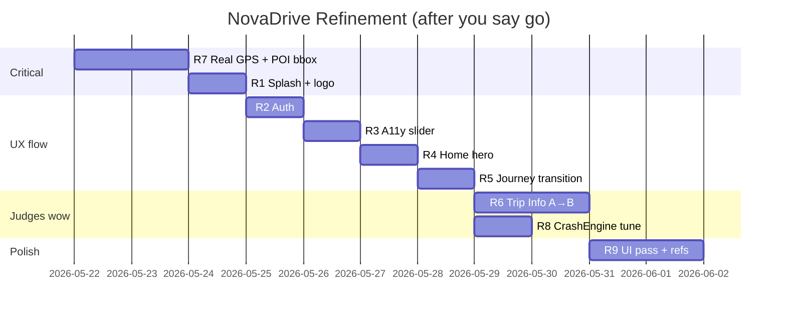

# NovaDrive — Refinement & Polish Implementation Plan

> **Status:** Design / planning only — **do not code until you say `go` or `continue`**  
> **Audience:** Product owner + full hackathon team  
> **Builds on:** P0 shipped (`novadrive-mobile/`, Expo SDK 54)  
> **Design skills applied:** Brainstorming (scope + trade-offs), Night-Highway HUD, frontend-design (motion, typography, depth)

---

## 0. Executive summary

P0 proved the **medical spine** (START FSM, GHP, QR relay, airplane mode). This plan covers **refinement**: brand splash, auth/accessibility UX, a real **Happy Journey** home, journey **transition**, **Trip Info (A→B)** for judges, **real GPS + sensible routing distances**, **CrashEngine tuning**, and a cohesive UI pass.

**Explicitly out of this pass (unless you reprioritize):**
- Always-on **scream / voice crash detection** — rejected in master plan (battery, privacy, false positives). See §8.
- Production Supabase auth backend — stub only.
- NGO marketplace, OS crash APIs — P2.

**Logo:** We can ship a **vector logo in-app** (SVG via `react-native-svg`) without Anti-Gravity. For a **marketing-grade** logo asset (PNG for slides), use Anti-Gravity / Gemini in parallel — optional, not blocking app work.

---

## 1. Your feedback → mapped work

| # | Your ask | Root cause today | Plan phase |
|---|----------|------------------|------------|
| 1 | Splash: logo popup, tagline, Get Started, improvise | Text-only splash, no motion/brand mark | **R1** |
| 2 | Sign-in: real email + Login; accessibility **slider** for text size | “Email optional” + toggle not slider | **R2, R3** |
| 3 | “Happy Journey” should feel great; Start Journey → **transition** → HUD | Plain home + abrupt navigation | **R4, R5** |
| 4 | Trip info A→B (trauma, zones, contacts, precautions) + chatbot retrieval | P1 was deferred; not built | **R6** |
| 5 | Real location, not “Chennai demo”; facilities not 800 km away | Hardcoded NH48 landmark; POI DB seeded only around Chennai | **R7** |
| 6 | UI inspiration / reference images; responsive polish | Minimal components, no design system beyond tokens | **R9** |
| 7 | Scream on loud sound; crash on phone throw | Scream not implemented (by design); CrashEngine thresholds too strict for hand-drop | **R8** (+ honesty on scream) |
| 8 | Replay full onboarding from splash | Already added “Replay onboarding” on home | **Keep** (verify in R4) |

---

## 2. Design direction (locked for refinement)

**Aesthetic:** Night-Highway HUD — calm, not panic. Navy `#0B1220`, amber actions, cyan for “online/live,” no purple-gradient AI slop.

**Motion:** One hero moment per flow (splash reveal, journey handoff). Respect `reduceMotion` from accessibility prefs.

**Typography:** Add **Expo Google Fonts** (recommendation):
- Display: **Barlow Condensed** or **DM Sans** (bold) for logo/wordmark
- Body: **DM Sans** / **Source Sans 3**
- Monospace GHP: **JetBrains Mono**

**Logo concept (in-app SVG, implementable without external tools):**
- Mark: stylized **highway lane** + **pulse node** (golden minute dot) inside a shield/hex
- Wordmark: **Nova** (white) + **Drive** (amber)
- 2s scale + fade-in on splash (Reanimated)

*If you prefer a designed PNG:* run Anti-Gravity prompt: *“Minimal app icon, highway emergency co-pilot, navy and amber, flat vector, no text”* → drop into `assets/icon.png` + splash.

---

## 3. Phase R1 — Splash screen (brand entrance)

### 3.1 Experience (improvised copy)

**Sequence (≈2.5s before button enabled):**

1. **0–0.8s:** Logo mark scales in (spring), subtle glow ring (amber, low opacity)
2. **0.8–1.4s:** Wordmark “NovaDrive” fades up
3. **1.4–2.0s:** Tagline: *“Signal drops. The critical minute doesn’t.”*
4. **2.0s+:** Grey supporting line (smaller): *“Offline triage · trauma routing · QR relay for 108”*
5. **Get started** button fades in (primary amber)

### 3.2 Implementation

| File | Change |
|------|--------|
| `app/splash.tsx` | Reanimated sequence; use `NovaLogo` component |
| `src/components/NovaLogo.tsx` | **New** — SVG mark + optional wordmark |
| `assets/` | Optional `splash-icon.png` if you supply external logo |

### 3.3 Acceptance

- [ ] First launch feels like a **product**, not a debug screen
- [ ] `reduceMotion` skips animations, shows static layout immediately
- [ ] Get started still routes to `/auth`

---

## 4. Phase R2 — Sign-in (email + Login)

### 4.1 UX

- Single **Email** field (required format, not “optional”)
- Primary: **Continue with email** (stores email in profile; Supabase hook later)
- Secondary: **Continue as Guest (demo)** — for judges
- Remove confusing duplicate “Continue” without label
- Footer: *“No password stored on device.”*

### 4.2 Acceptance

- [ ] Empty email → inline validation on Login path
- [ ] Guest path still one tap for demos

---

## 5. Phase R3 — Accessibility (text size slider)

### 3.1 UX

Replace boolean “Larger text” with a **slider** (e.g. 100% → 145%):
- Label: *Text size*
- Live preview sample line: *“Can the injured person walk?”*
- Persist `fontScale` in profile (`a11y.fontScale: number`)
- `ScreenShell` applies `fontSize * fontScale` globally

### 3.2 Acceptance

- [ ] Slider moves smoothly; all screens respect scale
- [ ] High contrast toggle unchanged

---

## 6. Phase R4 — Home (“Happy Journey”) hero

### 6.1 UX (improvised)

Not a plain title — a **dashboard welcome**:

- Top: small Nova mark + time-of-day greeting (*Good evening, Guest*)
- Hero card: *“Ready for the highway?”* subcopy on golden hour + offline
- Large **Start journey** CTA
- Secondary row: Emergency · Scan QR
- Tertiary: Replay onboarding (existing)
- Optional chip: last journey status / POI count in region

### 6.2 Acceptance

- [ ] Feels like “cab app home” quality, still calm (not Ola clone)
- [ ] Start journey does **not** start GPS yet — only after transition (R5)

---

## 7. Phase R5 — Journey transition → HUD

### 7.1 Flow

```
Home [Start journey]
  → /journey/depart (new transition screen, 1.2–1.8s)
      - “Starting journey…”
      - Route line animates (optional A→B if set in R6)
      - Progress bar
  → /journey (HUD, auto-start GPS + CrashEngine)
```

### 7.2 Implementation

| File | Change |
|------|--------|
| `app/journey/depart.tsx` | **New** — Reanimated transition |
| `app/home.tsx` | Navigate to `depart` not `journey` |
| `app/journey.tsx` | On mount: call `startJourney()` if not ACTIVE |

Use `react-native-reanimated` (already installed). Fade + slide up; respect `reduceMotion`.

### 7.3 Acceptance

- [ ] Visible handoff; judges understand “journey mode engaged”
- [ ] Location permission requested on HUD entry (or on depart — pick one, document in README)

---

## 8. Phase R6 — Trip Info (A → B) — P1 promoted for hackathon

This is the **Ola/Uber-style corridor briefing** you asked for. Fits RoadSoS “location-based services” strongly.

### 8.1 UX

New screen: **`/trip/plan`** (reachable from Home before Start journey)

| Field | Behavior |
|-------|----------|
| Point A | Default = current GPS; editable search placeholder |
| Point B | Text / preset corridors (e.g. Chennai → Trichy) |
| **Plan trip** | Builds corridor briefing |

**Briefing cards (scroll):**

1. **Route summary** — distance, est. drive time (Haversine/OSRM optional online)
2. **Trauma centers en route** — top 3 from SQLite bbox along polyline
3. **Accident-prone zones** — from seed table `corridor_hazards` (new)
4. **Low-network zones** — from seed `dead_zones`
5. **Precautions** — static + keyword rules (rain, night, NH48)
6. **Emergency contacts** — 108, nearest verified hospital phone

**Chatbot tie-in (hackathon-safe P0.5):**
- Same text field as emergency: *“Ask about this route”*
- Offline: keyword → pull matching cards (no hallucination)
- Online (optional): Groq slot-fill → **only** selects which cards to show; text from DB

### 8.2 Data model (SQLite additions)

```sql
corridor_hazards (id, name, lat, lng, severity, nh_code, note);
dead_zones (id, name, lat, lng, radius_km, note);
```

Seed from team CSV or simplified OSM Overpass in `ingestCorridors.py`.

### 8.3 Acceptance

- [ ] A→B shows **at least 4 card types** with real copy (not lorem)
- [ ] Offline works after one plan (cached in AsyncStorage)
- [ ] Judges hear: “Trip intelligence before the crash”

---

## 9. Phase R7 — Real location & sane routing (fix 800 km bug)

### 9.1 Problems

1. `locate.tsx` forces `landmark: 'Chennai–Trichy corridor (demo)'` and NH48 km 87  
2. POI database centers on **Chennai** (~13.08, 80.27). If you are elsewhere (e.g. North India), Haversine returns **hundreds of km** — correct math, wrong data.

### 9.2 Fixes

| Fix | Detail |
|-----|--------|
| **A. Real reverse geocode** | Use `expo-location` reverse geocode OR offline NH lookup table for landmark line |
| **B. Remove demo strings** | Show city/district from geocode; only show NH km if matched |
| **C. Bbox filter** | `rankFacilities(triage, lat, lng)` → only POIs within **100 km** (configurable); if none, show honest message + 108 |
| **D. Regional POI seed** | Run `ingestCorridors.py` for **user’s state** OR download bbox from Overpass on first online launch (P1.5) |
| **E. Cap display** | Never show facility > 150 km without warning: *“Outside offline pack — verify by phone”* |

### 9.3 Acceptance

- [ ] Capture location shows **your real lat/lng** and a sensible place name
- [ ] Nearest facility **&lt; 50 km** when POIs exist in region OR clear “expand offline map” message
- [ ] Emergency flow still works in airplane mode after GPS fix cached

---

## 10. Phase R8 — CrashEngine & “scream” (honest scope)

### 10.1 Scream / loud voice — **not in default scope**

| Approach | Verdict |
|----------|---------|
| Always-on mic + scream ML | **Rejected** — battery, privacy, false positives at highway speeds |
| Push-to-talk “I need help” | **P1** — optional, maps to SOS prefill |
| Crash = accelerometer + speed | **Keep** — honest for hackathon |

**Slide line:** *“We don’t listen to screams 24/7; we detect kinematic crash signatures during journey mode.”*

If you **insist** on sound for demo: **P1.5 optional** — 3-second recording on SOS hold only, keyword “help” offline — **not** auto crash.

### 10.2 Why phone throw doesn’t trigger crash

Current rules require **all** of:
- Speed before **> 25 km/h** (GPS while driving)
- Accel peak **> ~2.8g**
- Speed after **< 5 km/h**

Dropping phone on sofa: speed ≈ 0, no driving context → **by design no crash**.

### 10.3 Tuning plan (journey ACTIVE)

| Mode | Threshold | Use |
|------|-----------|-----|
| **Driving** | Keep speed gate 25 → 5 km/h | Real highway |
| **Dev / judge** | **Simulate crash** button | Guaranteed demo |
| **Sensitivity** (settings) | “High” lowers accel to ~2.0g; optional **drop test** profile: speed gate off, accel only — **lab only** |

Add **bump counter** in dev overlay: show last accel peak for tuning sessions.

### 10.4 Acceptance

- [ ] Simulate crash → calm dialog → user confirms → SOS path
- [ ] On a slow drive test OR shake table: document expected behavior in README
- [ ] No auto-dial / auto-triage at 15s zero

---

## 11. Phase R9 — UI polish pass (reference images)

### 11.1 Process

1. You share **reference images** (cab apps, medical, dark HUD) in team chat or `docs/design/refs/`
2. We extract: spacing, card radius, icon style, CTA hierarchy
3. Apply via shared components (not one-off screens)

### 11.2 Component upgrades

| Component | Polish |
|-----------|--------|
| `NovaButton` | Press scale, haptic light |
| `ScreenShell` | Optional hero header image / gradient top |
| `FacilityCard` | Distance badge, verified chip, tier icon |
| `ProgressRail` | Animated step indicator |
| `DispatchCard` | GHP monospace panel + copy button |
| Tabular nums on speed HUD | Already partial |

### 11.3 Responsive / devices

- Test **small Android** (5.5") and **large** (6.7")
- Safe area insets on all screens
- Min touch 48dp (already rule — audit)

---

## 12. Recommended build order



**Why R7 first:** Wrong distances undermine trust before any UI polish.

---

## 13. Files touched (estimate)

| Area | New | Modified |
|------|-----|----------|
| Splash / brand | `NovaLogo.tsx` | `splash.tsx` |
| Auth / a11y | — | `auth.tsx`, `accessibility.tsx`, `ScreenShell.tsx` |
| Home / journey | `journey/depart.tsx`, `trip/plan.tsx` | `home.tsx`, `journey.tsx` |
| Location / POI | `geocode.ts`, hazard seeds | `locate.tsx`, `facilitiesDb.ts`, `ingestCorridors.py` |
| Trip / chat | `tripBriefing.ts`, `parseTripQuery.ts` | `AppContext.tsx` |
| Crash | `crashEngine.ts` | settings or dev overlay |
| Design | `docs/design/refs/` | theme, components |

---

## 14. What we need from you before `go`

1. **Reference images** dropped in repo or linked (even 3 screenshots)
2. **Logo choice:** in-app SVG (fast) vs external PNG (Anti-Gravity)
3. **Your region** for POI seed priority (state/highway) — fixes 800 km locally
4. **Trip Info priority:** full R6 for hackathon or slim (cards with static NH48 demo corridor only)?
5. **Scream:** confirm **reject** for May submission vs P1.5 push-to-talk only

---

## 15. Acceptance for entire refinement sprint

- [ ] Full onboarding replay: splash animation → auth → medical → a11y slider → home hero
- [ ] Start journey → transition → HUD
- [ ] Trip plan A→B shows corridor cards (if R6 in scope)
- [ ] Real GPS; nearest facility distance believable
- [ ] Airplane mode test still passes
- [ ] `npm test` FSM tests still pass
- [ ] 90s demo script updated in `docs/SUBMISSION.md`

---

## 16. How to proceed

Reply **`go`** or **`continue`** to start implementation (recommended order §12).  
Reply with **reference images + answers to §14** to lock design before coding.

If you want a **slimmer hackathon cut** (skip R6 trip cards, only R1+R4+R5+R7+R8), say **`go slim`** and we implement phases R1, R2, R3, R4, R5, R7, R8 only (~4–5 days).

---

*NovaDrive · Refinement plan v1 · May 2026*
