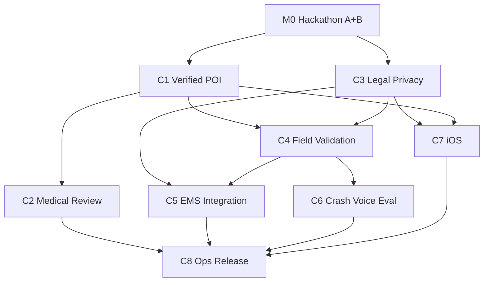

# Margi Phase C — Production Path Design Spec

**Date:** 2026-05-29  
**Status:** Approved for planning (post Phase A Judge bullet + Phase B honest research prototype)  
**Approved:** 2026-05-30 — Approach A (foundation-first); **no EMS sandbox/LOI** (SMS + fail-closed HTTP stubs through month 6)  
**Horizon:** 6–10 months after hackathon submission  
**Canonical baseline:** [docs/CANON.md](../../CANON.md)

---

## 1. Purpose

Phase C defines the **months-scale path** from Margi’s current **offline-first Golden Hour research prototype** (Expo Android, ~50 demo POIs, experimental crash/voice, optional Supabase/Sarthi BFF) toward **operationally honest field deployment** on Indian highway corridors—without relabeling the hackathon build as clinical production software.

Phase C is **not** a single release. It is an ordered portfolio of sub-projects with explicit success criteria, dependency edges, and honesty boundaries inherited from CANON.

---

## 2. Current state (post Phases A & B)

| Area | Shipped reality |
|------|-----------------|
| **Client** | `novadrive-mobile/` — Expo SDK 54, `com.margi.app`, judge APK CI green |
| **Offline core** | START FSM → SQLite rank → GHP → QR/SMS composer |
| **POI data** | ~11 curated Chennai/NH48 names + synthetic padding via `scripts/ingestCorridors.py`; `POI_DATA_VERIFIED` is hand-curated date |
| **Medical** | START implemented; physician sign-off **pending** ([START_TRIAGE_MEDICAL_REVIEW.md](../../START_TRIAGE_MEDICAL_REVIEW.md)) |
| **Field validation** | Template only; **zero completed sessions** ([FIELD_TEST.md](../../FIELD_TEST.md)) |
| **EMS / dispatch** | HTTP POST adapters + Supabase `dispatch_events` audit; env URLs required; **no 108 API partnership** |
| **Online optional** | Supabase auth/NGO (`20260528_phase3_core.sql`), Sarthi Gemini BFF on Vercel |
| **Crash / voice** | Sensor fusion + experimental voice pipeline; native crash adapter needs dev build; voice eval plan unfilled ([VOICE_CLASSIFIER_EVAL.md](../../VOICE_CLASSIFIER_EVAL.md)) |
| **iOS** | Not shipped; Android-first |
| **Tests / smoke** | 183 unit tests; Maestro flows documented, not CI-blocking |
| **Truth narrative** | CANON + archive index; `v2.0.0-production` = integration milestone tag only |

---

## 3. What “production path” means (CANON-aligned)

**Production path** = credible, verifiable progress toward **field-deployable Golden Hour decision support** on defined corridors, with language that never exceeds evidence.

| Claim tier | Allowed when |
|------------|--------------|
| **Research prototype** (current) | Demo POI seed, pending medical review, experimental sensors |
| **Field pilot candidate** | One corridor pack with ≥80% phone-verified trauma-tier POIs, ≥1 signed field session in FIELD_TEST.md, legal/privacy baseline published |
| **Operational pilot** | Physician-reviewed START sign-off, EMS dispatch MoU or sandbox API, ≥3 field sessions with redacted artifacts, crash/voice labeled with measured FPR or disabled by default |
| **Production emergency software** | **Out of Phase C scope** — requires regulatory/clinical pathways beyond this repo |

Margi must **never** silently upgrade claim tier. Each tier change updates CANON honesty table and release notes.

---

## 4. Strategic approaches (2–3 options)

### Approach A — Foundation-first (Data + Trust Lane) **← Recommended**

**Order:** Verified POI pipeline → legal/privacy baseline → medical governance → structured field validation → EMS partnership → native crash/voice hardening → iOS → ops/release.

| Pros | Cons |
|------|------|
| Closes largest credibility gap (demo POI padding) first | Slower “hero feature” demos for partners |
| Field tests produce meaningful metrics once data is real | EMS integration waits until month 4+ |
| Aligns with CANON honesty boundaries | Requires disciplined manual verification labor |
| Reduces liability before widening platform (iOS) | |

**Why recommended:** Judges and partners already see a working Golden Hour flow; the blocker to “pilot candidate” is **data truth**, not UI. `ingestCorridors.py` and `facilitiesDb.ts` provide hooks; synthetic padding must be eliminated before field or EMS work earns trust.

---

### Approach B — Partner-led (EMS-first Lane)

**Order:** Pursue Tamil Nadu 108 / GVK EMRI sandbox → build dispatch around live API → retrofit POI and triage to match EMS payloads.

| Pros | Cons |
|------|------|
| High-impact narrative if partnership lands | Partner timelines are unpredictable (months of bureaucracy) |
| Dispatch demo becomes “real” quickly | Routing users to unverified POIs undermines EMS integration |
| May unlock gov co-funding | Fail-closed UX without partners looks like regression |

**When to use:** Only if a **signed LOI or sandbox credentials** exist before Phase C month 1. Otherwise defer to Approach A.

---

### Approach C — Platform breadth (Parallel Android + iOS + ML)

**Order:** iOS build + App Store prep in parallel with native crash adapter and YAMNet eval while POI/medical lag.

| Pros | Cons |
|------|------|
| Broader device coverage for demos | Spreads small team across three hard problems |
| Apple audiences for hackathon follow-on | iOS SMS limitations increase support burden |
| ML metrics impress technically | Unverified POI on second platform **doubles** credibility risk |

**When to use:** After C1 (POI) and C3 (legal) reach pilot-candidate bar—target month 5+ as **C7 iOS**, not parallel month 1.

---

### Recommendation summary

Adopt **Approach A (Foundation-first)** with **narrow parallel tracks**:

- **Month 1–3 (critical path):** C1 Verified POI Pipeline + C3 Legal/Privacy baseline  
- **Month 2–4:** C2 Medical governance (starts when POI trauma-tier rubric is stable)  
- **Month 2–5:** C4 Field validation (starts after C1 delivers first verified corridor pack)  
- **Month 4–8:** C5 EMS integration (partner-dependent)  
- **Month 3–6:** C6 Native crash + voice ML eval (evidence-gated; default-off if FPR too high)  
- **Month 5–8:** C7 iOS  
- **Month 6–10:** C8 Production ops (monitoring, release train, incident response)

---

## 5. Sub-project decomposition

### C1 — Verified POI Pipeline (Months 1–3) **First 90-day slice**

**Goal:** Replace demo padding with **corridor packs** built from OSM ingest + human phone verification + documented trauma-tier rubric.

**Deliverables:**

- Extended `scripts/ingestCorridors.py` (police, clinics, bbox presets, no silent synthetic pad in `production` mode)
- `scripts/verify_pois.py` + CSV merge workflow (`data/corridors/nh48_verification.csv`)
- `docs/POI_VERIFICATION_RUNBOOK.md` (verifier instructions, call script, tier assignment rules)
- Generated `data/emergency_seed.db` + optional bundled asset for app
- App reads bundled seed or OTA pack manifest (future); updates `POI_DATA_VERIFIED` only when verification CSV confirms ≥80% phones checked
- Unit tests for ingest schema + merge logic

**Success criteria (C1 complete):**

- NH48 Chennai→Chengalpattu pack: **≥50 nodes**, **≥40 phone-verified**, **0 synthetic `pad-*` ids**
- Trauma-tier assignments documented per facility with source (phone call / hospital website / OSM tag)
- CANON honesty row updated: POI database describes verified corridor pack, not “demo padding”
- `npm test` green; ingest CI validates schema on PR

---

### C2 — Medical & Clinical Governance (Months 2–4)

**Goal:** Obtain documented review of START FSM mapping and in-app disclaimers.

**Deliverables:**

- Completed sign-off table in [START_TRIAGE_MEDICAL_REVIEW.md](../../START_TRIAGE_MEDICAL_REVIEW.md)
- FSM diff report if reviewer requests changes
- Updated activation/triage disclaimer copy (no “physician-certified” unless signed)
- Optional NDRF first-aid curriculum crosswalk appendix

**Success criteria:**

- At least one row filled: Emergency physician **or** certified trauma/first-aid trainer, dated signature
- SUBMISSION.md and JUDGE_START_HERE.md reference signed status accurately
- No marketing language exceeds sign-off scope

**Dependencies:** C1 stable enough that facility recommendations in review scenarios match verified POIs.

---

### C3 — Legal & Privacy Baseline (Months 1–3)

**Goal:** Publish privacy policy, data-flow diagram, and DPDP-aware retention rules before field pilot.

**Deliverables:**

- `docs/legal/PRIVACY.md` + `docs/legal/DATA_RETENTION.md`
- Supabase RLS review checklist (profiles, dispatch_events, volunteer_providers)
- GHP/relay data minimization statement (what leaves device, what BFF logs)
- In-app link to privacy policy on onboarding

**Success criteria:**

- Written policy covers: location, medical profile JSON, dispatch audit payloads, Sarthi chat (if online)
- Explicit **no auto-dial** and **user-initiated SMS** language
- Team sign-off from IIT Madras RoadSoS faculty advisor or designated legal reviewer

**Dependencies:** None for draft; final sign-off can parallel C1.

---

### C4 — Field Validation Program (Months 2–5)

**Goal:** Structured highway sessions with redacted artifacts in FIELD_TEST.md.

**Deliverables:**

- ≥3 completed FIELD_TEST.md sessions (NH48 preferred)
- CrashEngine false-positive log template
- Maestro or manual matrix rows tied to session builds
- Summary metrics: GPS accuracy, offline GHP success rate, SOS composer open rate

**Success criteria:**

- At least **1 session** on verified C1 corridor pack build
- Documented false-positive rate for crash heuristic (count/modal fires per hour)
- Screenshots stored in team drive with PII redaction checklist

**Dependencies:** C1 first verified pack; C3 privacy baseline before collecting tester names in repo.

---

### C5 — EMS & Dispatch Integration (Months 4–8)

**Goal:** Move from configurable HTTP stubs to **authorized** dispatch path while preserving fail-closed UX.

**Deliverables:**

- Partner API spec document (`docs/EMS_INTEGRATION.md`)
- Hardened `dispatchAdapters.ts` (timeouts, retries, idempotency keys)
- Supabase `dispatch_events` retention policy
- Sandbox demo with mock 108 server for CI

**Success criteria:**

- Signed MoU **or** sandbox credentials with test environment
- End-to-end demo: auto-dispatch returns real-shaped JSON from partner sandbox
- CANON updated: dispatch described as “pilot integration,” not “guaranteed EMS response”

**Dependencies:** C3 legal; partner engagement (Approach B gate); C4 field signal for priority.

---

### C6 — Native Crash & Voice ML Evaluation (Months 3–6)

**Goal:** Evidence-based decision on crash/voice features—ship, gate, or default-off.

**Deliverables:**

- Android dev-client native crash adapter merged per Phase 3 design
- 50-clip eval per [VOICE_CLASSIFIER_EVAL.md](../../VOICE_CLASSIFIER_EVAL.md)
- Published confusion matrix in VOICE_CLASSIFIER_EVAL.md (no empty metrics)
- Profile toggle defaults: **off** until precision ≥0.85 on highway-noise negatives

**Success criteria:**

- Native crash source badge shows `OS` | `Sensors` | `Manual` in field build
- Voice: documented precision/recall/FPR OR feature flagged `experimental-disabled`
- DEVICE_SMOKE_MATRIX rows 23–26 executed on physical device

**Dependencies:** C4 for highway noise clips; dev build pipeline from Phase A APK CI patterns.

---

### C7 — iOS Ship (Months 5–8)

**Goal:** TestFlight build with SMS/share fallbacks per platform policy.

**Deliverables:**

- `expo run:ios` CI or manual release checklist
- iOS-specific SOS fallback chain (share sheet, clipboard)
- App Store privacy nutrition labels aligned with C3

**Success criteria:**

- TestFlight build installs on physical iPhone
- Golden Hour offline demo passes airplane-mode checklist on iOS
- CANON lists iOS as **pilot platform**, Android remains primary

**Dependencies:** C1 verified pack (same SQLite), C3 legal, C2 disclaimers.

---

### C8 — Production Ops & Release Train (Months 6–10)

**Goal:** Repeatable releases, monitoring, incident response—not “clinical production.”

**Deliverables:**

- Semantic versioning policy (`v3.x-field-pilot`)
- Crash/analytics opt-in (Sentry or Expo Updates policy doc)
- On-call runbook for BFF/Supabase outages
- Play Store internal testing track

**Success criteria:**

- Monthly release cadence documented
- Zero secrets in repo verified by CI
- Rollback procedure tested once

**Dependencies:** C1–C4 minimum for first Play Store **internal** track; C5 optional for public listing.

---

## 6. Timeline overview (months after hackathon)

| Month | Critical path | Parallel |
|-------|---------------|----------|
| **0** (by 2026-05-31) | Hackathon submission freeze — Phases A+B only | — |
| **1** | C1 ingest + verification CSV schema | C3 legal draft |
| **2** | C1 phone verification blitz (NH48 top 50) | C3 review; C2 reviewer outreach |
| **3** | C1 app bundle integration; C1 sign-off | C4 first field session |
| **4** | C2 medical sign-off; C4 session 2–3 | C5 partner meetings |
| **5** | C5 sandbox integration | C6 voice clip collection |
| **6** | C6 eval results → ship or disable | C7 iOS alpha |
| **7–8** | C5 pilot dispatch | C7 TestFlight |
| **9–10** | C8 ops hardening | Second corridor pack (optional) |

---

## 7. Success criteria by phase/month

| Milestone | Target month | Measurable outcome |
|-----------|--------------|-------------------|
| **M0 — Hackathon ship** | 2026-05-31 | APK CI green, CANON truth, 183+ tests, Maestro docs |
| **M1 — POI schema locked** | Month 1 | Ingest + verify scripts tested; runbook published |
| **M2 — 50 verified NH48 POIs** | Month 2 | CSV complete; 0 synthetic pads in production pack |
| **M3 — Pilot candidate data** | Month 3 | App ships verified pack; CANON POI row updated |
| **M4 — Legal baseline** | Month 3 | PRIVACY.md + advisor sign-off |
| **M5 — Medical sign-off** | Month 4 | START_TRIAGE table filled |
| **M6 — Field evidence** | Month 5 | ≥3 FIELD_TEST sessions |
| **M7 — EMS sandbox** | Month 6–8 | Partner API demo OR documented deferral |
| **M8 — Sensor evidence** | Month 6 | Voice/crash metrics or default-off |
| **M9 — iOS pilot** | Month 8 | TestFlight Golden Hour pass |
| **M10 — Ops readiness** | Month 10 | Internal Play track + runbook |

---

## 8. Explicit out-of-scope for hackathon deadline (2026-05-31 23:59 IST)

The following **do not ship** before hackathon submission and **must not** be implied in judge materials:

- Verified national POI registry or elimination of all synthetic nodes
- Physician-certified START triage
- Real 108/EMS API integration (beyond SMS composer + optional HTTP env stubs)
- iOS App Store / TestFlight build
- Completed FIELD_TEST.md highway sessions
- Voice classifier precision/recall claims
- Native crash adapter in judge APK (debug APK uses sensor fusion path)
- DPDP legal sign-off or published privacy policy (draft only acceptable post-deadline)
- Play Store production listing
- Background volunteer GPS, auto-dial, always-on scream ML
- NGO admin dashboard, MapLibre offline tiles, silent dispatch

**What ships for hackathon:** Phase A+B artifacts only — research prototype APK, honest docs, optional Phase 3 integration demo env.

---

## 9. Dependency graph

**Critical path:** M0 → C1 → C4 → (C5 or C6 evidence) → C8  
**Parallel start:** C3 from month 1; C2 from month 2; C7 from month 5.

---

## 10. Risk register

| ID | Risk | Likelihood | Impact | Mitigation |
|----|------|------------|--------|------------|
| R1 | POI phone numbers stale/wrong | High | High | Call verification script; mark unverified; never default to fake 108 |
| R2 | EMS partner access delayed >6 mo | High | Medium | Fail-closed dispatch UX stays; document SMS composer as primary path |
| R3 | Medical reviewer unavailable | Medium | High | Engage IIT hospital network early; scope review to START mapping only |
| R4 | Crash/voice false positives on highway | High | Medium | Default-off until C6 metrics; 15s confirm dialog retained |
| R5 | Team bandwidth (student project) | High | High | Strict sequencing; defer C7 until C1 complete |
| R6 | Overclaiming “production” in outreach | Medium | Critical | CANON gate on all external decks; faculty review |
| R7 | Supabase/BFF outage during demo | Medium | Low | Offline Golden Hour path unchanged; chip shows offline |
| R8 | iOS SMS URI failures | High | Medium | Share/clipboard fallback chain in C7 |
| R9 | OSM Overpass rate limits | Medium | Low | Cache raw JSON; synthetic pad only in `demo` mode flag |
| R10 | DPDP enforcement for health data | Medium | High | C3 before public pilot; minimize dispatch payload fields |

---

## 11. Architecture notes (unchanged principles)

- **Client-heavy:** START + routing + GHP remain on-device; network optional ([ARCHITECTURE.md](../../ARCHITECTURE.md))
- **Fail-closed dispatch:** Missing `EXPO_PUBLIC_*_DISPATCH_URL` shows configure card, not fake success
- **Guest mode:** Preserved for demos and judges
- **Rejected patterns:** Auto-dial, always-on scream ML, background volunteer GPS, PWA-primary client

Phase C adds **data packs** and **governance artifacts**, not a rewrite of the FSM/GHP spine.

---

## 12. Documentation hierarchy

| Doc | Role in Phase C |
|-----|-----------------|
| [CANON.md](../../CANON.md) | Single source of truth; updated at each claim tier change |
| This spec | Portfolio roadmap |
| [docs/superpowers/plans/2026-05-29-production-path-90d.md](../plans/2026-05-29-production-path-90d.md) | First 90 days — C1 only |
| [FIELD_TEST.md](../../FIELD_TEST.md) | Field evidence log |
| [START_TRIAGE_MEDICAL_REVIEW.md](../../START_TRIAGE_MEDICAL_REVIEW.md) | Medical sign-off |
| [PHASE3_SETUP.md](../../PHASE3_SETUP.md) | Optional online integrations |

---

## 13. Self-review (spec quality gate)

- [x] No TBD placeholders — deferrals use explicit month targets or “documented deferral” outcomes  
- [x] Consistent with CANON: no clinical production claims in Phase C scope  
- [x] Hackathon out-of-scope section is explicit and dated  
- [x] Three approaches with recommendation and trade-offs  
- [x] Dependencies and risks are actionable  
- [x] Sub-projects are independently describable with success criteria  

**Last updated:** 2026-05-29
