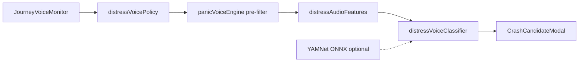

# Margi Mobile (P0)

**When signal drops, the path still holds.**

**Team NovaDrive** · Native Expo app for **IIT Madras Road Safety Hackathon 2026** — **RoadSoS** track (Care Path royal blue / saffron UI).

**Expo SDK 54** — matches the current **Play Store Expo Go** app (SDK 56 requires a newer Expo Go not on Play Store yet).

> Monorepo root: [../README.md](../README.md) · Changelog: [../CHANGELOG.md](../CHANGELOG.md) · Submission: [../docs/SUBMISSION.md](../docs/SUBMISSION.md)

## Drive flow

Home → **ENTER DRIVE MODE** (opens Trip / Plan Corridor) → **Start Driving** → calibration → **Live SOS HUD** → journey complete → Home.

Home also shows **Bystander QR**, **Quick SOS**, and **Map View** tiles. Female users see a stacked **NAARI SHAKTI** card below the drive card.

Design reference: [DESIGN.md](DESIGN.md) · Stabilization spec: [docs/superpowers/specs/2026-05-23-novadrive-stabilization-design.md](docs/superpowers/specs/2026-05-23-novadrive-stabilization-design.md)

## Features (P0)

- GovTech tabs: Home, Trip, Community, Profile + Configuration (`/settings`)
- Plan Corridor map, route cards (Alpha-1 / Beta), offline briefing (`trip/plan`, `trip/discover`)
- Route calibration screen → live speedometer HUD, sensor status, hold-to-SOS (3s)
- Foreground GPS + **CrashEngine** (impact/throw) + **Distress voice watch** (policy + spectral classifier; optional YAMNet in dev client)
- Calm 15s distress dialog — **no auto triage at countdown 0**; at 0s may open SMS 108 composer (user taps Send); no backdrop dismiss
- Hold-to-SOS → opens SMS 108 composer with GPS, then activation → trauma response
- Offline keyword parser on emergency chat
- Golden Hour Packet (GHP) + lz-string QR + checksum (corruption detection)
- Bystander QR scan + SecureStore relay cache + SMS 108 intent
- **Sarthi** floating AI assistant (mini window on tabs, full `/sarthi` screen) — live LLM via Next.js BFF when online, offline rules when not
- **Naari Shakti** women's safety portal — gender-gated home stack, protocol modal, full dashboard at `/naari-shakti`

## Naari Shakti (women's safety portal)

Institutional safety flow for users who select **Female** during onboarding. Separate from Quick SOS / Golden Hour triage — optimized for silent distress SMS, live location to ICE contacts, women's helpline, and hold-to-activate emergency with on-device voice recording.

| Piece | Location |
|-------|----------|
| Eligibility & messages | `src/lib/naariShakti/*` (Jest: eligibility, hold timer, engine, SMS bodies) |
| State | `src/context/NaariShaktiContext.tsx` |
| UI | `src/components/naari/*`, `app/naari-shakti.tsx` |
| Home entry | `src/components/home/HomePrimaryStack.tsx`, `app/(tabs)/explore.tsx` |
| Gender capture | `app/medical.tsx` (required), `app/auth.tsx` (optional), `GenderIdentityPicker.tsx` |

### User flow

1. **Medical profile** → choose gender (required before continuing onboarding).
2. **Home (female)** → stacked **ENTER DRIVE MODE** + **NAARI SHAKTI** cards (`HomePrimaryStack`). Male users see the drive card only.
3. First tap on Naari → **Naari Shakti Protocol** (*Unverified female user detected*) → **Enable Portal** or **Not Now**.
4. **Portal** (`/naari-shakti`):
   - Turn **Safety Mode** ON.
   - **Press & hold 2s** on orange emergency button → distress HUD appears **immediately**; TTS, GPS (cached/prefetched when possible), voice recording, SMS to nearest police station (+ ICE if enabled) follow.
   - **SMS Nearest Station** / **Share Live Location** / **Women's Helpline (181)**.
   - Quick help message presets, nearest safety point + navigate.

### Demo notes

- **Unverified female user** = self-reported `gender: 'female'` stored locally (no Aadhaar or identity API in P0).
- SMS uses `Linking` → OS Messages app; user must tap **Send** (iOS/Android policy).
- Grant **location** and **microphone** when prompted for full distress activation.
- Sarthi FAB is lifted on Home and hidden on the Naari portal route.

Design spec: [docs/superpowers/specs/2026-05-23-naari-shakti-design.md](docs/superpowers/specs/2026-05-23-naari-shakti-design.md)  
Stitch re-generation prompt: [../docs/design/stitch-prompts/naari-shakti-portal.md](../docs/design/stitch-prompts/naari-shakti-portal.md)

### Quick test

Device checklist rows 13–15: [docs/DEVICE_SMOKE_MATRIX.md](docs/DEVICE_SMOKE_MATRIX.md)

1. Guest or email sign-in → medical → **Female** → finish accessibility.
2. Home → **NAARI SHAKTI** card → **Enable Portal**.
3. Portal → turn **Safety Mode** ON.
4. Hold **Emergency Help** 2 seconds once → distress HUD + SMS composer with coordinates (no second hold required).

## Sarthi assistant

| Piece | Location |
|-------|----------|
| Mobile UI | `src/components/sarthi/*`, `app/sarthi.tsx`, overlay in `app/(tabs)/_layout.tsx` |
| Chat engine | `src/lib/sarthiEngine.ts`, `sarthiOffline.ts` |
| BFF (API keys server-side only) | [`../novadrive/app/api/sarthi/chat`](../novadrive/app/api/sarthi/chat/route.ts) |

1. Copy env examples:
   - `novadrive/.env.example` → `novadrive/.env` with `GOOGLE_GENERATIVE_AI_API_KEY` (Google AI Studio → **Gemini 2.0 Flash**)
   - `novadrive-mobile/.env.example` → `.env` with `EXPO_PUBLIC_SARTHI_API_URL` (e.g. `http://192.168.x.x:3000` for LAN dev)
2. Start BFF: `cd ../novadrive && npm run dev`
3. Start mobile: `npm run start:lan` — Sarthi FAB on main tabs; hidden during journey / emergency / scan.
4. **Language:** Profile → Settings → Regional & Language (`en` / `hi` / `ta`) — Sarthi offline KB and Gemini replies follow this.
5. **First Home visit each session:** Sarthi banner — *"I'm here to help you"* (localized).
6. **Offline:** 30+ crisis/FAQ playbooks in `src/lib/sarthi/sarthiKnowledgeBase.ts`; high-priority matches skip the network for speed. Offline mode shows explicit KB banner — no misleading "Gemini online" chip.

Design spec: [docs/superpowers/specs/2026-05-23-sarthi-assistant-design.md](docs/superpowers/specs/2026-05-23-sarthi-assistant-design.md)

## Distress voice detection

Reduces false “Distress signal detected” modals during navigation, TTS, and ambient noise while still catching real yells during an active journey or Naari safety mode.



| Piece | Location |
|-------|----------|
| Policy (navigation / TTS / mic warm-up) | `src/lib/voice/distressVoicePolicy.ts` |
| Spectral features + metering proxies | `src/lib/voice/distressAudioFeatures.ts` |
| Classifier + golden fixtures | `src/lib/voice/distressVoiceClassifier.ts`, `src/lib/__fixtures__/distressVoiceVectors.ts` |
| Optional YAMNet ONNX | `src/lib/voice/yamnetDistressInference.ts`, `assets/models/` |

| Runtime | Behavior |
|---------|----------|
| **Expo Go** | Metering dB + spectral proxies; no ONNX |
| **Dev client / APK** | Same pipeline; optional YAMNet when model + `onnxruntime-react-native` are installed |

Profile → **Voice Crash Detection** toggle (**experimental**) ; **Distress voice sensitivity** (low / medium / high) when enabled.

### CrashEngine thresholds (documented defaults)

| Setting | Accel peak (g) | Impact peak | Impact severe | Jerk | Notes |
|---------|----------------|-------------|---------------|------|-------|
| **High** (default) | 2.8 | 2.4 | 3.2 | 1.6 | + speed drop: was >25 km/h, now <5 km/h |
| **Medium** | ×1.12 stricter | same scale | | | Profile → sensitivity |
| **Low** | ×1.28 stricter | same scale | | | Fewer false positives on rough roads |

Source: `src/lib/crashEngine.ts` — **not field-calibrated on Indian highways**; confirm manually.

For YAMNet: see [scripts/export-yamnet-distress-onnx.md](scripts/export-yamnet-distress-onnx.md) (`npx expo prebuild` required — not Expo Go).

Design: [docs/superpowers/specs/2026-05-28-distress-voice-detection-design.md](docs/superpowers/specs/2026-05-28-distress-voice-detection-design.md) · Plan index: [../docs/superpowers/plans/2026-05-28-distress-voice-detection.md](../docs/superpowers/plans/2026-05-28-distress-voice-detection.md)

### Judge quick test (smoke rows 23–26)

1. Start journey → switch Home / Community / Settings tabs → **no** distress modal from UI sounds or app speech (row 23).
2. Play a notification chime during journey → **no** modal (row 24).
3. Optional: intentional yell near mic → modal after ~1–2 s confirmation (row 25).
4. Naari Safety Mode ON without journey → idle on portal/home → **no** false modal (row 26).

Full matrix: [docs/DEVICE_SMOKE_MATRIX.md](docs/DEVICE_SMOKE_MATRIX.md)

## Quality gates

```bash
npm run typecheck    # TypeScript (includes *.test.ts)
npm test             # 208 unit tests — lib/, voice, FSM, crash, GHP, Sarthi, Naari Shakti, brand, tokens, public branding, Phase 2–3
npm run verify:docs      # README "N unit tests" matches src/**/*.test.ts
npm run verify:branding  # no NovaDrive in public GitHub copy
npm run test:coverage
```

Device checklist: [docs/DEVICE_SMOKE_MATRIX.md](docs/DEVICE_SMOKE_MATRIX.md)

## Run

```bash
cd novadrive-mobile
npm install --legacy-peer-deps
npx expo install react-native-worklets babel-preset-expo
npm run typecheck
npm test
npx expo start
```

### Connect Expo Go to your PC

Pick **one** method. Tunnel is optional; LAN or USB is often more reliable.

#### A — Same Wi‑Fi (recommended when tunnel fails)

Phone and laptop on the **same router** (not “laptop hotspot → phone” unless you fix firewall — see B).

```bash
npm run start:lan
```

In Expo Go → **Enter URL manually**:

```text
exp://YOUR_LAPTOP_IP:8081
```

Find `YOUR_LAPTOP_IP` with `ipconfig` (IPv4 on Wi‑Fi), e.g. `exp://192.168.31.122:8081`.

Allow **Node.js** through Windows Firewall for **Private** networks.

#### B — Laptop mobile hotspot

Windows hotspot often blocks phone → laptop on port 8081. Try in order:

1. **Phone hotspot instead** — share internet from the phone, connect the laptop to that Wi‑Fi, then use **A (LAN)**.
2. **Tunnel** — `npm run start:tunnel` (needs ngrok; see troubleshooting below).
3. **USB + localhost** — install [Android platform-tools](https://developer.android.com/tools/releases/platform-tools), USB-debug the phone, then:

```bash
npm run start:localhost
adb reverse tcp:8081 tcp:8081
```

Open the QR / URL from the terminal (`exp://127.0.0.1:8081` on the device after `adb reverse`).

#### C — Tunnel (`exp.direct`)

```bash
npm run start:tunnel
```

QR URL should contain `exp.direct`. If you see `CommandError: failed to start tunnel` / `remote gone away` / `session closed`:

1. **Stale ngrok config** — remove `%USERPROFILE%\.expo\ngrok.yml`, then retry. If you use your own ngrok account, paste a fresh authtoken from [dashboard.ngrok.com](https://dashboard.ngrok.com/get-started/your-authtoken) into that file as `authtoken: ...` or set env `NGROK_AUTHTOKEN`.
2. **Only one Metro** — stop other Expo terminals; if port 8081 is busy, run `npx expo start --tunnel --port 8082` in an **interactive** PowerShell window (answer **Y** when asked to use another port).
3. **Network** — disable VPN; allow Node/ngrok through firewall; check [ngrok status](https://status.ngrok.com/) (outages are rare; “remote gone away” is usually local network or auth).
4. Reinstall tunnel helper: `npm install @expo/ngrok@^4.1.3`

#### D — No dev server (judge demo)

```bash
npm run android
```

Installs a debug build on the device; no Expo Go or Metro required. Uses JDK 17+ automatically (Windows often has Java 8 on PATH).

---

**“Project incompatible with Expo Go”** — this repo uses **SDK 54** for Play Store Expo Go. Run `npx expo install --fix` after `git pull` if versions drift.

**If Metro says `Cannot find module 'react-native-worklets/plugin'`:** run `npx expo install react-native-worklets`, then restart Expo (Ctrl+C first).

**If Metro says `Cannot find module 'babel-preset-expo'`:** run `npx expo install babel-preset-expo`, then restart Expo.

**If port 8081 is busy:** close other Expo windows, or:

```powershell
netstat -ano | findstr :8081
taskkill /PID <pid_from_above> /F
```

### Android APK / device (USB, like Android Studio)

**Phone:** Enable **Developer options** → **USB debugging**, plug in cable, tap **Allow** on the phone.

**PC:** `adb` must be on your PATH. If PowerShell says `adb is not recognized`, run this once per terminal session (typical Android Studio SDK location):

```powershell
$env:ANDROID_HOME = "$env:LOCALAPPDATA\Android\Sdk"
$env:Path = "$env:ANDROID_HOME\platform-tools;$env:ANDROID_HOME\emulator;$env:Path"
adb devices
```

You should see your phone as `device` (not `unauthorized`). Install [platform-tools](https://developer.android.com/tools/releases/platform-tools) only if that folder is missing.

**Java:** Gradle needs **JDK 17+**. If you see `This build uses a Java 8 JVM` or `Gradle requires JVM 17 or later`, use **`npm run android`** (auto-detects Android Studio JBR). Or set manually for this PowerShell session:

```powershell
$env:JAVA_HOME = "C:\Program Files\Android\Android Studio\jbr"
$env:Path = "$env:JAVA_HOME\bin;$env:Path"
java -version
```

You should see `openjdk version "17"` or `21`, not `1.8`.

```bash
cd novadrive-mobile
npm run android
```

First build downloads Gradle/SDK and can take 10–20 minutes. Later builds are faster. Grant location (journey), microphone, and camera when prompted.

**Gradle `IBM_SEMERU` error:** Gradle 9 + React Native’s old foojay plugin — fixed via `npm install` → `postinstall` runs `scripts/patch-foojay-gradle.js`. If it returns after `npm install`, run `node scripts/patch-foojay-gradle.js` once.

**`hermes-compiler` / `getAbsolutePath() on null`:** Install dev dep `hermes-compiler` (in `package.json`) and ensure `android/local.properties` contains `sdk.dir=...` pointing at your Android SDK (create it if missing; path is machine-specific).

**`build.ninja` / file used by another process (Reanimated CMake):** Two Gradle builds ran at once (e.g. double `npm run android`, or Android Studio + CLI). Fix:

```powershell
npm run android:clean-native
# wait ~5 seconds
npm run android
```

Run only **one** build at a time. Close Android Studio during CLI builds if locks persist.

## Airplane-mode acceptance test

1. Complete onboarding (Guest is fine).
2. Start journey → capture location → run triage → pick facility → build packet.
3. Enable airplane mode — verify GHP text and QR still display.
4. On a second device, scan QR → relay caches → disable airplane mode → SMS 108.

## POI database

App seeds `emergency_seed.db` on first launch (50+ nodes). To refresh from OSM:

```bash
python scripts/ingestCorridors.py --corridor NH48 --min-pois 50 --out data/emergency_seed.db
```

## Plan

See [docs/MARGI_FINAL_IMPLEMENTATION_PLAN.md](../docs/MARGI_FINAL_IMPLEMENTATION_PLAN.md).
