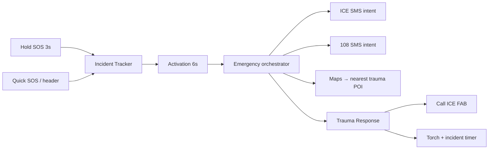

# Margi Mobile

**When signal drops, the path still holds.**

**BY TEAM NOVADRIVE** · Native Expo app for **IIT Madras Road Safety Hackathon 2026** (RoadSoS / Care Path).

| | |
|---|---|
| **Stack** | Expo SDK 54 · React Native · offline-first SQLite POI pack |
| **Design** | Deep navy + emergency saffron · [DESIGN.md](DESIGN.md) |
| **Monorepo** | [../README.md](../README.md) · [../CHANGELOG.md](../CHANGELOG.md) · [../docs/SUBMISSION.md](../docs/SUBMISSION.md) |

> **Expo Go:** SDK 54 matches the current Play Store Expo Go app. SDK 56 needs a newer Expo Go not on Play Store yet.

---

## What Margi does

Margi is a **golden-hour roadside safety companion**: live drive HUD with hold-SOS, offline trauma routing, Golden Hour Packet + bystander QR, community hazard reports, and **Sarthi** (on-device + cloud guidance). **Naari Shakti** adds a women’s safety portal with hold-to-activate distress. Everything critical works **without signal** after location and POI data are cached.

---

## Quick start

```bash
cd novadrive-mobile
npm install --legacy-peer-deps
npx expo install react-native-worklets babel-preset-expo
npm run typecheck
npm test
npm run start:lan          # phone + laptop on same Wi‑Fi → exp://YOUR_IP:8081
# or
npm run android            # USB debug APK (no Expo Go)
```

Copy env: `cp .env.example .env` — set `EXPO_PUBLIC_SARTHI_API_URL` for cloud Sarthi (see [Sarthi](#sarthi-assistant)).

---

## App map

| Tab / area | What you get |
|------------|----------------|
| **Home** | Drive mode, Quick SOS, Bystander QR, Naari Shakti (female), daily safety brief, Sarthi FAB |
| **Trip** | Plan corridor, route cards, calibration → live HUD |
| **Community** | Geo-filtered local alerts (~5 km), hazard reports, pioneers leaderboard |
| **Profile** | Medical ICE, settings, voice detection toggle |
| **Emergency** | Incident tracker → activation → trauma response → facility routing |
| **Naari Shakti** | `/naari-shakti` — safety mode, 2s hold distress, SMS station / share location |

**Home flow:** ENTER DRIVE MODE → Trip → Start Driving → calibration → **Live SOS HUD** (hold 3s) → journey summary.

---

## Emergency SOS (automated golden hour)

Hold SOS and Quick SOS now follow the **same intentional path** — no premature SMS before you pick the incident type.



| Step | Behavior |
|------|----------|
| **Hold SOS (3s)** | Opens **Incident Tracker** (road accident / natural calamity) — not a skipped activation screen |
| **Activation (6s)** | Countdown, then `runEmergencyOrchestrator` |
| **Orchestrator** | GPS → ICE SMS (if contact + setting on) → 108 SMS → rank nearest hospital → open Maps |
| **Trauma Response** | **Incident timer** (live since SOS), **torch** (rear flash), Call ICE + Call Center FABs, navigate to **hospital coords** (not your GPS pin) |
| **False alerts** | Voice crash detection **off by default**; crash countdown **does not** auto-open 108 SMS — user confirms via modal |

**Code:** `src/lib/emergency/emergencyOrchestrator*.ts`, `TraumaResponseActionBar.tsx`, `incidentElapsed.ts`, `hospitalNavTarget.ts`  
**Spec:** [docs/superpowers/specs/2026-05-28-margi-emergency-automation-design.md](docs/superpowers/specs/2026-05-28-margi-emergency-automation-design.md)

**Device smoke:** [docs/DEVICE_SMOKE_MATRIX.md](docs/DEVICE_SMOKE_MATRIX.md) — hold SOS → ICE → hospital Maps.

> SMS and dial use OS intents — the user taps **Send** / **Call** (iOS/Android policy).

---

## Location-aware safety

| Feature | Detail |
|---------|--------|
| **Community alerts** | Seed hazards tagged with lat/lng; list filtered to **5 km** around you |
| **Daily Safety Brief** | Regional vs baseline copy from NH48 verified pack bbox |
| **Sarthi context** | Corridor label from GPS (e.g. Tamil Nadu · NH-48 corridor) in chat + mini window |
| **Offline POI** | 50+ Chennai NH nodes in `emergency_seed.db`; baseline mode outside pack |

---

## Naari Shakti (women's safety portal)

High-contrast **saffron + navy** portal for users who select **Female** in medical onboarding — separate from Margi SOS triage.

| Piece | Location |
|-------|----------|
| Logic | `src/lib/naariShakti/*` |
| State | `src/context/NaariShaktiContext.tsx` |
| UI | `src/components/naari/*`, `app/naari-shakti.tsx` |
| Home card | `NaariShaktiPortalButton` in `HomePrimaryStack` |

**Flow:** Medical → Female → Home **NAARI SHAKTI** card → protocol modal → portal → Safety Mode ON → hold **Emergency Help** 2s → distress HUD + SMS + recording.

**Design:** [docs/superpowers/specs/2026-05-23-naari-shakti-design.md](docs/superpowers/specs/2026-05-23-naari-shakti-design.md)

---

## Sarthi assistant

Floating AI on main tabs + full screen `/sarthi`. **Offline KB** by default; **Gemini via BFF** when `EXPO_PUBLIC_SARTHI_API_URL` is set and reachable.

| Piece | Location |
|-------|----------|
| UI | `src/components/sarthi/*` |
| Engine | `src/lib/sarthiEngine.ts`, `sarthiKnowledgeBase.ts` |
| BFF | [`../novadrive/app/api/sarthi/chat`](../novadrive/app/api/sarthi/chat/route.ts) |

1. `novadrive/.env` — `GOOGLE_GENERATIVE_AI_API_KEY`
2. `cd ../novadrive && npm run dev`
3. Mobile `.env` — `EXPO_PUBLIC_SARTHI_API_URL=http://192.168.x.x:3000`
4. `npm run start:lan`

Shows explicit banner when cloud is unavailable — no fake “online” state.

---

## Distress voice & crash detection

Reduces false modals during navigation/TTS while still catching real distress on an active journey.

| Layer | Module |
|-------|--------|
| Policy | `distressVoicePolicy.ts` |
| Spectral + classifier | `distressAudioFeatures.ts`, `distressVoiceClassifier.ts` |
| Optional YAMNet | `yamnetDistressInference.ts` (dev client / APK) |
| Impact | `crashEngine.ts` |

**Settings:** Profile → Voice Crash Detection (**experimental**, default **off**) · sensitivity low/med/high.

**Calm dialog:** 15s countdown — dismiss with “I’m okay”; **no auto-SMS at 0** for Margi crash path.

Design: [docs/superpowers/specs/2026-05-28-distress-voice-detection-design.md](docs/superpowers/specs/2026-05-28-distress-voice-detection-design.md)

---

## Golden Hour Packet & bystander relay

- Offline triage FSM → facility rank → GHP build → lz-string QR + checksum
- **Scan** (`/scan`) — camera relay into SecureStore; SMS 108 intent
- Airplane-mode test: build packet online → airplane mode → QR still readable

---

## Quality gates

```bash
npm run typecheck
npm test                 # 220 unit tests
npm run verify:docs      # README test count matches sources
npm run verify:branding
npm run test:coverage
```

---

## Connect Expo Go

### Same Wi‑Fi (recommended)

```bash
npm run start:lan
```

Expo Go → **Enter URL manually:** `exp://YOUR_LAPTOP_IP:8081` (`ipconfig` → IPv4). Allow Node.js on **Private** firewall.

### USB (localhost)

```bash
npm run start:localhost
adb reverse tcp:8081 tcp:8081
```

### Tunnel

```bash
npm run start:tunnel
```

If tunnel fails: delete `%USERPROFILE%\.expo\ngrok.yml`, retry; disable VPN; see [ngrok dashboard](https://dashboard.ngrok.com/get-started/your-authtoken).

### Judge demo (no Metro)

```bash
npm run android
```

Uses Android Studio JBR (JDK 17+) on Windows automatically.

---

## Android build troubleshooting

| Issue | Fix |
|-------|-----|
| `adb` not found | Add `%LOCALAPPDATA%\Android\Sdk\platform-tools` to PATH |
| Java 8 / Gradle JVM | `npm run android` or set `JAVA_HOME` to Android Studio `jbr` |
| `react-native-worklets/plugin` | `npx expo install react-native-worklets` |
| `babel-preset-expo` missing | `npx expo install babel-preset-expo` |
| Port 8081 busy | `netstat -ano \| findstr :8081` then `taskkill /PID <pid> /F` |
| Reanimated CMake lock | `npm run android:clean-native` — one build at a time |
| foojay / IBM_SEMERU | `node scripts/patch-foojay-gradle.js` after install |

---

## POI refresh

```bash
python scripts/ingestCorridors.py --corridor NH48 --min-pois 50 --out data/emergency_seed.db
```

Runbook: [docs/POI_VERIFICATION_RUNBOOK.md](docs/POI_VERIFICATION_RUNBOOK.md)

---

## Further reading

| Doc | Topic |
|-----|--------|
| [docs/MARGI_FINAL_IMPLEMENTATION_PLAN.md](../docs/MARGI_FINAL_IMPLEMENTATION_PLAN.md) | Full implementation plan |
| [docs/superpowers/specs/2026-05-23-novadrive-stabilization-design.md](docs/superpowers/specs/2026-05-23-novadrive-stabilization-design.md) | Stabilization |
| [scripts/export-yamnet-distress-onnx.md](scripts/export-yamnet-distress-onnx.md) | Optional YAMNet model |

---

*Margi · Team NovaDrive · IIT Madras Road Safety Hackathon 2026*
