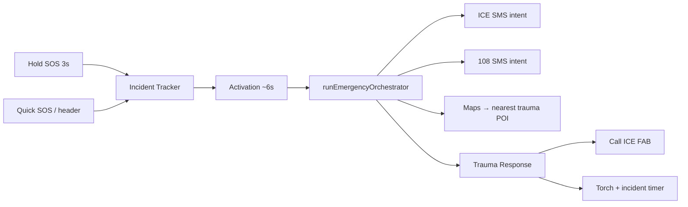

# Margi Mobile

**When signal drops, the path still holds.**

**BY TEAM NOVADRIVE** · Native Expo app for **IIT Madras Road Safety Hackathon 2026** (RoadSoS / Care Path).

| | |
|---|---|
| **Version** | 2.0.0 (`com.margi.app` · scheme `margi://`) |
| **Stack** | Expo SDK 54 · React Native 0.81 · offline-first SQLite trauma POI |
| **Design** | Deep navy `#000a1e` + emergency saffron `#fe6b00` · [DESIGN.md](DESIGN.md) |
| **Monorepo** | [../README.md](../README.md) · [../CHANGELOG.md](../CHANGELOG.md) · [../docs/SUBMISSION.md](../docs/SUBMISSION.md) |
| **Judges** | [../JUDGE_START_HERE.md](../JUDGE_START_HERE.md) |

> **Expo Go:** SDK 54 matches current Play Store Expo Go. For **torch**, native crash hooks, and judge APK flows, use **`npm run android`** (development build) instead of Expo Go alone.

---

## What Margi does

Margi is a **golden-hour roadside safety companion**: live drive HUD with hold-SOS, **automated emergency orchestration**, offline trauma routing, Golden Hour Packet + bystander QR, geo-filtered community alerts, **Sarthi** (on-device + cloud guidance), and **Naari Shakti** (women's safety portal). Critical flows work **offline** after location and POI data are cached.

---

## Quick start

```bash
cd novadrive-mobile
npm install --legacy-peer-deps
npx expo install react-native-worklets babel-preset-expo
npm run typecheck
npm test
npm run verify:docs
npm run verify:branding
npm run start:lan          # phone + laptop same Wi‑Fi → exp://YOUR_IP:8081
# recommended for full native features:
npm run android            # USB debug APK + Metro (JDK 21 via Android Studio JBR)
```

**Environment:** copy `.env.example` → `.env`

| Variable | Purpose |
|----------|---------|
| `EXPO_PUBLIC_SUPABASE_URL` | Supabase project URL (auth + NGO + dispatch audit) |
| `EXPO_PUBLIC_SUPABASE_ANON_KEY` | Publishable anon key |
| `EXPO_PUBLIC_SARTHI_API_URL` | Sarthi BFF base (e.g. deployed `novadrive` on Vercel) |
| `EXPO_PUBLIC_TRAUMA_DISPATCH_URL` | Optional HTTP trauma dispatch endpoint |
| `EXPO_PUBLIC_POLICE_DISPATCH_URL` | Optional HTTP police dispatch endpoint |

Setup guide: [../docs/PHASE3_SETUP.md](../docs/PHASE3_SETUP.md)

---

## App map

Expo Router tabs use internal names; labels match the bottom bar:

| Tab label | Route | Features |
|-----------|-------|----------|
| **Home** | `app/(tabs)/explore.tsx` | `HomePrimaryStack` (drive + Naari), Quick SOS, Bystander QR, Daily Safety Brief, Sarthi FAB, `DashboardHeader` with **BY TEAM NOVADRIVE** |
| **Trip** | `app/(tabs)/drive.tsx` | Plan corridor, OSRM polyline when online, calibration → live HUD |
| **Community** | `app/(tabs)/history.tsx` | Hazards filtered to **~5 km** (`communityAlerts.ts`), leaderboard |
| **Profile** | `app/(tabs)/profile.tsx` | Medical ICE, voice crash toggle, accessibility link |

**Other routes:** `/emergency/*`, `/naari-shakti`, `/sarthi`, `/scan`, `/rahveer`, `/ngo`, `/auth`, `/settings`, `/medical`, `/brief/[slug]`

**Drive flow:** ENTER DRIVE MODE → Trip → **Start Driving** → calibration → **Live SOS HUD** (hold 3s on top strip) → journey summary.

---

## Emergency SOS (automated golden hour)

No premature SMS before incident type is selected.



| Step | Behavior |
|------|----------|
| **Hold SOS (3s)** | `/emergency/selection` — road accident / natural calamity (`holdSosReleaseGrace.ts`) |
| **Activation** | Countdown splash → `runEmergencyOrchestrator` |
| **Orchestrator** | GPS → ICE SMS (if contact + setting) → 108 SMS → rank hospital → Maps to **facility coordinates** |
| **Trauma Response** | `TraumaResponseActionBar` — live **incident timer** (`incidentElapsed.ts`), **torch** via hidden `TorchCameraLayer` + `useTorch`, Call ICE / Call Center FABs |
| **False alerts** | Voice crash **off by default**; crash countdown **does not** auto-open 108 SMS |

| Module | Path |
|--------|------|
| Orchestrator | `src/lib/emergency/emergencyOrchestrator.ts`, `emergencyOrchestratorPlan.ts` |
| Hospital Maps target | `src/lib/emergency/hospitalNavTarget.ts` |
| Trauma UI | `src/components/emergency/TraumaResponseActionBar.tsx`, `TorchCameraLayer.tsx` |
| Spec | [docs/superpowers/specs/2026-05-28-margi-emergency-automation-design.md](docs/superpowers/specs/2026-05-28-margi-emergency-automation-design.md) |

**Device smoke:** [docs/DEVICE_SMOKE_MATRIX.md](docs/DEVICE_SMOKE_MATRIX.md) — rows 11, 19–20, 33+.

SMS/dial use OS intents — user taps **Send** / **Call**.

---

## Location-aware safety

| Feature | Detail |
|---------|--------|
| **Community alerts** | Seed hazards with lat/lng; `history` tab filters to **5 km** (`localSafetyAlerts.ts`) |
| **Daily Safety Brief** | Regional vs baseline copy from NH48 verified pack bbox |
| **Sarthi context** | `buildSarthiContext.ts` — corridor label from GPS in chat + mini window |
| **Offline POI** | 50+ Chennai NH nodes in bundled `emergency_seed.db`; baseline mode outside pack |

---

## Naari Shakti (women's safety portal)

High-contrast **saffron + navy** portal for users who select **Female** in medical onboarding — separate from Margi SOS triage. UI uses solid saffron surfaces (not pale `secondaryContainer` washes).

| Piece | Location |
|-------|----------|
| Logic | `src/lib/naariShakti/*` |
| State | `src/context/NaariShaktiContext.tsx` |
| UI | `src/components/naari/*`, `app/naari-shakti.tsx` |
| Home entry | `NaariShaktiPortalButton` in `HomePrimaryStack` |

**Flow:** Medical → Female → Home **NAARI SHAKTI** → protocol modal → portal → Safety Mode ON → hold **Emergency Help** 2s → distress HUD + SMS + recording.

Design: [../docs/superpowers/specs/2026-05-23-naari-shakti-design.md](../docs/superpowers/specs/2026-05-23-naari-shakti-design.md)

---

## Sarthi assistant

Floating AI on main tabs + full screen `/sarthi`. **Offline KB** by default; **Gemini via BFF** when `EXPO_PUBLIC_SARTHI_API_URL` is set and reachable.

| Piece | Location |
|-------|----------|
| UI | `src/components/sarthi/*` |
| Chat hook | `src/hooks/useSarthiChat.ts` |
| Engine | `src/lib/sarthiEngine.ts`, `sarthiKnowledgeBase.ts` |
| BFF route | [`../novadrive/app/api/sarthi/chat`](../novadrive/app/api/sarthi/chat/route.ts) |

1. Deploy or run `novadrive` with `GOOGLE_GENERATIVE_AI_API_KEY`
2. Mobile `.env` — `EXPO_PUBLIC_SARTHI_API_URL=https://your-bff.example.com`
3. `npm run start:lan` or `npm run android`

Connection status chip shows when cloud is unavailable — no fake “online” state.

---

## Phase 2 & 3 integrations (v2.0.0)

| Feature | Screens / modules |
|---------|-------------------|
| **Supabase auth** | `app/auth.tsx`, `src/lib/supabase/*` |
| **NGO volunteers** | `app/ngo/*`, `src/lib/ngo/volunteerProviders.ts` |
| **OSRM trip** | Trip tab — Nominatim + driving route polyline |
| **HTTP dispatch** | `dispatchOrchestrator.ts` + Supabase `dispatch_events` audit |
| **Rah-Veer** | `app/rahveer/*`, `src/lib/rahveerDb.ts` — Good Samaritan claim log |
| **Native crash (dev)** | `nativeCrashAdapter` — source badge on calm dialog; requires dev client / APK |
| **Multilingual Support** | `app/auth.tsx`, `src/lib/translations/*` — **15 languages** (Spanish, Arabic, Hindi, Tamil, etc.) inside a prominent searchable selector grid with quick-filters & haptics |

---

## Distress voice & crash detection

Reduces false modals during navigation/TTS while catching real distress on an active journey (or Naari safety mode).

| Layer | Module |
|-------|--------|
| Policy | `distressVoicePolicy.ts` |
| Classifier | `distressAudioFeatures.ts`, `distressVoiceClassifier.ts` |
| Optional YAMNet | `yamnetDistressInference.ts` (dev client / APK) |
| Impact | `crashEngine.ts` |

**Settings:** Profile → Voice Crash Detection (**experimental**, default **off**).

**Calm dialog:** 15s countdown — dismiss with “I’m okay”; **no auto-SMS at 0**.

Design: [docs/superpowers/specs/2026-05-28-distress-voice-detection-design.md](docs/superpowers/specs/2026-05-28-distress-voice-detection-design.md)

---

## Golden Hour Packet & bystander relay

- Offline triage FSM → facility rank → GHP build → lz-string QR + checksum (`MARGI GHP` header, `mg-` hash prefix)
- **`/scan`** — camera relay into SecureStore; SMS 108 intent
- **`/emergency/relay`** — web-style relay for judges
- Airplane-mode test: build packet online → airplane mode → QR still readable

---

## Quality gates

```bash
npm run typecheck
npm test                 # 230 unit tests (73 suites)
npm run verify:docs      # README test count matches src/**/*.test.ts
npm run verify:branding
npm run test:coverage
```

---

## Connect Expo Go

### Same Wi‑Fi (recommended)

```bash
npm run start:lan
```

Expo Go → **Enter URL manually:** `exp://YOUR_LAPTOP_IP:8081` (`ipconfig` → IPv4). Allow Node.js on **Private** firewall.

### USB (localhost)

```bash
npm run start:localhost
adb reverse tcp:8081 tcp:8081
```

### Tunnel

```bash
npm run start:tunnel
```

If tunnel fails: delete `%USERPROFILE%\.expo\ngrok.yml`, retry; disable VPN.

### Judge demo (no Metro)

```bash
npm run android
# or prebuilt APK:
npm run android:apk
```

See [scripts/BUILD_APK.md](scripts/BUILD_APK.md). Windows uses Android Studio **JBR** (JDK 17+) automatically via `scripts/run-android.cjs`.

---

## Android build troubleshooting

| Issue | Fix |
|-------|-----|
| `adb` not found | Add `%LOCALAPPDATA%\Android\Sdk\platform-tools` to PATH |
| Java 8 / Gradle JVM | `npm run android` or set `JAVA_HOME` to Android Studio `jbr` |
| `react-native-worklets/plugin` | `npx expo install react-native-worklets` |
| `babel-preset-expo` missing | `npx expo install babel-preset-expo` |
| Port 8081 busy | `netstat -ano \| findstr :8081` then `taskkill /PID <pid> /F` |
| Reanimated CMake lock | `npm run android:clean-native` — one build at a time |
| JSX in `.ts` hook | Keep JSX in `.tsx` (e.g. `TorchCameraLayer.tsx`, not `useTorch.ts`) |
| foojay / IBM_SEMERU | `node scripts/patch-foojay-gradle.js` runs on `postinstall` |
| `[CXX5304] SDK XML version 4` | Harmless warning when Studio CLI versions differ; build can still succeed |
| `CreateProcess: paging file too small` | Disable parallel builds via `gradle.properties` (`org.gradle.parallel=false`, `org.gradle.workers.max=1`) and sequentialize C++ compilation via `CMAKE_BUILD_PARALLEL_LEVEL=1` env variable |

---

## POI refresh

```bash
python ../scripts/ingestCorridors.py --corridor NH48 --min-pois 50 --out data/emergency_seed.db
```

Runbook: [../docs/POI_VERIFICATION_RUNBOOK.md](../docs/POI_VERIFICATION_RUNBOOK.md)

---

## Project structure (key paths)

```
app/
  (tabs)/explore.tsx      # Home tab
  (tabs)/drive.tsx        # Trip / HUD
  emergency/              # selection, activation, response, route, triage, packet
  naari-shakti.tsx
src/lib/emergency/        # orchestrator, navigation, activation
src/lib/naariShakti/
src/lib/voice/
src/components/emergency/ # TraumaResponseActionBar, TorchCameraLayer
src/lib/brand.ts          # TEAM_ATTRIBUTION_LINE, GHP headers
```

---

## Further reading

| Doc | Topic |
|-----|--------|
| [../docs/MARGI_FINAL_IMPLEMENTATION_PLAN.md](../docs/MARGI_FINAL_IMPLEMENTATION_PLAN.md) | Full implementation plan |
| [docs/superpowers/specs/2026-05-23-novadrive-stabilization-design.md](docs/superpowers/specs/2026-05-23-novadrive-stabilization-design.md) | Tab shell & stabilization |
| [docs/superpowers/specs/2026-05-30-margi-ui-theme-restoration-design.md](docs/superpowers/specs/2026-05-30-margi-ui-theme-restoration-design.md) | Navy theme restoration |
| [scripts/export-yamnet-distress-onnx.md](scripts/export-yamnet-distress-onnx.md) | Optional YAMNet model |

---

*Margi · Team NovaDrive · IIT Madras Road Safety Hackathon 2026*
